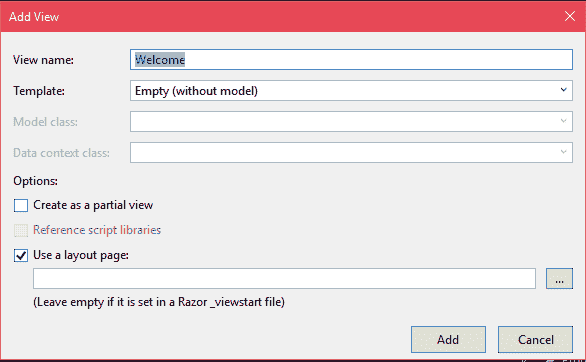
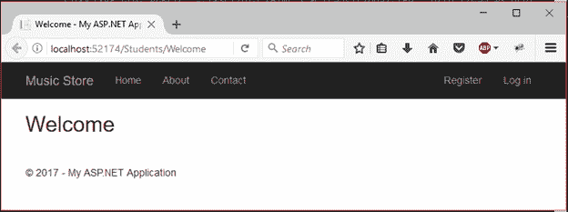

# ASP.NET 视图

> 原文：<https://www.javatpoint.com/asp-net-mvc-view>

MVC 视图是一个标准的 HTML 页面，可能包含脚本。它用于为应用程序创建网页。与 ASP.NET 网页不同，MVC 视图被映射到动作，然后控制器将视图呈现给浏览器。

MVC 对于项目结构有一定的约定。视图文件应该位于视图文件夹的子目录中。

MVC 使用 Razor 视图引擎，这样我们也可以用 HTML 编写服务器端代码。让我们创建一个视图并在浏览器中执行它。

* * *

## 创建应用程序视图

要添加视图，右击**视图**文件夹内的子文件夹，选择**添加- >添加视图**。它将弹出视图名称等。



该文件具有以下默认代码。

### // Welcome.cshtml

```

@{
    ViewBag.Title = "Welcome";
}
<h2>Welcome</h2>

```

如果我们想执行它，我们有这样一个控制器:

```

using System;
using System.Collections.Generic;
using System.Linq;
using System.Web;
using System.Web.Mvc;
namespace MvcApplicationDemo.Controllers
{
    public class StudentsController : Controller
    {
        // GET: Students
        public ActionResult Index()
        {
            return View();
        }
        public ActionResult Welcome()
        {
            return View();
        }
    }
}

```

该控制器具有**欢迎**动作方法，将向浏览器呈现欢迎视图文件。右键单击**欢迎. cshtml** 文件，在浏览器中选择**视图。这将产生以下输出。**

输出:

