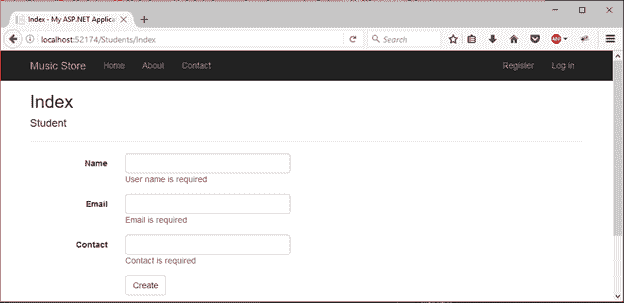
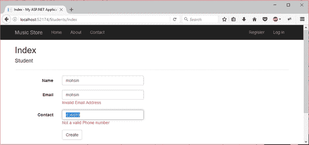

# ASP.NET MVC 输入验证

> 原文：<https://www.javatpoint.com/asp-net-mvc-validation>

验证用户输入是应用程序程序员的必要任务。一个应用程序应该只允许有效的用户输入，这样我们只能得到想要的信息。

ASP.NET MVC 框架提供了我们可以应用于模型属性的内置注释。它验证输入并向用户显示适当的消息。

* * *

## 常用的验证注释

| 释文 | 描述 |
| 需要 | 它用于制作必填字段。 |
| 显示名称 | 它用于定义我们要为字段显示的文本。 |
| 字符串长度 | 它定义了字符串字段的最大长度。 |
| 范围 | 它用于设置数值字段的最大值和最小值。 |
| 约束 | 它列出了将参数或表单值绑定到模型属性时要排除或包含的字段。 |
| 脚手架立柱 | 它允许在编辑器表单中隐藏字段。 |
| 最大长度 | 它用于设置字段的最大长度。 |
| 电子邮件地址 | 它用于验证电子邮件地址。 |
| 数据类型 | 它用于指定字段的数据类型。 |
| 正则表达式 | 它用于关联字段的正则表达式。 |

**例**

让我们创建一个使用注释验证输入的例子。为了创建这个例子，首先我们创建一个**学生控制器**，然后创建一个**学生**模型。

## 控制器

### //学生控制器. cs

```cs

using System;
using System.Collections.Generic;
using System.Linq;
using System.Web;
using System.Web.Mvc;
namespace MvcApplicationDemo.Controllers
{
    public class StudentsController : Controller
    {
        // GET: Students
        public ActionResult Index()
        {
            return View();
        }
    }
}

```

* * *

## 模型

### // Student.cs

```cs

using System.ComponentModel.DataAnnotations;

namespace MvcApplicationDemo.Models
{
    public class Student
    {
        public int ID { get; set; }
        // -- Validating Student Name
        [Required(ErrorMessage ="Name is required")]
        [MaxLength(12)]
        public string Name { get; set; }
        // -- Validating Email Address
        [Required(ErrorMessage ="Email is required")]
        [EmailAddress(ErrorMessage = "Invalid Email Address")]
        public string Email { get; set; }
        // -- Validating Contact Number
        [Required(ErrorMessage = "Contact is required")]
        [DataType(DataType.PhoneNumber)]
        [RegularExpression(@"^\(?([0-9]{3})\)?[-. ]?([0-9]{3})[-. ]?([0-9]{4})$", ErrorMessage = "Not a valid Phone number")]
        public string Contact { get; set; }
    }
}

```

* * *

## 视角

### // Index.cshtml

```cs

@model MvcApplicationDemo.Models.Student
@{
    ViewBag.Title = "Index";
}
<h2>Index</h2>
@using (Html.BeginForm()) 
{
    @Html.AntiForgeryToken()
    <div class="form-horizontal">
        <h4>Student</h4>
        <hr />
        @Html.ValidationSummary(true, "", new { @class = "text-danger" })
        <div class="form-group">
            @Html.LabelFor(model => model.Name, htmlAttributes: new { @class = "control-label col-md-2" })
            <div class="col-md-10">
                @Html.EditorFor(model => model.Name, new { htmlAttributes = new { @class = "form-control" } })
                @Html.ValidationMessageFor(model => model.Name, "", new { @class = "text-danger" })
            </div>
        </div>
        <div class="form-group">
            @Html.LabelFor(model => model.Email, htmlAttributes: new { @class = "control-label col-md-2" })
            <div class="col-md-10">
                @Html.EditorFor(model => model.Email, new { htmlAttributes = new { @class = "form-control" } })
                @Html.ValidationMessageFor(model => model.Email, "", new { @class = "text-danger" })
            </div>
        </div>
        <div class="form-group">
            @Html.LabelFor(model => model.Contact, htmlAttributes: new { @class = "control-label col-md-2" })
            <div class="col-md-10">
                @Html.EditorFor(model => model.Contact, new { htmlAttributes = new { @class = "form-control" } })
                @Html.ValidationMessageFor(model => model.Contact, "", new { @class = "text-danger" })
            </div>
        </div>
        <div class="form-group">
            <div class="col-md-offset-2 col-md-10">
                <input type="submit" value="Create" class="btn btn-default" />
            </div>
        </div>
    </div>
}
<div>
    @Html.ActionLink("Back to List", "Index")
</div>
@section Scripts {
    @Scripts.Render("~/bundles/jqueryval")
}

```

输出:

要查看输出，右键单击 **Index.cshtml** 文件，并选择在浏览器中查看。这将产生以下结果。



我们可以看到，它验证表单字段并向用户显示错误消息。在下面的截图中，我们正在验证输入的数据是否符合预期。

