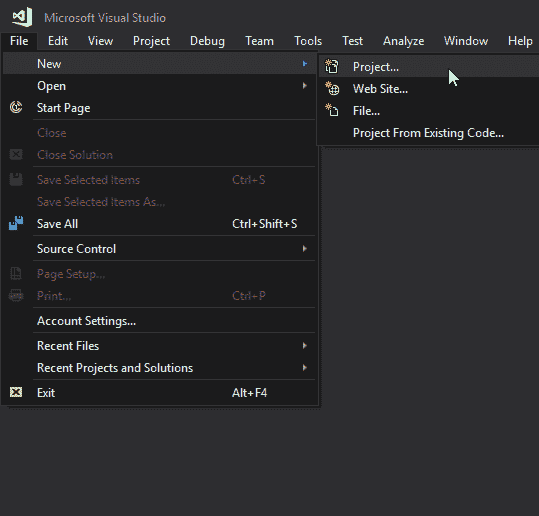
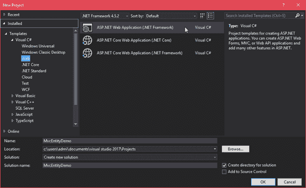
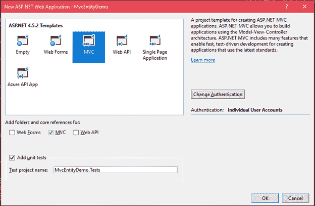
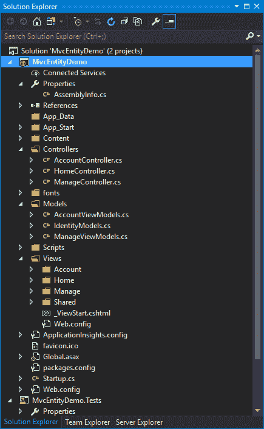
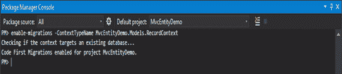
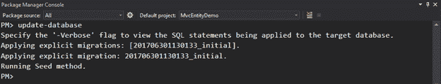
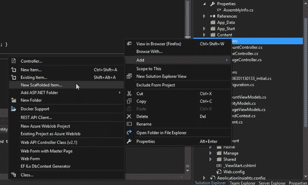
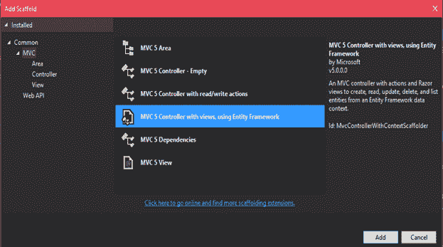
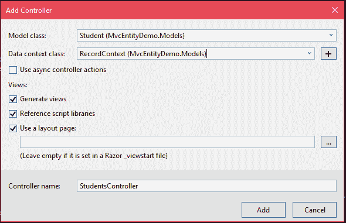
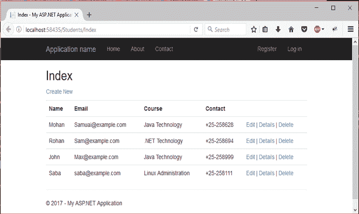

# ASP.NET MVC 实体框架

> 原文：<https://www.javatpoint.com/asp-net-mvc-entity-framework>

它是一个数据访问框架，用于在 visual studio 中创建和测试数据。它是.NET 框架和 Visual Studio。最新的包是作为实体框架获取包发货的。最新版本是实体框架 6.0。

我们正在我们的 ASP.NET MVC 应用程序中使用它。首先，我们将创建一个项目，然后向其中添加模型。

该示例需要以下工具和技术:

*   Visual Studio 2017
*   .NET 4.5
*   实体框架 6.0

1.  创建一个 MVC 项目

从菜单栏中选择文件菜单，然后选择新建项目。



提供项目名称并点击 ok。



选择项目模板，然后单击“确定”。



单击“确定”后，visual studio 将创建一个具有以下结构的项目。在我们的案例中，项目结构如下所示:



现在，为数据库中的表创建一个模型。右键单击**模型**文件夹，通过将名称设置为**学生. cs** 来添加新班级。使用以下代码修改此类。

* * *

## 模型

### // Student.cs

```cs

using System;
namespace MvcEntityDemo.Models
{
    public class Student
    {
        public int ID { get; set; }
        public string Name { get; set; }
        public string Email { get; set; }
        public string Course { get; set; }
        public string Contact { get; set; }
    }
}

```

为给定的数据模型创建一个用于与实体框架协调的数据库上下文类。将此类放在“模型”文件夹中。右键单击**模型**文件夹并添加一个类。为该类提供一个名称 **RecordContext.cs** 。使用以下代码修改您的类。

### 记录上下文.cs

```cs

using MvcEntityDemo.Models;
using System.Data.Entity;
using System.Data.Entity.ModelConfiguration.Conventions;
namespace MvcEntityDemo.Models
{
    public class RecordContext : DbContext
    {
        public RecordContext() : base("RecordContext")
        {
        }
        public DbSet<Student> Students { get; set; }
        protected override void OnModelCreating(DbModelBuilder modelBuilder)
        {
            modelBuilder.Conventions.Remove<PluralizingTableNameConvention>();
        }
    }
}

```

* * *

## 创建迁移

要创建迁移，通过浏览**视图- >其他窗口- >包管理器控制台**打开包管理器控制台。在包管理器控制台中，运行以下命令。

```cs

enable-migrations -ContextTypeName MvcEntityDemo.Models.RecordContext

```

我们在下面的截图中执行这个命令。



执行该命令后，框架在项目中创建一个**迁移**文件夹和一个**配置. cs** 文件。

我们正在用以下代码更新此文件。

### // Configuration.cs

```cs

namespace MvcEntityDemo.Migrations
{
    using MvcEntityDemo.Models;
    using System.Collections.Generic;
    using System.Data.Entity.Migrations;
    internal sealed class Configuration : DbMigrationsConfiguration<MvcEntityDemo.Models.RecordContext>
    {
        public Configuration()
        {
            AutomaticMigrationsEnabled = false;
        }
        protected override void Seed(MvcEntityDemo.Models.RecordContext context)
        {
            var students = new List<Student>
            {
            new Student{Name="Mohan",Email="Samuai@example.com",Course="Java Technology", Contact="+25-258628"},
            new Student{Name="Rohan",Email="Sam@example.com",Course=".NET Technology", Contact="+25-258694"},
            new Student{Name="John",Email="Max@example.com",Course="Java Technology", Contact="+25-258999"},
            new Student{Name="Saba",Email="saba@example.com",Course="Linux Administration", Contact="+25-258111"},
            };
            students.ForEach(s => context.Students.Add(s));
            context.SaveChanges();
        }

        }
    }
}

```

保存此文件，并在包管理器控制台中运行以下两个命令。

```cs

PM> add-migration initial 

```

它之后，运行这个也

```cs

PM> update-database.

```



此命令将在迁移文件夹中为项目创建首字母缩写。

创建支架以在网页上显示数据。



选择并添加脚手架。



添加控制器并提供创建视图的细节。



* * *

## 控制器

添加了一个新的学生控制器，它包含一些自动生成的代码，如下所示。

### //学生控制器. cs

```cs

using System;
using System.Collections.Generic;
using System.Data;
using System.Data.Entity;
using System.Linq;
using System.Net;
using System.Web;
using System.Web.Mvc;
using MvcEntityDemo.Models;
namespace MvcEntityDemo.Controllers
{
    public class StudentsController : Controller
    {
        private RecordContext db = new RecordContext();
        // GET: Students
        public ActionResult Index()
        {
            return View(db.Students.ToList());
        }

        // GET: Students/Details/5
        public ActionResult Details(int? id)
        {
            if (id == null)
            {
                return new HttpStatusCodeResult(HttpStatusCode.BadRequest);
            }
            Student student = db.Students.Find(id);
            if (student == null)
            {
                return HttpNotFound();
            }
            return View(student);
        }
        // GET: Students/Create
        public ActionResult Create()
        {
            return View();
        }
        // POST: Students/Create
        // To protect from overposting attacks, please enable the specific properties you want to bind to, for 
        // more details see https://go.microsoft.com/fwlink/?LinkId=317598.
        [HttpPost]
        [ValidateAntiForgeryToken]
        public ActionResult Create([Bind(Include = "ID,Name,Email,Course,Contact")] Student student)
        {
            if (ModelState.IsValid)
            {
                db.Students.Add(student);
                db.SaveChanges();
                return RedirectToAction("Index");
            }
            return View(student);
        }
        // GET: Students/Edit/5
        public ActionResult Edit(int? id)
        {
            if (id == null)
            {
                return new HttpStatusCodeResult(HttpStatusCode.BadRequest);
            }
            Student student = db.Students.Find(id);
            if (student == null)
            {
                return HttpNotFound();
            }
            return View(student);
        }
        // POST: Students/Edit/5
        // To protect from overposting attacks, please enable the specific properties you want to bind to, for 
        // more details see https://go.microsoft.com/fwlink/?LinkId=317598.
        [HttpPost]
        [ValidateAntiForgeryToken]
        public ActionResult Edit([Bind(Include = "ID,Name,Email,Course,Contact")] Student student)
        {
            if (ModelState.IsValid)
            {
                db.Entry(student).State = EntityState.Modified;
                db.SaveChanges();
                return RedirectToAction("Index");
            }
            return View(student);
        }
        // GET: Students/Delete/5
        public ActionResult Delete(int? id)
        {
            if (id == null)
            {
                return new HttpStatusCodeResult(HttpStatusCode.BadRequest);
            }
            Student student = db.Students.Find(id);
            if (student == null)
            {
                return HttpNotFound();
            }
            return View(student);
        }
        // POST: Students/Delete/5
        [HttpPost, ActionName("Delete")]
        [ValidateAntiForgeryToken]
        public ActionResult DeleteConfirmed(int id)
        {
            Student student = db.Students.Find(id);
            db.Students.Remove(student);
            db.SaveChanges();
            return RedirectToAction("Index");
        }
        protected override void Dispose(bool disposing)
        {
            if (disposing)
            {
                db.Dispose();
            }
            base.Dispose(disposing);
        }
    }
}

```

在视图文件夹中创建的**学生**文件夹。这个文件夹包含一些自动生成的文件，如索引，创建，删除等。索引文件包含以下代码。

### // Index.cshtml

```cs

@model IEnumerable<MvcEntityDemo.Models.Student>
@{
    ViewBag.Title = "Index";
}
<h2>Index</h2>
<p>
    @Html.ActionLink("Create New", "Create")
</p>
<table class="table">
    <tr>
        <th>
            @Html.DisplayNameFor(model => model.Name)
        </th>
        <th>
            @Html.DisplayNameFor(model => model.Email)
        </th>
        <th>
            @Html.DisplayNameFor(model => model.Course)
        </th>
        <th>
            @Html.DisplayNameFor(model => model.Contact)
        </th>
        <th></th>
    </tr>
@foreach (var item in Model) {
    <tr>
        <td>
            @Html.DisplayFor(modelItem => item.Name)
        </td>
        <td>
            @Html.DisplayFor(modelItem => item.Email)
        </td>
        <td>
            @Html.DisplayFor(modelItem => item.Course)
        </td>
        <td>
            @Html.DisplayFor(modelItem => item.Contact)
        </td>
        <td>
            @Html.ActionLink("Edit", "Edit", new { id=item.ID }) |
            @Html.ActionLink("Details", "Details", new { id=item.ID }) |
            @Html.ActionLink("Delete", "Delete", new { id=item.ID })
        </td>
    </tr>
}
</table>

```

按 **Ctrl+F5** 运行该文件，将产生以下输出。

