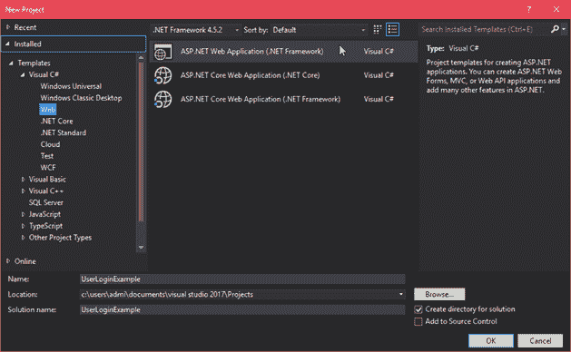
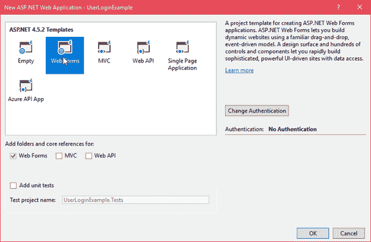
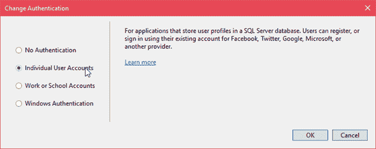
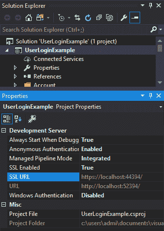
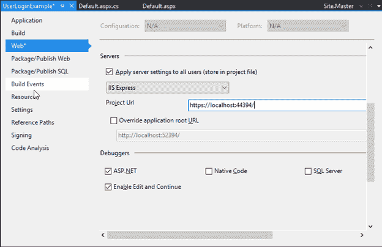
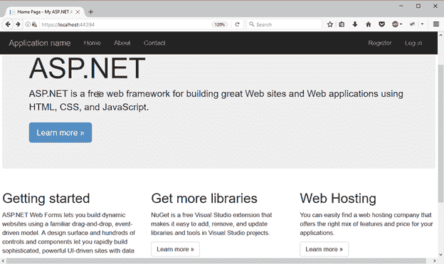
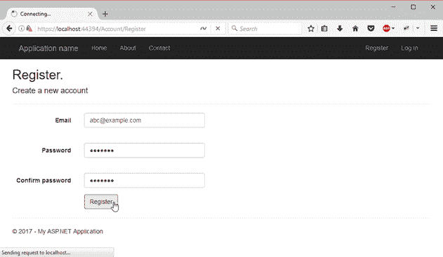
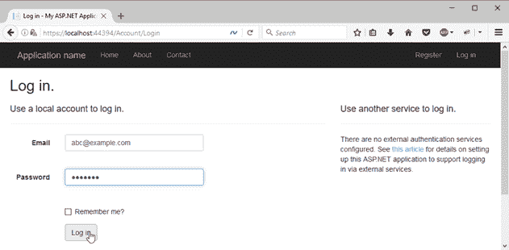
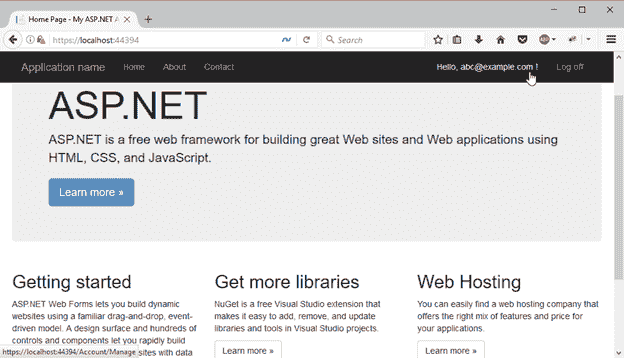
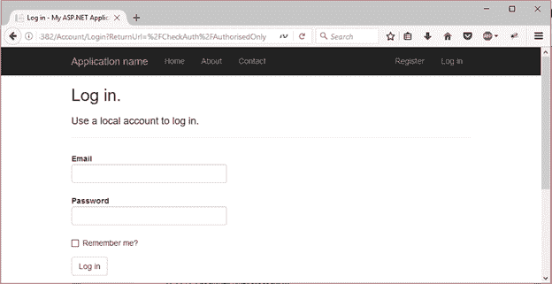

# ASP.NET MVC 认证

> 原文：<https://www.javatpoint.com/asp-net-mvc-authentication>

建议使 web 应用程序高度安全。网络上的 web 应用程序面临着安全问题和挑战。ASP.NET 提供了身份验证功能来处理这些问题，以便我们可以过滤用户来访问我们的应用程序。

我们可以在创建应用程序时为应用程序设置各种类型的身份验证。在应用程序制作过程中，MVC 要求包括以下内容的身份验证。



**不认证:**用于对应用设置不认证。它允许匿名用户访问。

**个人用户帐户:**为应用程序设置身份验证是最常用的方法。它用于设置单个用户访问应用程序的身份验证。

**工作或学校账号:**用于对用户进行活动目录、微软 Azure 活动目录等认证。我们可以为单个组织设置权限。

**Windows 身份验证:**主要用于内网应用。

**例**

让我们创建一个实现身份验证模块的 ASP.NET MVC 应用程序。该示例包括以下步骤。

* * *

## 创建一个 ASP.NET MVC 项目

选择文件菜单并创建新项目，提供项目名称并从给定的几个选项中选择应用程序类型。




选择模板



更改身份验证



单击“确定”后，它将创建一个类似如下的项目。



该项目具有默认结构，包含模型、视图和控制器的单个文件夹。**家庭控制器**为默认控制器；我们可以使用 **Ctrl+F5** 来执行这个项目。当运行到浏览器时，它将产生以下输出。



我们可以看到在应用程序的右上角有**注册**和**登录**链接。这些链接是可用的，因为我们在创建应用程序时更改了**身份验证类型**。现在这个应用程序将只允许注册用户。

除此之外，我们还可以在控制器级别设置身份验证。ASP.NET MVC 提供了可以应用于控制器和动作级别的注释。

* * *

## 认证注释

ASP.NET 提供了一个 **Authorize** 注释，可以应用于设置用户可访问性的动作。要创建控制器，右键单击**控制器**文件夹并选择控制器，它将向该文件夹添加一个新控制器。截图如下。



创建的控制器有一些默认代码，我们已经修改了这些代码来实现授权注释。我们的控制器名是 **CheckAuthController。**

### 检查身份验证控制器.cs

```cs
using System;
using System.Collections.Generic;
using System.Linq;
using System.Web;
using System.Web.Mvc;
namespace AuthenticateApplication.Controllers
{
    public class CheckAuthController : Controller
    {
        // GET: CheckAuth
        public ContentResult Index()
        {
            return Content("Hello, You are Guest.");
        }
        // GET: CheckAuth/AuthorisedOnly
        [Authorize]
        public ContentResult AuthorisedOnly()
        {
            return Content("You are registered user.");
        }
    }
}

```

通过从浏览器访问，如果我们使用**http://localhost:54382/CheckAuth，**它将产生以下输出。



它之所以有效，是因为它是公共可访问的，但另一个动作不是公共的。所以，当我们访问**http://localhost:54382/CheckAuth/authorised only**时，它会自动重定向到**登录**页面。这意味着只有注册用户才能访问它。

