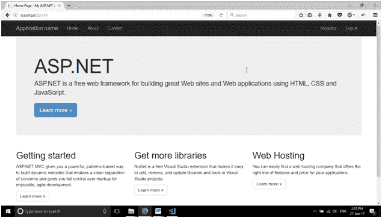
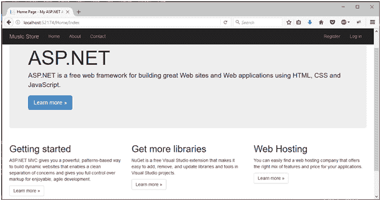
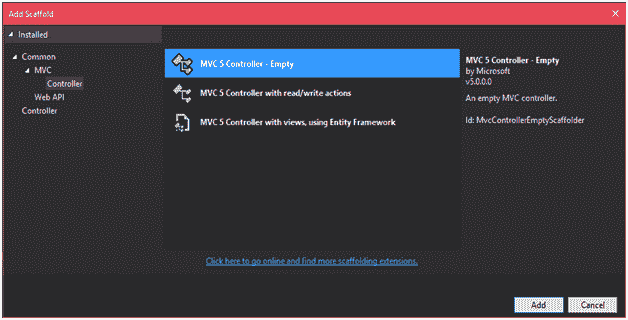
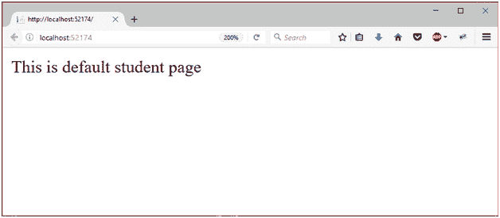
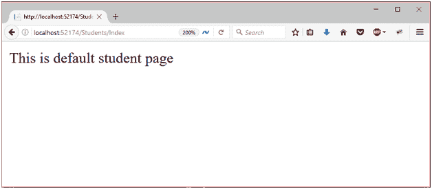

# ASP.NET MVC 路由

> 原文：<https://www.javatpoint.com/asp-net-mvc-routing>

在 MVC 中，路由是将浏览器请求映射到控制器动作并返回响应的过程。每个 MVC 应用程序都有默认 **HomeController** 的默认路由。我们可以为新创建的控制器设置自定义路由。

**路由图 cs** 文件用于设置应用程序的路由。最初它包含以下代码。

### // RouteConfig.cs

```

using System;
using System.Collections.Generic;
using System.Linq;
using System.Web;
using System.Web.Mvc;
using System.Web.Routing;
namespace MvcApplicationDemo
{
public class RouteConfig
    {
public static void RegisterRoutes(RouteCollection routes)
        {
            routes.IgnoreRoute("{resource}.axd/{*pathInfo}");
            routes.MapRoute(
                name: "Default",
                url: "{controller}/{action}/{id}",
                defaults: new { controller = "Home", action = "Index", id = UrlParameter.Optional }
            );
        }
    }
}

```

根据该设置文件，主控制器的索引操作将被视为默认操作。第一次，当应用程序运行时，它会产生以下输出。



如果我们看地址栏，它只包含 **localhost:52174** 。没有指定控制器和动作，因为 MVC 路由器从**路由器映射控制器**

如果我们在地址栏中显式输入控制器和动作名称，它将重定向到同一个动作。**localhost:52174/Home/Index**会对浏览器产生同样的输出。



现在，让我们创建一个新的控制器并将其配置到路由文件中。右键单击**控制器**文件夹，然后选择添加控制器。它会弹出一个窗口。选择一个空的控制器，就像我们在屏幕截图中做的那样。



这个控制器有一些源代码，用下面的代码覆盖它。

### //学生控制器. cs

```

using System.Web.Mvc;
namespace MvcApplicationDemo.Controllers
{
public class StudentsController : Controller
    {
public ContentResult Index()
        {
return Content("This is default student page");
        }
    }
}

```

为了在路由文件中配置这个控制器，我们在 **RouteConfig.cs** 文件中做了一些修改。代码如下。

### // RouteConfig.cs

```

using System;
using System.Collections.Generic;
using System.Linq;
using System.Web;
using System.Web.Mvc;
using System.Web.Routing;
namespace MvcApplicationDemo
{
public class RouteConfig
    {
public static void RegisterRoutes(RouteCollection routes)
        {
            routes.IgnoreRoute("{resource}.axd/{*pathInfo}");
            routes.MapRoute(
                name: "Students",
                url: "{controller}/{action}/{id}",
                defaults: new { controller = "Students", action = "Index", id = UrlParameter.Optional }
            );
        }
    }
}

```

该应用程序为**本地主机:52174** 和**本地主机:52174/学生/索引**生成相同的输出

因为 MVC 框架的 route 模块将浏览器 URL 映射到项目的 RouteConfig 文件。

输出:



这与上面相同，即使我们已经明确输入了控制器和动作名称。

