# ASP.NET MVC 脚手架

> 原文:[https://www.javatpoint.com/asp-net-mvc-scaffolding](https://www.javatpoint.com/asp-net-mvc-scaffolding)

这是 ASP.NET 的一个特点，允许我们快速生成功能代码。它也被称为代码生成器框架。它预装在 Visual Studio 2013 及更高版本中。

要创建基本的 CRUD 应用程序，脚手架是最好的选择。它减少了时间量并生成干净的代码。这里，我们使用支架来开发 CRUD 应用程序。

**ASP.NET 原油示例**

这个例子由下面给出的几个步骤组成。

1.  **创建新项目**

从菜单栏选择**文件**菜单，选择**新建- >项目**。我们也可以使用快捷方式 **Ctrl+Shift+N** 创建一个新项目。

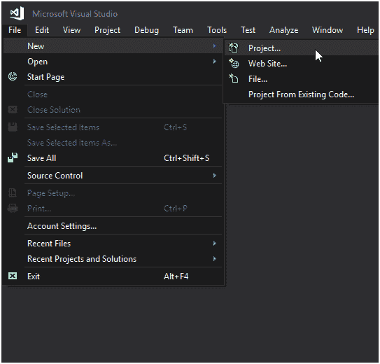

这将弹出一个包含项目的窗口。我们正在选择**ASP.NET 网络应用。**

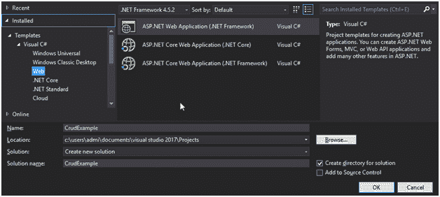

点击确定后，弹出一个新的模板窗口。这里，我们选择 **MVC** 模板，用于创建 MVC web 应用程序。

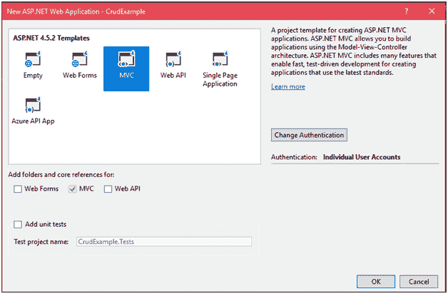

点击**确定**后会创建一个项目，并显示一个进度条，如下图所示。

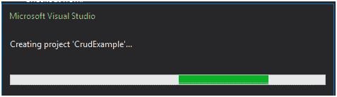

### CRUD 项目结构

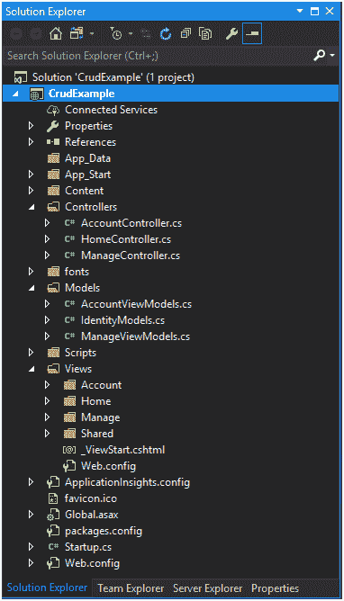

我们可以通过按下 **Ctrl+F5** 来运行这个应用程序。它将为浏览器生成一个默认的索引页面，如下所示。

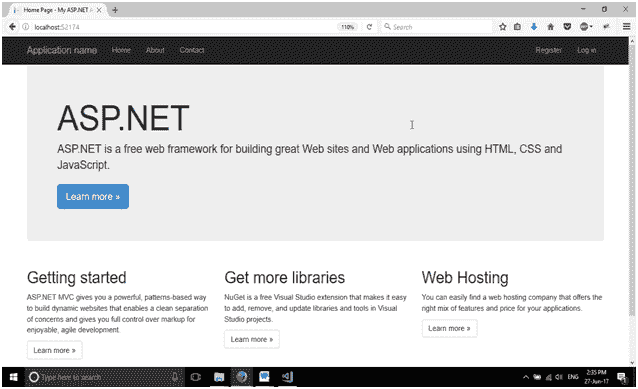

为了创建完整的 crud，我们需要在项目中添加模型、视图和控制器。这里，我们正在创建一个处理数据的模型。

15.  **创建新模型**

我们正在项目的**模型**文件夹中创建一个**学生**模型。右击模型文件夹，选择**添加- >类**，弹出对话框。通过提供名称来创建类。

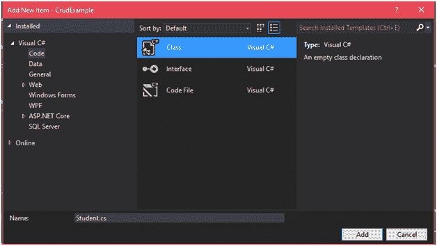

这个模型类有一些源代码，修改它的代码就像我们下面做的那样。

### // Student.cs

```
using System;
using System.Collections.Generic;
using System.ComponentModel.DataAnnotations;
using System.Linq;
using System.Web;
namespace CrudExample.Models
{
public class Student
    {
public int ID { get; set; }
        [Required]
public string Name { get; set; }
        [Required]
        [EmailAddress]
public string Email { get; set; }
        [Required]
public string Contact { get; set; }
    }
}

```

21.  **创建上下文类**

我们正在**模型**文件夹中创建另一个类，它用于与实体框架通信并执行数据库操作。这个类继承了 DbContext 类。

### //studentropic . cs

```
using System;
using System.Collections.Generic;
using System.Linq;
using System.Web;
using System.Data.Entity.ModelConfiguration.Conventions;
using System.Data.Entity;
namespace CrudExample.Models
{
public class StudentRecord : DbContext
    {
public DbSet Students { get; set; }
protected override void OnModelCreating(DbModelBuilder modelBuilder)
        {
            modelBuilder.Conventions.Remove<pluralizingtablenameconvention>();
        }
    }
}</pluralizingtablenameconvention> 
```

25.  **在项目中增加脚手架**

右键单击**控制器**文件夹，并添加脚手架，就像我们在屏幕拍摄中所做的那样。

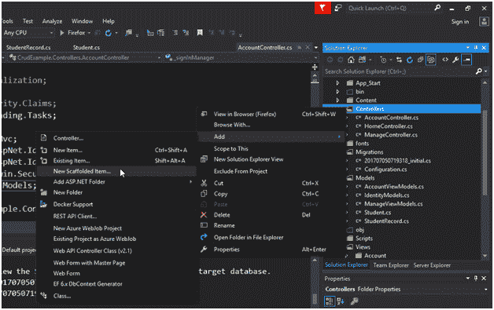

会弹出如下对话框。选择具有实体框架的控制器。

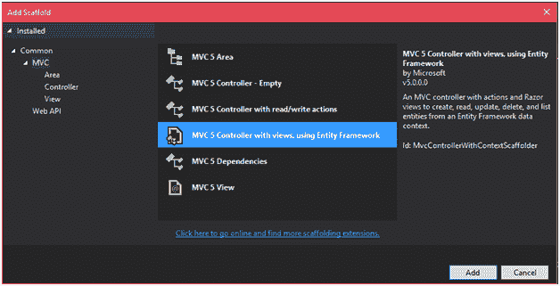

并点击添加按钮。它要求模型和上下文名称。填写条目，然后单击确定。

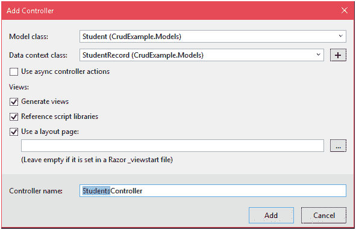

点击添加按钮后，会创建一个**学生控制器**控制器和一个**学生**文件夹。学生文件夹包含每个 CRUD 操作的网页。

### //学生控制器. cs

```
using System;
using System.Collections.Generic;
using System.Data;
using System.Data.Entity;
using System.Linq;
using System.Net;
using System.Web;
using System.Web.Mvc;
using CrudExample.Models;
namespace CrudExample.Controllers
{
public class StudentsController : Controller
    {
private StudentRecord db = newStudentRecord();
// GET: Students
public ActionResult Index()
        {
return View(db.Students.ToList());
        }
// GET: Students/Details/5
public ActionResult Details(int? id)
        {
if (id == null)
            {
return new HttpStatusCodeResult(HttpStatusCode.BadRequest);
            }
Student student = db.Students.Find(id);
if (student == null)
            {
return HttpNotFound();
            }
return View(student);
        }
// GET: Students/Create
public ActionResult Create()
        {
return View();
        }
// POST: Students/Create
// To protect from overposting attacks, please enable the specific properties you want to bind to, for 
// more details see https://go.microsoft.com/fwlink/?LinkId=317598.
        [HttpPost]
        [ValidateAntiForgeryToken]
public ActionResult Create([Bind(Include = "ID,Name,Email,Contact")] Student student)
        {
if (ModelState.IsValid)
            {
                db.Students.Add(student);
                db.SaveChanges();
return RedirectToAction("Index");
            }
return View(student);
        }
// GET: Students/Edit/5
public ActionResult Edit(int? id)
        {
if (id == null)
            {
return new HttpStatusCodeResult(HttpStatusCode.BadRequest);
            }
Student student = db.Students.Find(id);
if (student == null)
            {
return HttpNotFound();
            }
return View(student);
        }
// POST: Students/Edit/5
// To protect from overposting attacks, please enable the specific properties you want to bind to, for 
// more details see https://go.microsoft.com/fwlink/?LinkId=317598.
        [HttpPost]
        [ValidateAntiForgeryToken]
public ActionResult Edit([Bind(Include = "ID,Name,Email,Contact")] Student student)
        {
if (ModelState.IsValid)
            {
                db.Entry(student).State = EntityState.Modified;
                db.SaveChanges();
return RedirectToAction("Index");
            }
return View(student);
        }
// GET: Students/Delete/5
public ActionResult Delete(int? id)
        {
if (id == null)
            {
return new HttpStatusCodeResult(HttpStatusCode.BadRequest);
            }
Student student = db.Students.Find(id);
if (student == null)
            {
return HttpNotFound();
            }
return View(student);
        }
// POST: Students/Delete/5
        [HttpPost, ActionName("Delete")]
        [ValidateAntiForgeryToken]
public ActionResult DeleteConfirmed(int id)
        {
Student student = db.Students.Find(id);
            db.Students.Remove(student);
            db.SaveChanges();
return RedirectToAction("Index");
        }
protected override void Dispose(bool disposing)
        {
if (disposing)
            {
                db.Dispose();
            }
base.Dispose(disposing);
        }
    }
}

```

视图中的**学生**文件夹包含以下文件。

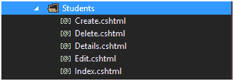

**Index.cshtml** 文件包含以下代码。

### // Index.cshtml

```
@model IEnumerable<scaffoldingTest.Models.Student>
@{
    ViewBag.Title = "Index";
}
<h2>Index</h2>
<p>
    @Html.ActionLink("Create New", "Create")
</p>
<table class="table">
<tr>
<th>
            @Html.DisplayNameFor(model => model.Name)
</th>
<th>
            @Html.DisplayNameFor(model => model.Email)
</th>
<th>
            @Html.DisplayNameFor(model => model.Contact)
</th>
<th></th>
</tr>
@foreach (var item in Model) {
<tr>
<td>
            @Html.DisplayFor(modelItem => item.Name)
</td>
<td>
            @Html.DisplayFor(modelItem => item.Email)
</td>
<td>
            @Html.DisplayFor(modelItem => item.Contact)
</td>
<td>
            @Html.ActionLink("Edit", "Edit", new { id=item.ID }) |
            @Html.ActionLink("Details", "Details", new { id=item.ID }) |
            @Html.ActionLink("Delete", "Delete", new { id=item.ID })
</td>
</tr>
}
</table>

```

输出:

右键点击 **Index.cshtml** 文件，选择“在浏览器中查看”，这将执行文件并产生以下输出。

### //索引文件

该索引文件用于显示学生记录。当前表为空，因此它不显示任何数据。

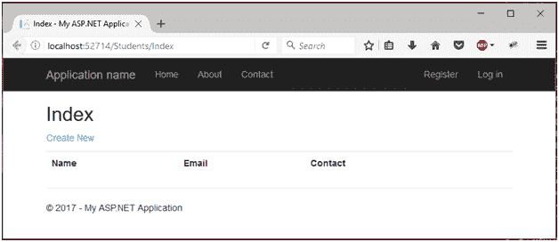

### 添加新学生

我们可以通过点击**新建**按钮来添加新学生。这将重定向到学生表单。

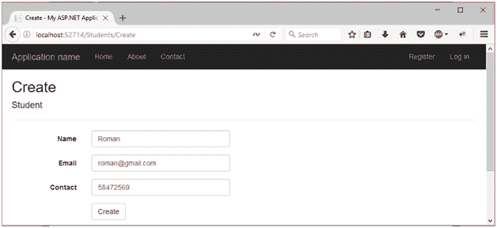

添加之后，我们又添加了两个条目，然后重定向回索引文件。现在，它包含三个学生记录。

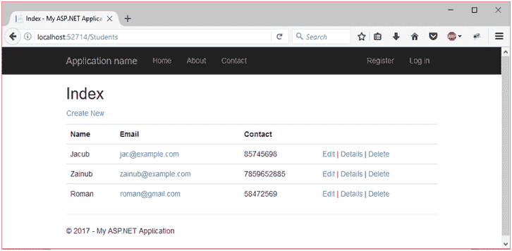

### 更新记录

我们可以通过点击**编辑**按钮来更新记录。这将重定向到更新表单。下面的截图显示了编辑页面。

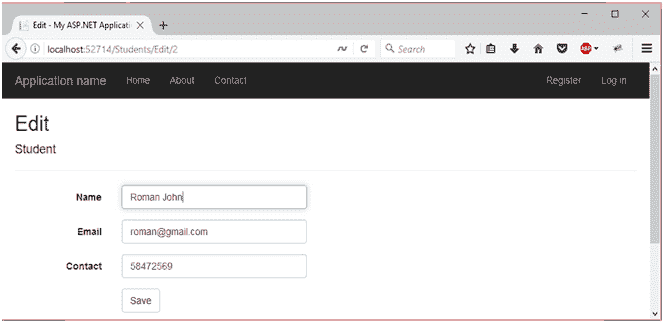

更新记录后索引页面如下所示:

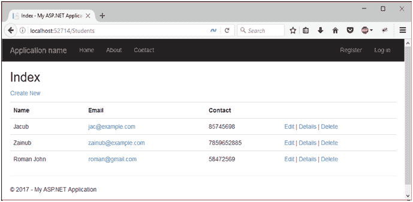

### 删除记录

我们只需点击提供的**删除**链接即可删除任何记录。让我们从表格中删除**罗曼·约翰**。将向用户显示一条确认消息以确保安全。

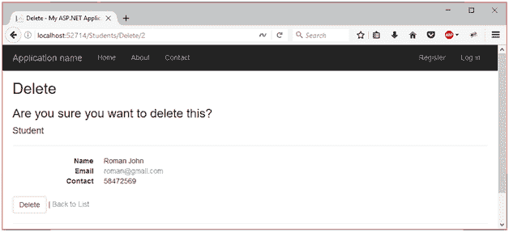

点击**删除**按钮后，重定向到包含剩余记录的索引页面。

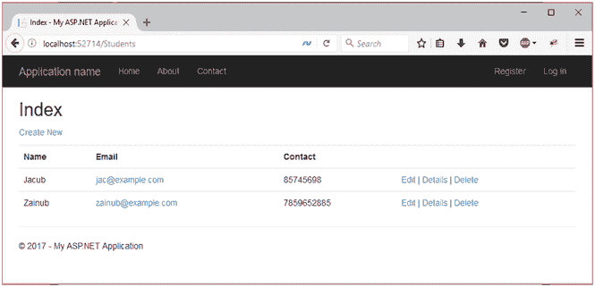

我们可以看到只有两条记录是存在的。