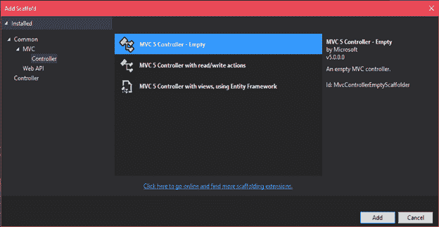
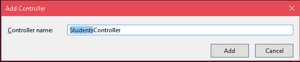
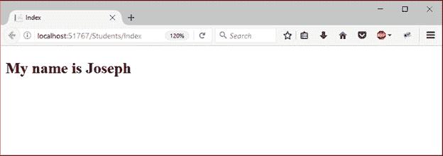

# ASP.NET 剃刀游戏攻略

> 原文：<https://www.javatpoint.com/asp-net-razor>

Razor 是一种标准的标记语法，允许我们将服务器代码嵌入到网页中。它使用自己的语法和关键字来生成视图。

如果网页中有服务器代码，服务器将首先执行该代码，然后向浏览器发送响应。它允许我们在视图页面中执行逻辑任务。我们可以在视图页面中创建表达式、循环和变量。

它简化了语法，易于学习和编码。该文件扩展名为 **.cshtml.**

### @字符

Razor 使用这个字符从 HTML 转换到 C#。当@ symbol 与 razor 语法一起使用时，它会转换为 Razor 特定的标记，否则会转换为普通的 C#。我们用它来启动单行表达式、单语句块或多语句块。

### 剃刀关键词

*   功能
*   继承
*   模型
*   部分
*   助手(ASP.NET 核心不支持。)

* * *

## 例子

让我们创建一个具有 Razor 语法的视图。右键点击**控制器**文件夹，选择**添加- >控制器**，会提示如下对话框。



为控制器提供一个名称。



点击添加按钮，这将创建一个控制器并添加以下代码。

**//studentcontroller . cs**

```cs

using System;
using System.Collections.Generic;
using System.Linq;
using System.Web;
using System.Web.Mvc;
namespace RazorViewExample.Controllers
{
    public class StudentsController : Controller
    {
        // GET: Students
        public ActionResult Index()
        {
            return View();
        }
    }
}

```

**// Index.cshtml**

```cs

@{
    Layout = null;
    var name = "Joseph";
}
<!DOCTYPE html>   
<html>
<head>
    <meta name="viewport" content="width=device-width" />
    <title>Index</title>
</head>
<body>
    <h2>My name is @name </h2>
</body>
</html>

```

它向浏览器生成以下输出。

