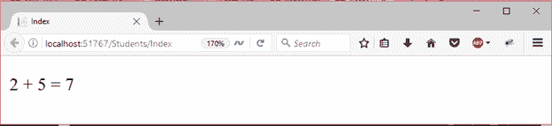

# ASP.NET 剃刀代码表达式

> 原文：<https://www.javatpoint.com/asp-net-razor-code-expressions>

Razor 语法广泛用于 C#编程语言。要将 C#代码写入视图，请使用@ (at)符号启动 Razor 语法。我们可以用它来编写单行表达式或多行代码块。让我们看看如何在视图页面中使用 C#代码。

下面的示例演示代码表达式。

**// Index.cshtml**

```

@{
    Layout = null;
    var coursename = "Java Collection";
}
<!DOCTYPE html> 
<html>
<head>
    <meta name="viewport" content="width=device-width" />
    <title>Index</title>
</head>
<body>
    <h2>I want to learn @coursename </h2>
</body>
</html>

```

产生以下输出。

输出:


* * *

## 隐式剃刀表达式

隐式 Razor 表达式以@ (at)字符开头，后跟 C#代码。下面的示例演示了隐式表达式。

**// Index.cshtml**

```

@{
    Layout = null;
}
<!DOCTYPE html>  
<html>
<head>
    <meta name="viewport" content="width=device-width" />
    <title>Index</title>
</head>
<body>
    <p>Current Time is: @DateTime.Now.ToString("T")</p>
</body>
</html>

```

它产生以下输出。

输出:


* * *

## 显式剃刀表达式

显式 Razor 表达式由带平衡括号的@ (at)字符组成。在下面的示例中，表达式用括号括起来，以便安全执行。如果没有用括号括起来，它将抛出一个错误。

我们可以使用显式表达式将文本与表达式连接起来。

**// Index.cshtml**

```

@{
    Layout = null;
}
<!DOCTYPE html>  
<html>
<head>
    <meta name="viewport" content="width=device-width" />
    <title>Index</title>
</head>
<body>
    <p>2 + 5 = @(2+5)</p>
</body>
</html>

```

它产生以下输出。

输出:



* * *

## 剃刀表达式编码

Razor 提供表达式编码，以避免恶意代码和安全风险。在这种情况下，如果用户输入恶意脚本作为输入，razor 引擎会对脚本进行编码并呈现为 HTML 输出。

这里，我们在视图页面中没有使用剃刀语法。

**// Index.cshtml**

```

@{
    Layout = null;
}
<!DOCTYPE html>
<html>
<head>
    <meta name="viewport" content="width=device-width" />
    <title>Index</title>
</head>
<body>
    Html.Raw("<script>alert('System Failure!')</script>")
</body>
</html>

```

它产生以下输出。

输出:


* * *

在下面的例子中，我们正在编码 JavaScript 脚本。

**// Index.cshtml**

```

@{
    Layout = null;
}
<!DOCTYPE html>
<html>
<head>
    <meta name="viewport" content="width=device-width" />
    <title>Index</title>
</head>
<body>
    @("<script>alert('this is alert box')</script>")
</body>
</html>

```

现在，它产生以下输出。

输出:


这次 razor 引擎对脚本进行编码，并以简单的 HTML 字符串形式返回。