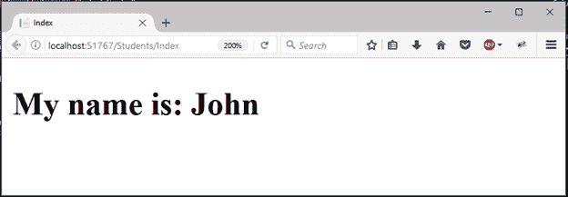
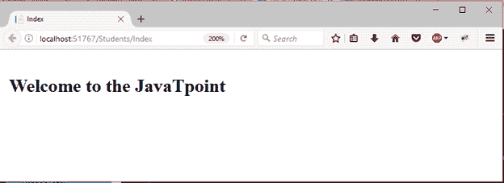
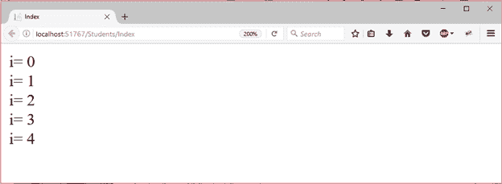

# ASP.NET 剃刀代码块

> 原文:[https://www.javatpoint.com/asp-net-razor-code-blocks](https://www.javatpoint.com/asp-net-razor-code-blocks)

代码块用于封装 C#代码语句。它以@ (at)字符开头，用{}括起来(大括号)。与表达式不同，代码块中的 C#代码不会被呈现。代码块中的默认语言是 C#，但是我们可以转换回 HTML。代码块中的 HTML 将呈现为 HTML。

* * *

## 例子

**// Index.cshtml**

```

@{
    Layout = null;
    var name = "John";
}
<!DOCTYPE html>
<html>
<head>
    <meta name="viewport" content="width=device-width" />
    <title>Index</title>
</head>
<body>
    <h2>My name is: @name </h2>
</body>
</html>

```

它产生以下输出。



* * *

## 隐式转换

C#是 Razor 代码块中的默认语言。在代码块中编写的 HTML 呈现为 HTML，这称为隐式转换。Razor 代码阻止 HTML 代码的隐式转换，并呈现给视图页面。

在下面的代码中，编写了 HTML，并且执行时没有错误。

**// Index.cshtml**

```

@{
    Layout = null;
}
<!DOCTYPE html>
<html>
<head>
    <meta name="viewport" content="width=device-width" />
    <title>Index</title>
</head>
<body>
@{
    var name = "JavaTpoint";
    <h4>Welcome to the @name </h4>
}
</body>
</html>

```

它产生以下输出。



* * *

## 显式分隔转换

有时，当我们定义一个应该呈现 HTML 的代码块的一个子部分时，用 Razor **<文本>** 标签包围要呈现的字符。

授权使用<text>标签。否则，它会引发编译时错误。请参见以下代码。</text>

**// Index.cshtml**

```

@{
    Layout = null;
}
<!DOCTYPE html>
<html>
<head>
    <meta name="viewport" content="width=device-width" />
    <title>Index</title>
</head>
<body>
@for (var i = 0; i < 5; i++)
{
    <text>i= @i </text> <br/>
}
</body>
</html>

```

它产生以下输出。

