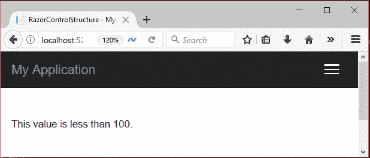
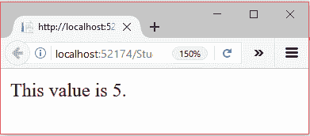
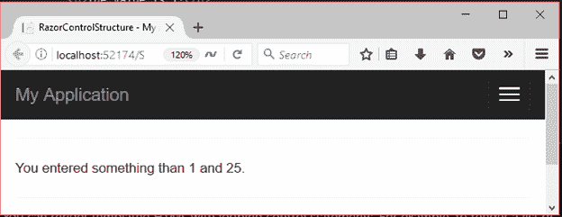
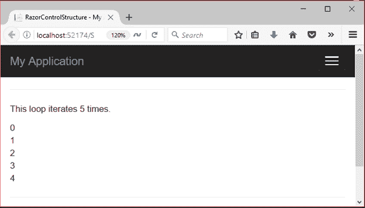

# ASP.NET 剃刀控制结构

> 原文：<https://www.javatpoint.com/asp-net-razor-control-structures>

控制结构是用于控制程序流的控制语句。C#编程语言使用 **if，else，if else，switch，for，foreach，而**在应用程序中执行条件逻辑。

Razor 引擎支持视图文件中的所有这些控件。让我们看一些使用 razor 语法实现控制结构的例子。

* * *

## @if

**//razorcontrolstructure . cshtml**

```

@{
    ViewBag.Title = "RazorControlStructure";
    var value = 20;
}
<hr />
@if (value > 100)
{
    <p>This value is greater than 100.</p>
}
else
{ <p>This value is less than 100.</p>
}

```

输出:

它产生以下输出。



* * *

## 否则和否则如果

在 else 和 else if 语句中不需要 **@ (at)** 符号。

**//razorcontrolstructure . cshtml**

```

@{
    Layout = null;
    ViewBag.Title = "RazorControlStructure";
    var value = 5;
}
@if (value > 5)
{
    <p>This value is greater than 5</p>
}
else if (value == 5)
{
    <p>This value is 5.</p>
}
else
{
    <p>This value is less than 5.</p>
}

```

输出:



* * *

## @开关示例

**//razorcontrolstructure . cshtml**

```

@{
    ViewBag.Title = "RazorControlStructure";
    var value = 20;
}
<hr />
@switch (value)
{
    case 1:
        <p>You Entered 1</p>
        break;
    case 25:
        <p>You Entered 25</p>
        break;
    default:
        <p>You entered something than 1 and 25.</p>
        break;
}

```

输出:



* * *

## @for

**//razorcontrolstructure . cshtml**

```

@{
    ViewBag.Title = "RazorControlStructure";
    var value = 5;
}
<hr />
<p>This loop iterates 5 times.</p>
@for (var i = 0; i < value; i++)
{
        <text>@i</text> <br/>
}

```

输出:

它产生以下输出。

