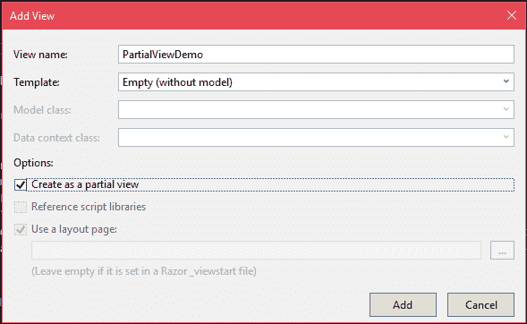
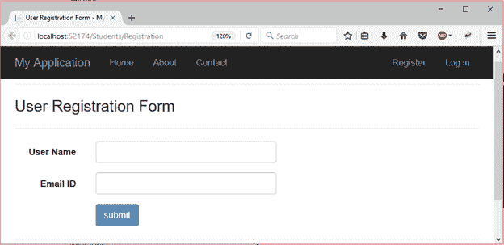
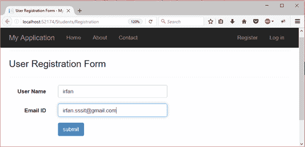
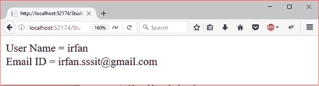

# ASP.NET·雷泽局部视图

> 原文：<https://www.javatpoint.com/asp-net-razor-partial-views>

ASP.NET 提供了一个创建可重用组件的工具，这样就可以在 web 应用程序中共享这些组件。这些可共享的组件被称为局部视图。

局部视图是可以插入父视图的视图。该视图文件的扩展名与其他视图的扩展名相同 **.cshtml.**

## 我们什么时候应该使用局部视图？

当拥有一个包含几个逻辑部分的大视图文件时，我们可以将其分解成更小的组件，这些组件可以进一步呈现为部分视图。

#### 注:- Razor 视图适用于 DRY(不要重复自己)概念。

ASP.NET 提供了以下两种方法来呈现局部视图。

| 方法 | 描述 | 重载方法 |
| 部分(字符串) | 它将指定的部分视图呈现为 HTML 编码的字符串。 | 部分(字符串，对象)部分(字符串，对象，视图数据字典)部分(字符串，视图数据字典) |
| 渲染部分(字符串) | 它通过使用指定的 HTML 帮助程序呈现指定的部分视图。 | 渲染部分(字符串，对象)渲染部分(字符串，对象，视图数据字典)渲染部分(字符串，视图数据字典) |

这两种方法都用于呈现局部视图，只是 render partial()具有 void 返回类型。RenderPartial()的性能优于 Partial()。

* * *

## 创建局部视图

要创建局部视图，右键单击**视图**文件夹或其子文件夹，然后添加视图，如下图所示。



添加后，它会创建一个不包含任何生产代码的文件**。**

我们有一个包含一些 HTML 源代码的视图。我们想在这个文件中渲染创建的局部视图。让我们看看如何做到这一点？

我们的视图文件包含以下源代码。

**// Registration.cshtml**

```
@{
    ViewBag.Title = "User Registration Form";
}
<hr />
<h3>User Registration Form</h3>
<hr />
<div class="form-horizontal">
    @using (Html.BeginForm("Registration","Students"))
    {
        <div class="form-group">
            @Html.Label("User Name", new { @class = "control-label col-sm-2" })
            <div class="col-sm-10">
                @Html.TextBox("username", null, new { @class = "form-control" })
            </div>
        </div>
        @Html.Partial("PartialViewDemo") 
        <div class="form-group">
            <div class="col-sm-2"></div>
            <div class="col-sm-10">
                <input type="submit" value="submit" class="btn btn-primary" />
            </div>
        </div>
    }
</div>

```

**PartialViewDemo.cshtml**

```
<div class="form-group">
    @Html.Label("Email ID", new { @class = "control-label col-sm-2" })
    <div class="col-sm-10">
        @Html.TextBox("email", null, new { @class = "form-control" })
    </div>
</div>

```

注册页面包含单个文本框组件，部分视图演示页面包含第二个文本框。

**@Html。Partial()** 方法用于将部分视图渲染到注册视图。

输出:

当我们运行注册页面时，它会产生以下输出。



我们可以以单一形式提交。



此表单将所有值提交给下面屏幕截图中显示的操作。

