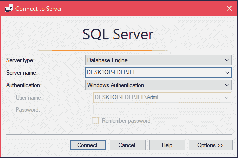
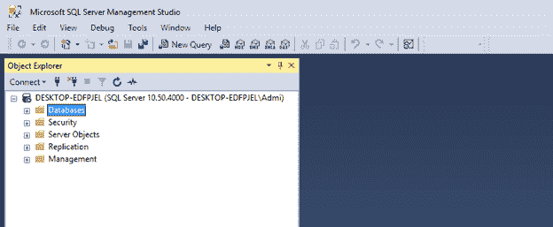
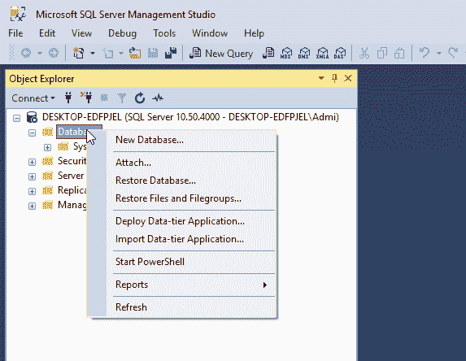
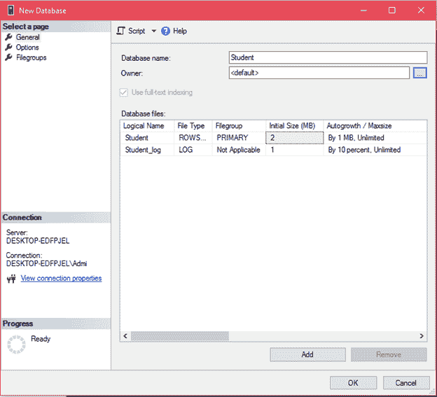
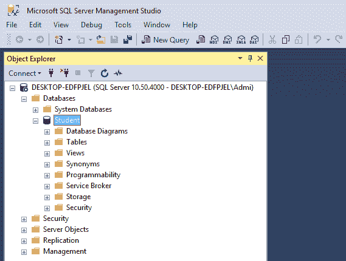
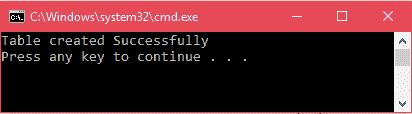
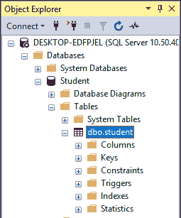
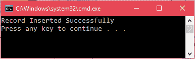
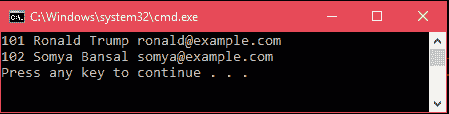
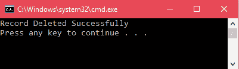

# ADO.NET SQL 服务器连接

> 原文：<https://www.javatpoint.com/ado-net-sql-server-connectivity>

要连接到 SQL Server，我们必须在系统中安装它。我们正在使用微软的 SQL Server 管理工具来连接到 SQL Server。我们可以用这个工具来处理数据库。现在，按照以下步骤连接到 SQL Server。

1.  **打开微软 SQL Server 管理工具**

它将提示数据库连接。提供服务器名称和身份验证。



成功连接后，它会显示以下窗口。



6.  **创建数据库**

现在，通过选择数据库选项然后右键单击它来创建数据库。它会弹出一个选项菜单，并提供几个选项。



点击**新建数据库**，系统会询问数据库名称。在这里，我们创建了一个**学生**数据库。



点击确定按钮，然后它将创建一个数据库，我们可以在下面截图的左窗口看到。



13.  **建立连接并创建表格**

创建数据库后，现在，让我们使用下面的 C# 代码创建一个表。在这个源代码中，我们使用创建的**学生**数据库进行连接。

在 visual studio 2017 中，我们创建了一个. NET 控制台应用程序项目，其中包含以下 C# 代码。

**// Program.cs**

```cs

using System;
using System.Data.SqlClient;
namespace AdoNetConsoleApplication
{
    class Program
    {
        static void Main(string[] args)
        {
            new Program().CreateTable();
        }
        public void CreateTable()
        {
            SqlConnection con = null;
            try
            {
                // Creating Connection
                con = new SqlConnection("data source=.; database=student; integrated security=SSPI");
                // writing sql query
                SqlCommand cm = new SqlCommand("create table student(id int not null, 
				name varchar(100), email varchar(50), join_date date)", con);
                // Opening Connection
                con.Open();
                // Executing the SQL query
                cm.ExecuteNonQuery();
                // Displaying a message
                Console.WriteLine("Table created Successfully");
            }
            catch (Exception e)
            {
                Console.WriteLine("OOPs, something went wrong."+e);
            }
            // Closing the connection
            finally
            {
                con.Close();
            }
        }
    }
}

```

使用 **Ctrl+F5** 执行该代码。执行后，它会向控制台显示如下消息。



我们还可以在微软的 SQL Server 管理工作室中看到创建的表。它显示了如下所示的创建的表。



看，我们这里有一张桌子。最初，这个表是空的，所以我们需要向其中插入数据。

23.  **将数据插入表格**

**// Program.cs**

```cs

using System;
using System.Data.SqlClient;
namespace AdoNetConsoleApplication
{
    class Program
    {
        static void Main(string[] args)
        {
            new Program().CreateTable();
        }
        public void CreateTable()
        {
            SqlConnection con = null;
            try
            {
                // Creating Connection
                con = new SqlConnection("data source=.; database=student; integrated security=SSPI");
                // writing sql query
                SqlCommand cm = new SqlCommand("insert into student
				(id, name, email, join_date)values('101','Ronald Trump','ronald@example.com','1/12/2017')", con);
                // Opening Connection
                con.Open();
                // Executing the SQL query
                cm.ExecuteNonQuery();
                // Displaying a message
                Console.WriteLine("Record Inserted Successfully");
            }
            catch (Exception e)
            {
                Console.WriteLine("OOPs, something went wrong."+e);
            }
            // Closing the connection
            finally
            {
                con.Close();
            }
        }
    }
}

```

使用 **Ctrl+F5** 执行该代码，将显示以下输出。



28.  **检索记录**

在这里，我们将检索插入的数据。请看下面的 C# 代码。

**// Program.cs**

```cs

using System;
using System.Data.SqlClient;
namespace AdoNetConsoleApplication
{
    class Program
    {
        static void Main(string[] args)
        {
            new Program().CreateTable();
        }
        public void CreateTable()
        {
            SqlConnection con = null;
            try
            {
                // Creating Connection
                con = new SqlConnection("data source=.; database=student; integrated security=SSPI");
                // writing sql query
                SqlCommand cm = new SqlCommand("Select * from student", con);
                // Opening Connection
                con.Open();
                // Executing the SQL query
                SqlDataReader sdr = cm.ExecuteReader();
                // Iterating Data
                while (sdr.Read())
                {
                    Console.WriteLine(sdr["id"] + " " + sdr["name"]+" "+sdr["email"]); // Displaying Record
                }
            }
            catch (Exception e)
            {
                Console.WriteLine("OOPs, something went wrong.\n"+e);
            }
            // Closing the connection
            finally
            {
                con.Close();
            }
        }
    }
}

```

通过 **Ctrl+F5** 执行此代码，将产生以下结果。这会显示两条记录，一条是我们手动插入的。

输出:



35.  **删除记录**

本次**学生**表包含两条记录。下面的 C# 代码从表中删除了一行。

**// Program.cs**

```cs

using System;
using System.Data.SqlClient;
namespace AdoNetConsoleApplication
{
    class Program
    {
        static void Main(string[] args)
        {
            new Program().CreateTable();
        }
        public void CreateTable()
        {
            SqlConnection con = null;
            try
            {
                // Creating Connection
                con = new SqlConnection("data source=.; database=student; integrated security=SSPI");
                // writing sql query
                SqlCommand cm = new SqlCommand("delete from student where id = '101'", con);
                // Opening Connection
                con.Open();
                // Executing the SQL query
                cm.ExecuteNonQuery();
                Console.WriteLine("Record Deleted Successfully");
            }
            catch (Exception e)
            {
                Console.WriteLine("OOPs, something went wrong.\n"+e);
            }
            // Closing the connection
            finally
            {
                con.Close();
            }
        }
    }
}

```

输出:

它显示以下输出。



我们可以通过使用 SqlDataReader 检索数据来验证它。