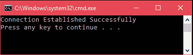

# ADO.NET SqlConnection 类

> 原文:[https://www.javatpoint.com/ado-net-connection](https://www.javatpoint.com/ado-net-connection)

它用于建立到 SQL Server 数据库的开放连接。它是一个密封的类，因此不能被继承。SqlConnection 类将 SqlDataAdapter 和 SqlCommand 类一起使用，以提高连接到 Microsoft SQL Server 数据库时的性能。

即使超出范围，连接也不会显式关闭。因此，必须通过调用 close()方法显式关闭连接。

## SqlConnection 签名

```

public sealed class SqlConnection : System.Data.Common.DbConnection, ICloneable, IDisposable

```

### SqlConnection 构造函数

| 构造器 | 描述 |
| SqlConnection() | 它用于初始化 SqlConnection 类的新实例。 |
| SqlConnection(字符串)0 | 它用于初始化 SqlConnection 类的新实例，并将连接字符串作为参数。 |
| SqlConnection(字符串，SqlCredential) | 它用于初始化 SqlConnection 类的新实例，该实例接受两个参数。首先是连接字符串，其次是 sql 凭据。 |

### SqlConnection 方法

| 方法 | 描述 |
| 开始时间() | 它用于启动数据库事务。 |
| 更改数据库(字符串) | 它用于更改打开的 SqlConnection 的当前数据库。 |
| 更改密码（字符串，字符串） | 它会为连接字符串中指示的用户更改 SQL Server 密码。 |
| 关闭() | 它用于关闭与数据库的连接。 |
| CreateCommand() | 它在指定的事务中登记为分布式事务。 |
| GetSchema（） | 它返回此 SqlConnection 数据源的架构信息。 |
| 打开() | 它用于打开数据库连接。 |
| ResetStatistics() | 如果启用了统计信息收集，它将重置所有值。 |

* * *

## SqlConnection 示例

现在，让我们创建一个与 SQL Server 建立连接的示例。我们已经创建了一个**学生**数据库，并将使用它进行连接。请看下面的 C#代码。

```

using (SqlConnection connection = new SqlConnection(connectionString))  
{  
  connection.Open();       
}

```

**使用**块自动关闭连接。我们不需要显式调用 close()方法，使用块的**在代码退出块时隐式地为我们这样做。**

**// Program.cs**

```

using System;
using System.Data.SqlClient;
namespace AdoNetConsoleApplication
{
    class Program
    {
        static void Main(string[] args)
        {
            new Program().Connecting();
        }
        public void Connecting()
        {
            using (
                     // Creating Connection
                     SqlConnection con = new SqlConnection("data source=.; database=student; integrated security=SSPI")
                 )
            {
                con.Open();
                Console.WriteLine("Connection Established Successfully");
            }
        }
    }
}

```

输出:



什么，如果我们不使用**使用**块。

如果我们不使用 block 来创建连接，我们必须显式关闭连接。在下面的例子中，我们使用了 try-block 而不是 block。

**// Program.cs**

```

using System;
using System.Data.SqlClient;
namespace AdoNetConsoleApplication
{
    class Program
    {
        static void Main(string[] args)
        {
            new Program().Connecting();
        }
        public void Connecting()
        {
            SqlConnection con = null;
            try
            {
                // Creating Connection
                con = new SqlConnection("data source=.; database=student; integrated security=SSPI");
                con.Open();
                Console.WriteLine("Connection Established Successfully");
            }
            catch (Exception e)
            {
                Console.WriteLine("OOPs, something went wrong.\n"+e);
            }
            finally
            {   // Closing the connection
                con.Close();
            }
        }
    }
}

```

输出:

