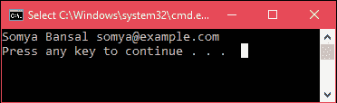

# ADO.NET SqlCommand 类

> 原文：<https://www.javatpoint.com/ado-net-command>

此类用于存储和执行 SQL Server 数据库的 SQL 语句。它是一个密封的类，因此不能被继承。

## SqlCommand 签名

```cs
public sealed class SqlCommand : System.Data.Common.DbCommand, ICloneable, IDisposable

```

### 构造器

此类提供以下构造函数。

| 构造器 | 描述 |
| SqlCommand（） | 它用于初始化 SqlCommand 类的新实例。 |
| SqlCommand（String） | 它用于用字符串参数初始化 SqlCommand 类的新实例。 |
| SqlCommand(字符串，SqlConnection) | 它用于初始化 SqlCommand 类的新实例。它需要两个参数，第一个是查询字符串，第二个是连接字符串。 |
| SqlCommand(字符串、SqlConnection、SqlTransaction) | 它用于初始化 SqlCommand 类的新实例。它分别采用三个参数:查询、连接和事务字符串。 |
| SqlCommand(字符串、SqlConnection、SqlTransaction、sqlcommandcolumnecryptionsetting) | 它使用指定的命令文本、连接、事务和加密设置初始化 SqlCommand 类的新实例。 |

### 方法

| 方法 | 描述 |
| BeginExecuteNonQuery() | 它用于启动此 SQL 命令描述的 SqL 语句的异步执行。 |
| 取消() | 它试图取消 SqlCommand 的执行。 |
| 克隆() | 它创建一个新的 SqlCommand 对象，该对象是当前实例的副本。 |
| CreateParameter() | 它创建了一个新的 SqlParameter 对象实例。 |
| Reader() | 它用于将命令文本发送到连接，并构建一个 SqlDataReader。 |
| ExecuteXmlReader() | 它用于将命令文本发送到连接，并构建一个 XmlReader 对象。 |
| ExecuteScalar（） | 它执行查询并返回结果集中第一行的第一列。其他列或行被忽略。 |
| 准备() | 它用于通过使用 SQL Server 实例来创建命令的准备版本。 |
| ResetCommandTimeout() | 它用于将 CommandTimeout 属性重置为默认值。 |

* * *

## 例子

在本例中，我们正在创建一个 SqlCommand 实例并执行一条 SQL 语句。

**// Program.cs**

```cs
using System;
using System.Data.SqlClient;
namespace AdoNetConsoleApplication
{
    class Program
    {
        static void Main(string[] args)
        {
            new Program().CreateTable();
        }
        public void CreateTable()
        {
            SqlConnection con = null;
            try
            {
                // Creating Connection
                con = new SqlConnection("data source=.; database=student; integrated security=SSPI");
                // writing sql query
                SqlCommand cm = new SqlCommand("select * from student", con);
                // Opening Connection
                con.Open();
                // Executing the SQL query
                SqlDataReader sdr = cm.ExecuteReader();
                while (sdr.Read())
                {
                    Console.WriteLine(sdr["name"]+" "+ sdr["email"]);
                }
            }
            catch (Exception e)
            {
                Console.WriteLine("OOPs, something went wrong." + e);
            }
            // Closing the connection
            finally
            {
                con.Close();
            }
        }
    }
}

```

输出:

结合 **Ctrl+F5** 执行该程序，将产生如下输出。



它打印学生的姓名和电子邮件。