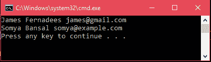

# ADO.NET sqldata reader 类

> 原文:[https://www.javatpoint.com/ado-net-datareader](https://www.javatpoint.com/ado-net-datareader)

此类用于从 SQL Server 数据库中读取数据。它从一个 SQL Server 数据库中读取只读的行流中的数据。它是密封类，因此不能被继承。它继承了 DbDataReader 类并实现了 IDisposable 接口。

## SqlDataReader 签名

```

public class SqlDataReader : System.Data.Common.DbDataReader, IDisposable

```

### SqlDataReader 属性

| 财产 | 描述 |
| 关系 | 它用于获取与 SqlDataReader 关联的 SqlConnection。 |
| 深度 | 它用于获取一个值，该值指示当前行的嵌套深度。 |
| 字段计数 | 它用于获取当前行中的列数。 |
| 哈斯洛 | 它用于获取一个值，该值指示 SqlDataReader 是否包含一行或多行。 |
| 属性 | 它用于检索一个布尔值，该值指示指定的 SqlDataReader 实例是否已关闭。 |
| 项目[字符串] | 它用于在给定列名的情况下，以其本机格式获取指定列的值。 |
| 项目[Int32] | 它用于在给定列序号的情况下，以指定列的本机格式获取指定列的值。 |
| 记录已受影响 | 它用于获取通过执行 Transact-SQL 语句而更改、插入或删除的行数。 |
| VisibleFieldCount | 它用于获取 SqlDataReader 中未隐藏的字段数量。 |

### 方法

| 方法 | 描述 |
| 关闭() | 它用于关闭 SqlDataReader 对象。 |
| GetBoolean（Int32） | 它用于以布尔值的形式获取指定列的值。 |
| 位元组(Int32) | 它用于获取指定列的字节值。 |
| GetChar(Int32) | 它用于以单个字符的形式获取指定列的值。 |
| GetDateTime（Int32） | 它用于将指定列的值作为 DateTime 对象获取。 |
| get time(int 32) | 它用于以十进制对象的形式获取指定列的值。 |
| get ul(int 32) | 它用于以双精度浮点数的形式获取指定列的值。 |
| GetFloat(Int32) | 它用于以单精度浮点数的形式获取指定列的值。 |
| GetName（Int32） | 它用于获取指定列的名称。 |
| GetSchemaTable() | 它用于获取描述 SqlDataReader 的列元数据的数据表。 |
| GetValue（Int32） | 它用于以本机格式获取指定列的值。 |
| 获取值(对象[]) | 它用于用当前行的列值填充对象数组。 |
| NextResult() | 它用于在读取 SQL 语句的结果时获得下一个结果。 |
| 已读() | 它用于从 SQL Server 数据库中读取记录。 |

要创建一个 SqlDataReader 实例，我们必须调用 SqlCommand 对象的 ExecuteReader 方法。

* * *

## 例子

在下面的程序中，我们使用 SqlDataReader 从 SQL Server 获取数据。下面给出了一个 C#代码。

**// Program.cs**

```

using System;
using System.Data.SqlClient;
namespace AdoNetConsoleApplication
{
    class Program
    {
        static void Main(string[] args)
        {
            new Program().GetData();
        }
        public void GetData()
        {
            SqlConnection con = null;
            try
            {
                // Creating Connection
                con = new SqlConnection("data source=.; database=student; integrated security=SSPI");
                // writing sql query
                SqlCommand cm = new SqlCommand("select * from student", con);
                // Opening Connection
                con.Open();
                // Executing the SQL query
                SqlDataReader sdr = cm.ExecuteReader();
                while (sdr.Read())
                {
                    Console.WriteLine(sdr["name"]+" "+ sdr["email"]);
                }
            }
            catch (Exception e)
            {
                Console.WriteLine("OOPs, something went wrong." + e);
            }
            // Closing the connection
            finally
            {
                con.Close();
            }
        }
    }
}

```

输出:

结合 **Ctrl+F5** 执行该程序，将产生如下输出。

