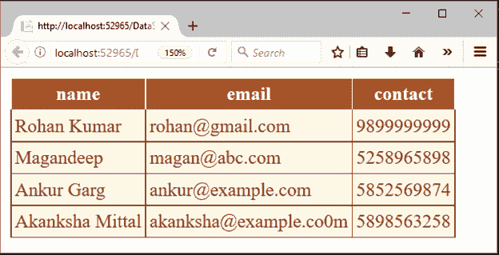

# 阿多.NET 数据适配器

> 哎哎哎:# t0]https://www . javatppoint . com/ado-net-data adapter

数据适配器作为数据集和数据源之间的桥梁来检索数据。数据适配器是一个表示一组 SQL 命令和一个数据库连接的类。它可用于填充数据集和更新数据源。

## 数据适配器类签名

```
public class DataAdapter : System.ComponentModel.Component, System.Data.IDataAdapter

```

### 数据适配器构造函数

| 构造器 | 描述 |
| DataAdapter() | 它用于初始化数据适配器类的新实例。 |
| DataAdapter(数据适配器) | 它用于从相同类型的现有对象初始化数据适配器类的新实例。 |

### 方法

| 方法 | 描述 |
| CloneInternals() | 它用于创建此数据适配器实例的副本。 |
| 排列(布尔型) | 它用于释放数据适配器使用的非托管资源。 |
| 填充(数据集) | 它用于在数据集中添加行，以匹配数据源中的行。 |
| 填充模式(数据集、模式类型、字符串、标识符) | 它用于将数据表添加到指定的数据集。 |
| GetFillParameters() | 它用于获取用户在执行 SQL SELECT 语句时设置的参数。 |
| ResetFillLoadOption() | 它用于将 FillLoadOption 重置为默认状态。 |
| shoulserializeacceptchangesduringfill() | 它确定 AcceptChangesDuringFill 属性是否应该持久化。 |
| ShouldSerializeFillLoadOption() | 它确定 FillLoadOption 属性是否应该持久化。 |
| ShouldSerializeTableMappings() | 它确定一个或多个 DataTableMapping 对象是否存在。 |
| 更新(数据集) | 它用于调用相应的 INSERT、UPDATE 或 DELETE 语句。 |

* * *

## 例子

**// DataSetDemo.aspx**

```
<%@ Page Language="C#" AutoEventWireup="true" CodeBehind="DataSetDemo.aspx.cs" 
Inherits="DataSetExample.DataSetDemo" %>
<!DOCTYPE html>

<html >
<head runat="server">
    <title></title>
</head>
<body>
    <form id="form1" runat="server">
        <div>

        </div>
        <asp:GridView ID="GridView1" runat="server" CellPadding="3" BackColor="#DEBA84" 
		BorderColor="#DEBA84" BorderStyle="None" BorderWidth="1px" CellSpacing="2">
            <FooterStyle BackColor="#F7DFB5" ForeColor="#8C4510" />
            <HeaderStyle BackColor="#A55129" Font-Bold="True" ForeColor="White" />
            <PagerStyle ForeColor="#8C4510" HorizontalAlign="Center" />
            <RowStyle BackColor="#FFF7E7" ForeColor="#8C4510" />
            <SelectedRowStyle BackColor="#738A9C" Font-Bold="True" ForeColor="White" />
            <SortedAscendingCellStyle BackColor="#FFF1D4" />
            <SortedAscendingHeaderStyle BackColor="#B95C30" />
            <SortedDescendingCellStyle BackColor="#F1E5CE" />
            <SortedDescendingHeaderStyle BackColor="#93451F" />
        </asp:GridView>
    </form>
</body>
</html>

```

### 代码隐藏

```
using System;
using System.Data.SqlClient;
using System.Data;
namespace DataSetExample
{
    public partial class DataSetDemo : System.Web.UI.Page
    {
        protected void Page_Load(object sender, EventArgs e)
        {
            using (SqlConnection con = new SqlConnection("data source=.; database=student; integrated security=SSPI"))
            {
                SqlDataAdapter sde = new SqlDataAdapter("Select * from student", con);
                DataSet ds = new DataSet();
                sde.Fill(ds);
                GridView1.DataSource = ds;
                GridView1.DataBind();
            }
        }
    }
}

```

输出:

