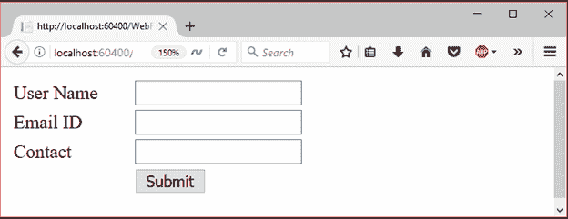
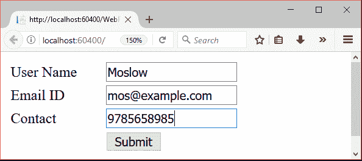
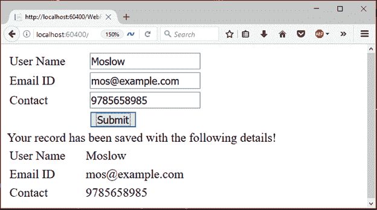

# ADO.NET 网页表单示例

> 原文:[https://www.javatpoint.com/ado-net-web-form-example](https://www.javatpoint.com/ado-net-web-form-example)

我们可以创建一个具有 ADO.NET 连通性的网络表单。具有表单控件的简单 web 表单可以提交给服务器。ADO.NET 允许我们将提交的值存储到 SQL Server 数据库中。

这里，我们正在创建一个连接到 SQL Server 数据库的 web 表单应用程序。

此网页表单包含以下源代码。

### web 表单

**//web rmadonet . aspx**

```
<%@ Page Language="C#" AutoEventWireup="true" CodeBehind="WebFormAdoNet.aspx.cs" 
Inherits="ado.netWebFormExample.WebFormAdoNet" %>
<!DOCTYPE html>
<html >
<head runat="server">
    <title></title>
    <style type="text/css">
        .auto-style1 {
            width: 100%;
        }
        .auto-style2 {
            width: 100px;
        }
        .auto-style3 {
            width: 95px;
        }
    </style>
</head>
<body>
    <form id="form1" runat="server">
        <div>
            <table class="auto-style1">
                <tr>
                    <td class="auto-style2">
                       <asp:Label runat="server" Text="User Name" ID="usernamelabelId"></asp:Label></td>
                    <td>
                       <asp:TextBox ID="UsernameId" runat="server"></asp:TextBox></td>
                </tr>
                <tr>
                    <td class="auto-style2">
                        <asp:Label runat="server" Text="Email ID"></asp:Label></td>
                    <td>
                        <asp:TextBox ID="EmailId" runat="server"></asp:TextBox></td>
                </tr>
                <tr>
                    <td class="auto-style2">
                        <asp:Label runat="server" Text="Contact"></asp:Label></td>
                    <td>
                        <asp:TextBox ID="ContactId" runat="server"></asp:TextBox></td>
                </tr>
                <tr>
                    <td class="auto-style2"></td>
                    <td>
                        <asp:Button ID="ButtonId" runat="server" Text="Submit" OnClick="ButtonId_Click" /></td>
                </tr>
            </table>
        </div>
    <div>
        <asp:Label ID="Label1" runat="server"></asp:Label>
    </div>
    </form>
    <table class="auto-style1">
        <tr>
            <td class="auto-style3">
                <asp:Label ID="Label2" runat="server"></asp:Label></td>
            <td>
                <asp:Label ID="Label5" runat="server"></asp:Label></td>
        </tr>
        <tr>
            <td class="auto-style3">
                <asp:Label ID="Label3" runat="server"></asp:Label></td>
            <td>
                <asp:Label ID="Label6" runat="server"></asp:Label></td>
        </tr>
        <tr>
            <td class="auto-style3">
                <asp:Label ID="Label4" runat="server"></asp:Label></td>
            <td>
                <asp:Label ID="Label7" runat="server"></asp:Label></td>
        </tr>
    </table>
    </body>
</html>

```

### 代码隐藏

**//web rmadonet . aspx . cs**

```
using System;
using System.Data.SqlClient;
namespace ado.netWebFormExample
{
    public partial class WebFormAdoNet : System.Web.UI.Page
    {
        protected void Page_Load(object sender, EventArgs e)
        {
        }
        protected void ButtonId_Click(object sender, EventArgs e)
        {
            SqlConnection con = null;
            try
            {
                // Creating Connection
                con = new SqlConnection("data source=.; database=student; integrated security=SSPI");
                // Writing insert query
                string query = "insert into student(name,email,contact)values('"+UsernameId.Text+ "',
                '" + EmailId.Text + "','" + ContactId.Text + "')";
                SqlCommand sc = new SqlCommand(query,con);
                // Opening connection
                con.Open();
                // Executing query
                int status = sc.ExecuteNonQuery();
                Label1.Text = "Your record has been saved with the following details!";
                // ----------------------- Retrieving Data ------------------ //
                SqlCommand cm = new SqlCommand("select top 1 * from student", con);
                // Executing the SQL query
                SqlDataReader sdr = cm.ExecuteReader();
                sdr.Read();
                    Label2.Text = "User Name"; Label5.Text = sdr["name"].ToString();
                    Label3.Text = "Email ID";  Label6.Text = sdr["email"].ToString();
                    Label4.Text = "Contact";   Label7.Text = sdr["contact"].ToString();                
            }
            catch (Exception ex)
            {
                Console.WriteLine("OOPs, something went wrong." + ex);
            }
            // Closing the connection
            finally
            {
                con.Close();
            }          
        }
    }
}

```

输出:

它向浏览器生成以下输出。



填写表格并提交数据。



提交后，它从 SQL Server 数据库中存储和检索数据。

