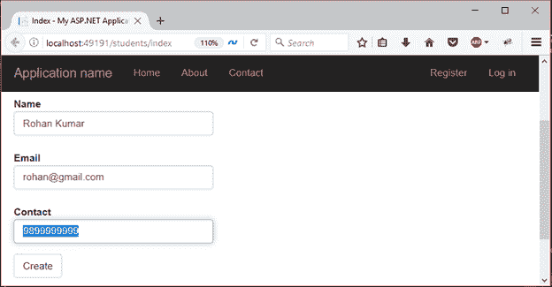

# ADO.NET MVC 范例

> 原文：<https://www.javatpoint.com/ado-net-mvc-example>

MVC (Model View Controller)是一种广泛应用于应用程序开发的 web 应用程序设计模式。在这里，我们在 ADO.NET 框架的帮助下创建了一个连接到 SQL Server 的 MVC 应用程序。

该应用程序包含一个模型、一个视图和一个控制器文件。下面是应用程序的源代码。

### 模型

**// Student.cs**

```

using System;
using System.ComponentModel.DataAnnotations;
namespace Ado.NetMvcApplication.Models
{
    public class Student
    {
        public int ID { get; set; }
        // -- Validating Student Name
        [Required(ErrorMessage = "Name is required")]
        [MaxLength(12)]
        public string Name { get; set; }
        // -- Validating Email Address
        [Required(ErrorMessage = "Email is required")]
        [EmailAddress(ErrorMessage = "Invalid Email Address")]
        public string Email { get; set; }
        // -- Validating Contact Number
        [Required(ErrorMessage = "Contact is required")]
        [DataType(DataType.PhoneNumber)]
        [RegularExpression(@"^\(?([0-9]{3})\)?[-. ]?([0-9]{3})[-. ]?([0-9]{4})$", ErrorMessage = "Not a valid Phone number")]
        public string Contact { get; set; }
    }
}

```

### 视角

**// Index.cshtml**

```

@model Ado.NetMvcApplication.Models.Student
@{
    ViewBag.Title = "Index";
}
<h2>Index</h2>
@using (Html.BeginForm("Save", "Students"))
{
    @Html.AntiForgeryToken()

    <div class="form-horizontal">
        <h4>Student</h4>
        <hr />
        @Html.ValidationSummary(true, "", new { @class = "text-danger" })
        <div class="form-group">
            @Html.LabelFor(model => model.Name, htmlAttributes: new { @class = "control-label col-md-2" })
            <div class="col-md-10">
                @Html.EditorFor(model => model.Name, new { htmlAttributes = new { @class = "form-control" } })
                @Html.ValidationMessageFor(model => model.Name, "", new { @class = "text-danger" })
            </div>
        </div>
        <div class="form-group">
            @Html.LabelFor(model => model.Email, htmlAttributes: new { @class = "control-label col-md-2" })
            <div class="col-md-10">
                @Html.EditorFor(model => model.Email, new { htmlAttributes = new { @class = "form-control" } })
                @Html.ValidationMessageFor(model => model.Email, "", new { @class = "text-danger" })
            </div>
        </div>
        <div class="form-group">
            @Html.LabelFor(model => model.Contact, htmlAttributes: new { @class = "control-label col-md-2" })
            <div class="col-md-10">
                @Html.EditorFor(model => model.Contact, new { htmlAttributes = new { @class = "form-control" } })
                @Html.ValidationMessageFor(model => model.Contact, "", new { @class = "text-danger" })
            </div>
        </div>
        <div class="form-group">
            <div class="col-md-offset-2 col-md-10">
                <input type="submit" value="Create" class="btn btn-default" />
            </div>
        </div>
    </div>
}
@section Scripts {
    @Scripts.Render("~/bundles/jqueryval")
}

```

### 控制器

**//studentcontroller . cs**

```

using System.Web.Mvc;
using Ado.NetMvcApplication.Models;
using System.Data.SqlClient;
namespace Ado.NetMvcApplication.Controllers
{
    public class StudentsController : Controller
    {
        // GET: Students
        public ActionResult Index()
        {
            return View();
        }
        [HttpPost]
        public ContentResult Save(Student student)
        {
            string status = "";
            // Creating Connection
            using (SqlConnection con = new SqlConnection("data source=.; database=student; integrated security=SSPI"))
            {
                // Insert query
                string query = "INSERT INTO student(name,email,contact) VALUES(@name, @email, @contact)";
                using (SqlCommand cmd = new SqlCommand(query))
                {
                    cmd.Connection = con;
                    // opening connection
                    con.Open();
                    // Passing parameter values
                    cmd.Parameters.AddWithValue("@name", student.Name);
                    cmd.Parameters.AddWithValue("@email", student.Email);
                    cmd.Parameters.AddWithValue("@contact", student.Contact);
                    // Executing insert query
                    status = (cmd.ExecuteNonQuery() >= 1) ?  "Record is saved Successfully!" : "Record is not saved";
                    status += "
";
                }
                    // Executing select command
                using (SqlCommand cmd = new SqlCommand("select * from student"))
                {
                    cmd.Connection = con;
                    // Retrieving Record from datasource
                    SqlDataReader sdr = cmd.ExecuteReader();
                    // Reading and Iterating Records
                    while (sdr.Read())
                    {
                        status += "name: "+sdr["name"]+"
 Email: "+sdr["email"]+"
 Contact: "+sdr["contact"];
                    }
                }
                return Content(status);
            }
        }
    }
}

```

输出:



提交后，它存储数据并从 SQL Server 数据库中获取数据，并向浏览器生成以下结果。

