# C# 中的 WPF

> 原文：<https://www.javatpoint.com/wpf-in-c-sharp>

WPF 被称为视窗演示基金会。Windows Presentation Foundation 被称为开发框架。WPF 也是著名的子系统.NET 框架。Windows 演示基础框架可以构建 Windows 客户端应用程序。视窗应用程序可以在视窗操作系统上运行。前端使用 XAML 语言，后端使用 C# 语言。

在[中.NET 框架](https://www.javatpoint.com/net-framework)，WPF 作为一个 Windows 库出现了。Windows 客户端应用程序可以通过 Windows 库构建。Windows 库也可以用来生成下一代的 Windows 窗体。目前，我们正在使用 4.5 版本的 WPF。我们也可以称 WPF 为发动机。通过使用视窗演示基金会，我们可以在视窗 7 和视窗操作系统中创建、显示和操作用户界面、文档、电影、图像和媒体。WPF 包含图书馆的布景。WPF 图书馆提供了我们可以构建、运行、执行的功能，通过 WPF 图书馆，我们可以管理所有的 Windows 客户端应用程序。

WPF 雇佣了 XAML，这是一种基于 XML 的语言。 [XML](https://www.javatpoint.com/xml-tutorial) 用于定义和链接各种元素。使用 WPF 开发的应用程序，我们可以将其部署为独立桌面程序，或者我们可以将 WPF 应用程序作为嵌入式对象托管在[网站](https://www.javatpoint.com/website)上。

WPF 应用程序旨在统一用户界面元素。所有这些包括固定和自适应文档、2D/三维渲染、运行时动画、预渲染媒体。WPF 运行时库包括微软视窗的所有版本。

由微软 Silverlight 提供的功能是 WPF 的子集，与 Adobe Flash 相比，它提供了嵌入式网络控件。

## C# 中 WPF 的特点

*   视窗演示基金会是一个图形系统。WPF 为我们提供了创建下一代 Windows 应用程序的功能。
*   WPF 结合了用户界面的特点 2D，三维图形，文件和多媒体。
*   WPF 也被称为API，通过它，我们可以批量构建具有出色用户体验的大容量 Windows 客户端应用程序。
*   Windows Presentation Foundation 包含了所有的功能，借助这些功能，我们可以领先于 MFC、Windows Forms 包括 GDI、GDI+HTML 等技术。

## WPF 的特点如下:

### 1.Direct3D

图形包括桌面项目，如窗口。图形使用 Direct3D 渲染。通过这一点，我们可以显示复杂的图形和自定义主题。通过使用 Direct3D，我们可以将图形任务卸载到 Windows 中的 GPU 上。Direct3D 的使用减少了 [CPU](https://www.javatpoint.com/cpu-full-form) 的工作量。我们针对并行像素计算优化了图形处理器。通过使用 WPF 的 Direct3D 功能，屏幕可以轻松刷新，并可以降低我们不需要强大图形处理器的市场(如上网本市场)的兼容性。

Windows Presentation Foundation 是微软的 UI 框架，用于创建具有丰富用户体验的应用程序。WPF 的重点主要是矢量图形，我们将允许控件和元素缩放，而不会有任何质量损失或像素化。

### 2.控件

使用 XAML 语是 WPF 的特色之一。XAML 也被称为基于 XML 的语言。WPF XAML 的目的是设计展示逻辑。XAML 启用了编程模型。使用 XAML，我们可以将表示逻辑和业务逻辑分开。应用程序设计完成后，我们可以将应用程序的集成和业务逻辑移交给开发人员。这种方法可读性更强，比代码更短。

### 3.控制设备

WPF 包含许多控件集，通过这些控件集，我们可以快速组装用户界面。丰富的控制集也是 WPF 的特色。大多数控件都类似于 windows 窗体控件，只是在控件中做了一些小的更改。

*   **列表框**

窗口形式的列表框只包含文本值。在列表框中，我们不能显示带有文本的图像列表。

**列表框示例**

[C#](https://www.javatpoint.com/c-sharp-tutorial) 和 WPF 中的 Listbox 类显示了 ListBox 控件。WPF 的列表框包含列表框中的项目集合。这里我们将展示如何添加项目，从列表框中移除项目，以及将列表框绑定到数据源。

高度和宽度属性将向我们显示列表框的宽度和高度。列表框的 name 属性将向我们显示控件的名称。名称被称为唯一标识符。列表框的边距属性向我们显示了父控件上列表框的边距。列表框的水平和垂直对齐属性用于设置水平和垂直对齐。

下面的代码用于设置列表框控件的名称、高度和宽度。

```

<ListBox Margin="10,10,0,13" Name="listBox1" HorizontalAlignment="Left" VerticalAlignment="Top" Width="194" Height="200"/>

```

这里我们将在列表框上执行不同的功能。

### 将项目静态添加到列表框控件

列表框控件是列表框项的集合。为了在 ListBox 控件中添加该项，我们将编写以下代码:

要在 WPF 的 ListBox 控件中添加该项，我们将执行以下步骤:

对于 WPF 应用程序，单击文件->新建->项目，如下图所示:

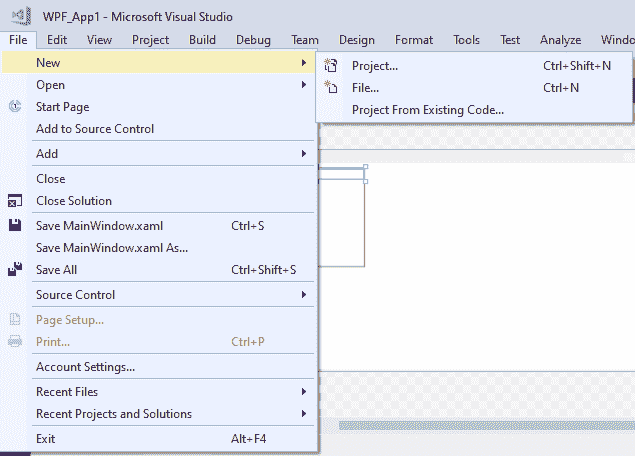

之后，将出现如下图所示的窗口:

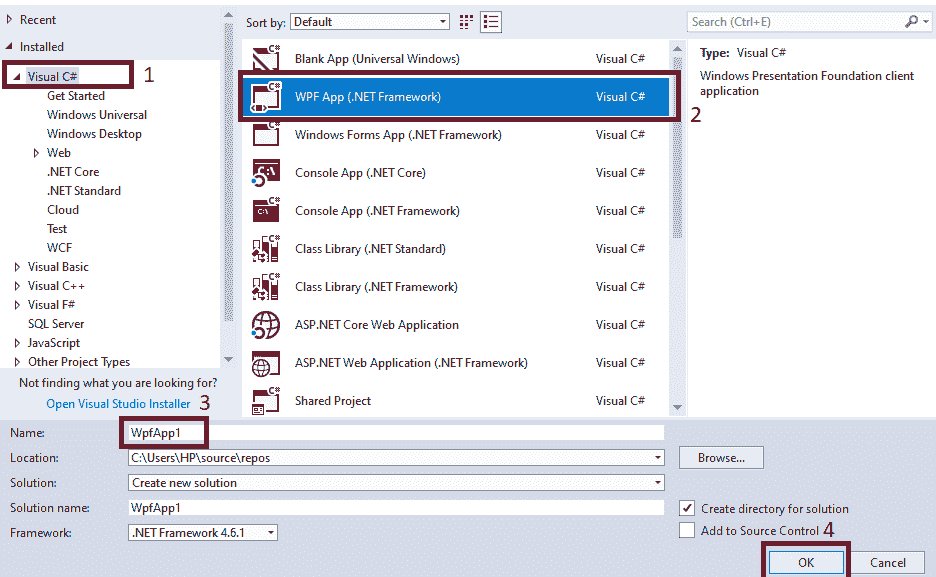

根据上面的截图，点击 **Visual C#- > WPF App(.NET Framework)->App 名称(WPF_App1)- >点击确定。**

之后，将出现如下图所示的窗口:

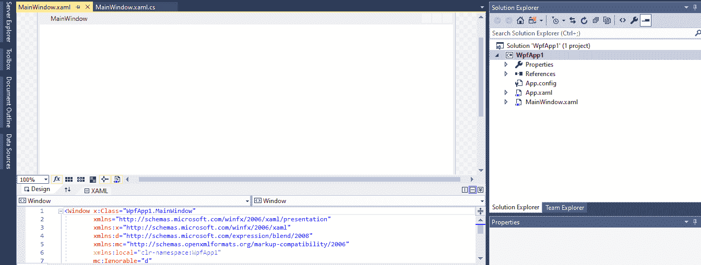

**要静态添加 ListBox 控件，我们将在 MainWindow 中编写以下代码。XAML 之窗:**

```

<Window x:Class="WPF_App1.MainWindow"

        xmlns:x="http://schemas.microsoft.com/winfx/2006/xaml"
        xmlns:d="http://schemas.microsoft.com/expression/blend/2008"
        xmlns:mc="http://schemas.openxmlformats.org/markup-compatibility/2006"
        xmlns:local="clr-namespace:WPF_App1"
        mc:Ignorable="d"
        Title="MainWindow" Height="450" Width="800">
    <Grid>
        <ListBox Margin="10,10,0,13" Name="listBox1" HorizontalAlignment="Left" VerticalAlignment="Top" Width="194" Height="200">
            <ListBoxItem Content="Coffie"></ListBoxItem>
            <ListBoxItem Content="Tea"></ListBoxItem>
            <ListBoxItem Content="Orange Juice"></ListBoxItem>
            <ListBoxItem Content="Milk"></ListBoxItem>
            <ListBoxItem Content="Iced Tea"></ListBoxItem>
            <ListBoxItem Content="Mango Shake"></ListBoxItem>
        </ListBox>

    </Grid>
</Window>

```

**以上代码设计如下:**

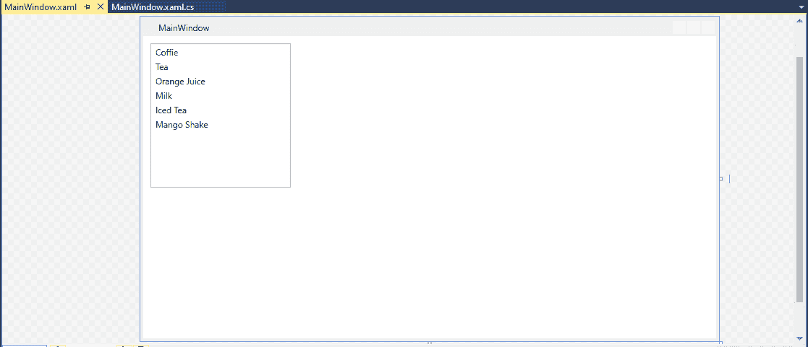

在上面的代码中，我们在 XAML 进行设计时，在列表框中添加了该项。

**OutPut**

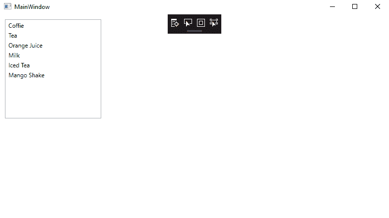

### 4.独立屏幕分辨率

独立屏幕分辨率是屏幕分辨率的一个明显特征。以独立屏幕的形式，即使在低分辨率屏幕上，WPF 的分辨率用户界面也会更好看。对于 WPF 独立的屏幕分辨率，屏幕分辨率使用 DirectX 组件，Windows 窗体应用程序使用机器的 32 个组件。为了与 DirectX 组件对话， [WPF](https://www.javatpoint.com/wpf) 使用媒体集成层(MIL)。直接组件将在 WPF 的用户界面上显示基于矢量的图形。

借助下面的截图，我们可以很容易地找出在低分辨率屏幕的情况下，Windows 窗体 UI 和 WPF UI 的区别。


在上面的截图中，如果我们在较低的分辨率下看到字符“W”，我们发现窗口窗体看起来像扭曲的图像，基于矢量的 WPF 看起来像优雅的。

### 5.控件内的控件

在 WPF 连同文本中，我们也可以将控件定义为另一个基本控件的内容。例如:像按钮一样。对于开发者来说，WPF 的这一特性确实是一个惊人的事实，通过这一点，当我们谈论用户界面时，我们知道了 WPF 的力量。

**这里是窗口控件内部控件的 XAML 代码是:**

```

<Window x:Class="WpfApp2.MainWindow"

        xmlns:x="http://schemas.microsoft.com/winfx/2006/xaml"
        xmlns:d="http://schemas.microsoft.com/expression/blend/2008"
        xmlns:mc="http://schemas.openxmlformats.org/markup-compatibility/2006"
        xmlns:local="clr-namespace:WpfApp2"
        mc:Ignorable="d"
        Title="MainWindow" Height="450" Width="800">
    <Grid>
        <Button Margin="90,88,75,124" Name="ButtonWithTextBox" FontSize="16">
            <TextBox Width="75">Enter Text</TextBox>
        </Button>

    </Grid>
</Window>

```

**输出**

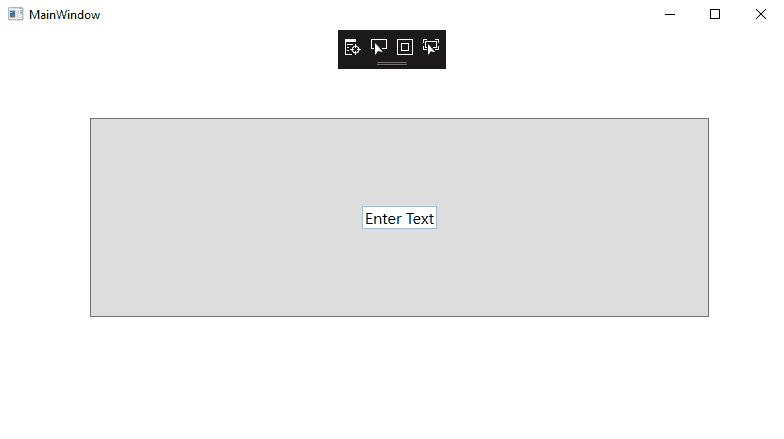

### 6.ontrol template(控制模板)

如果我们想用 WPF 改变按钮的形状，我们可以改变按钮的形状。这里我们将举一个 WPF 的例子，我们可以声明按钮，并可以改变椭圆的形状。

```

<Window x:Class="WpfApp2.MainWindow"

        xmlns:x="http://schemas.microsoft.com/winfx/2006/xaml"
        xmlns:d="http://schemas.microsoft.com/expression/blend/2008"
        xmlns:mc="http://schemas.openxmlformats.org/markup-compatibility/2006"
        xmlns:local="clr-namespace:WpfApp2"
        mc:Ignorable="d"
        Title="MainWindow" Height="450" Width="800">
    <Grid>
        <Button x:Name="EllipticalButton" Margin="30,12,45,0" Content="Elliptical Button" FontSize="18">
            <Button.Template>
                <ControlTemplate TargetType="{x:Type Button}">
                    <Grid>
                        <Ellipse Width="500" Height="80" Fill="Yellow"/>
                        <ContentPresenter HorizontalAlignment="Center"         VerticalAlignment="Center"/>
                    </Grid>
                </ControlTemplate>
            </Button.Template>
        </Button>

    </Grid>
</Window>

```

**输出**

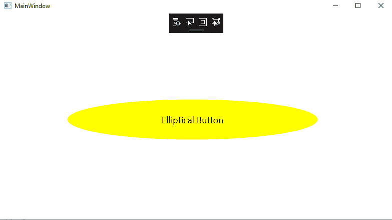

### 7.动画片

与基于帧的方法相比，WPF 支持基于时间的动画。这将系统的速度与系统的性能分开。WPF 通过定时器支持低级别的动画，也通过动画类支持高级别的抽象。

*   当我们将任何 WPF 元素属性注册为从属属性时，我们可以激活它。
*   我们可以基于.NET 类型的属性，它将被动画化。ColorAnimation 类可以更改元素的颜色，元素的宽度可以通过使用 DoubleAnimation 类来设置动画。
*   故事板可以包含动画组。
    *   对于操纵动画，故事板是开始、停止和暂停的主要方式。
    *   我们可以用外部事件触发动画，包括用户动作。
    *   要重绘，场景是时间触发的。

### 8.文档

WPF 支持文档的分页。WPF 的 DocumentViewer 类用于读取固定布局的文档。页面视图由 FlowDocumentReader 类显示，通过该类，我们可以看到不同的视图模式，如可滚动、每页和调整查看区域后的文本流。

WPF 用 XML 纸质规范文档支持我们。它还支持使用开放打包约定来读写分页文档。

### 9.互用性

Windows 窗体可以与 **ElementHost** 和 **WindowsFormsHost** 类一起使用。

为了使用 Windows 窗体，我们将执行下面的 WPF C# 代码:

```

System.Windows.Forms.Integration.WindowsFormsHost.EnableWindowsFormsInterop();

```

### 10.不同布局的可用性

我们使用布局来逻辑分离用户界面上的控件。使用布局，我们可以清楚地显示窗口上的控件。有一个强大的布局控制设置在 WPF。

**WPF 的布局是:**

**1。堆叠面板:**堆叠面板在 WPF 是一个简单而有用的布局面板。StackPanel 包含堆栈形式的元素，其中元素可以排列在彼此下方或旁边，元素的堆栈取决于方向。StackPanel 用于创建任何类型的列表。为了使用内部布局面板，我们使用了 WPF 项目控件，如[列表框](https://www.javatpoint.com/wpf-listbox)、组合框或菜单。

```

<Window x:Class="WpfApp2.MainWindow"

        xmlns:x="http://schemas.microsoft.com/winfx/2006/xaml"
        xmlns:d="http://schemas.microsoft.com/expression/blend/2008"
        xmlns:mc="http://schemas.openxmlformats.org/markup-compatibility/2006"
        xmlns:local="clr-namespace:WpfApp2"
        mc:Ignorable="d"
        Title="MainWindow" Height="450" Width="800" FontSize="20">

        <StackPanel>
            <TextBlock Margin="10" FontSize="25" FontWeight="Bold" FontStyle="Italic">Which type of Coffee would you like?</TextBlock>
            <Button Margin="10" FontSize="16">Black</Button>
            <Button Margin="10" Click="Button_Click" FontSize="16">With milk</Button>
            <Button Margin="10" FontSize="16">Latte machiato</Button>
            <Button Margin="10" FontSize="16">Chappuchino</Button>
        </StackPanel>
</Window>

```

**输出**

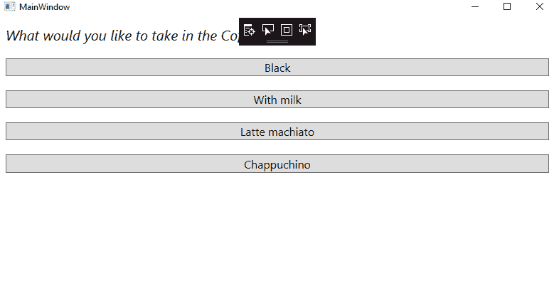

### 水平放置堆叠项目。

要将项目水平放置在堆栈面板中，我们将以对话框窗口的两个按钮“确定”、“取消”按钮为例，因为如果用户更改字体大小或切换语言，文本的大小会发生变化。我们应该避免固定大小的按钮，这两个按钮都取决于它们的大小。如果按钮需要空格，他们会自动获取。

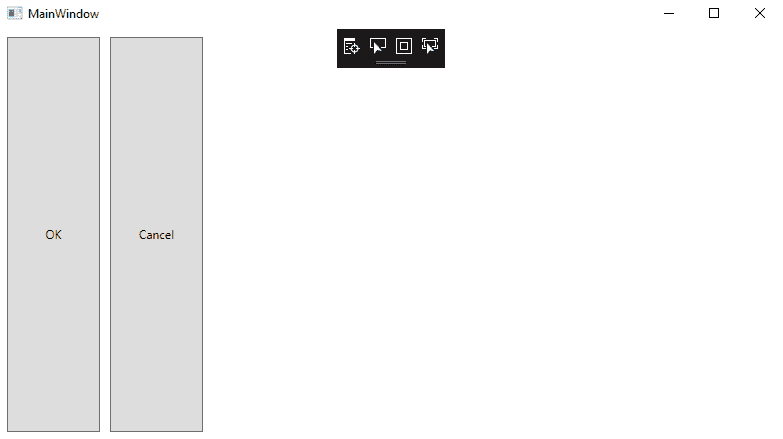

### 2.网格布局

网格是一个布局面板；在网格布局的帮助下，我们可以在包含行和列的表格结构中排列子控件。网格布局将像 [HTML](https://www.javatpoint.com/html-tutorial) 表格一样工作，但是这种布局是灵活的。一个单元格中可以有多个控件。控件可以跨越多个单元格，并且可以相互重叠。

控件可以使用水平对齐和垂直对齐属性来调整自身的大小，这些属性由锚点定义。锚点和网格线之间的距离由控件的边距定义。

### 定义行和列

默认情况下，网格包含一行一列。我们将把行定义项添加到行定义集合中，把列定义项添加到列定义集合中。

这里我们举一个例子，它显示了三行两列的网格:

大小可以定义为逻辑单元的绝对数量，即百分比值或逻辑单元:

固定:固定显示逻辑单元的固定大小(1/96 单元)。

自动:有了自动，他们需要多少空间来控制。

星号(*):这将占用可用空间。

网格被认为是 WPF 强大而有用的布局。在网格中，我们必须在行和列中排列单元格中的子元素。当添加 XAML 文档时，或者当我们在 Visual Studio 中创建新的 WPF 项目时，Visual Studio 会自动添加网格作为窗口元素中的第一个容器。

我们可以通过两种方式创建行和列:

### 第一种方法:通过 XAML 代码

默认情况下，网格包含一行和一列。我们可以为网格中的每一行使用行定义元素来添加更多的行和列。列元素的行定义属性和在网格中使用了列定义属性。ColumnDefinition 属性。网格是看不见的。为了显示网格线，我们将“显示网格线”属性设置为 true。网格线有助于调试确定网格线所在的元素。

这里我们将举一个例子，我们必须创建 3 行 3 列。现在我们可以添加 9 个文本块，并通过定义网格来维护文本块在网格中的位置。行和网格。列值。如果网格。行和网格。没有定义列属性，那么在这种情况下，我们可以将元素放在网格中。Row="0 "和 Grid。column =“0”。换句话说，我们可以说我们可以将元素放在第一行和第一列。

为了显示网格中的行和列，我们将编写以下代码:

```

<Window x:Class="Grid_WPF.MainWindow"

        xmlns:x="http://schemas.microsoft.com/winfx/2006/xaml"
        xmlns:d="http://schemas.microsoft.com/expression/blend/2008"
        xmlns:mc="http://schemas.openxmlformats.org/markup-compatibility/2006"
        xmlns:local="clr-namespace:Grid_WPF"
        mc:Ignorable="d"
        Title="MainWindow" Height="450" Width="800">
    <Grid>
        <Grid ShowGridLines="True">
            <Grid.ColumnDefinitions>
                <ColumnDefinition></ColumnDefinition>
                <ColumnDefinition></ColumnDefinition>
                <ColumnDefinition></ColumnDefinition>
            </Grid.ColumnDefinitions>
            <Grid.RowDefinitions>
                <RowDefinition></RowDefinition>
                <RowDefinition></RowDefinition>
                <RowDefinition></RowDefinition>
            </Grid.RowDefinitions>
            <TextBlock Text="Row0 Column0" Grid.Row="0" Grid.Column="0" FontSize="16" VerticalAlignment="Center" HorizontalAlignment="Center"></TextBlock>
            <TextBlock Text="Row0 Column1" Grid.Row="0" Grid.Column="1" FontSize="16" VerticalAlignment="Center" HorizontalAlignment="Center"></TextBlock>
            <TextBlock Text="Row0 Column2" Grid.Row="0" Grid.Column="2" FontSize="16" VerticalAlignment="Center" HorizontalAlignment="Center"></TextBlock>
            <TextBlock Text="Row1 Column0" Grid.Row="1" Grid.Column="0" FontSize="16" VerticalAlignment="Center" HorizontalAlignment="Center"></TextBlock>
            <TextBlock Text="Row1 Column1" Grid.Row="1" Grid.Column="1" FontSize="16" VerticalAlignment="Center" HorizontalAlignment="Center"></TextBlock>
            <TextBlock Text="Row1 Column2" Grid.Row="1" Grid.Column="2" FontSize="16" VerticalAlignment="Center" HorizontalAlignment="Center"></TextBlock>
            <TextBlock Text="Row2 Column0" Grid.Row="2" Grid.Column="0" FontSize="16" VerticalAlignment="Center" HorizontalAlignment="Center"></TextBlock>
            <TextBlock Text="Row2 Column1" Grid.Row="2" Grid.Column="1" FontSize="16" VerticalAlignment="Center" HorizontalAlignment="Center"></TextBlock>
            <TextBlock Text="Row2 Column2" Grid.Row="2" Grid.Column="2" FontSize="16" VerticalAlignment="Center" HorizontalAlignment="Center"></TextBlock>
        </Grid>

    </Grid>
</Window>

```

**输出**

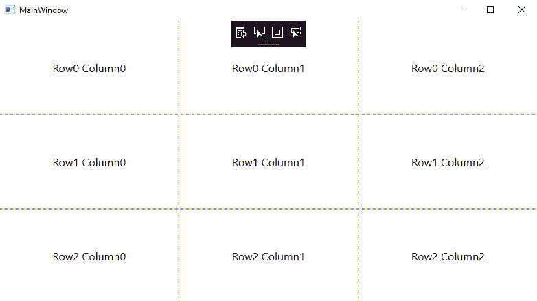

### 将控件添加到网格

为了将控件添加到网格布局中，我们只需要将声明放在网格的开始和结束标签之间。

行和列定义必须继续子控件的定义。

“网格布局”面板为我们提供了两个附加属性“网格”。这两个属性定义了控件的位置。

为了在 WPF 的网格中添加控件，我们将编写以下代码:

```

<Window x:Class="Grid_WPF.MainWindow"

        xmlns:x="http://schemas.microsoft.com/winfx/2006/xaml"
        xmlns:d="http://schemas.microsoft.com/expression/blend/2008"
        xmlns:mc="http://schemas.openxmlformats.org/markup-compatibility/2006"
        xmlns:local="clr-namespace:Grid_WPF"
        mc:Ignorable="d"
        Title="MainWindow" Height="450" Width="800">
    <Grid>
        <Grid.RowDefinitions>
            <RowDefinition Height="Auto" />
            <RowDefinition Height="Auto" />
            <RowDefinition Height="*" />
            <RowDefinition Height="28" />
        </Grid.RowDefinitions>
        <Grid.ColumnDefinitions>
            <ColumnDefinition Width="Auto" />
            <ColumnDefinition Width="200" />
        </Grid.ColumnDefinitions>
        <Label Grid.Row="0" Grid.Column="0" Content="Name:"/>
        <Label Grid.Row="1" Grid.Column="0" Content="E-Mail:"/>
        <Label Grid.Row="2" Grid.Column="0" Content="Comment:"/>
        <TextBox Grid.Column="1" Grid.Row="0" Margin="3" />
        <TextBox Grid.Column="1" Grid.Row="1" Margin="3" />
        <TextBox Grid.Column="1" Grid.Row="2" Margin="3" />
        <Button Grid.Column="1" Grid.Row="3" HorizontalAlignment="Right" 
            MinWidth="80" Margin="3" Content="Send"  />

    </Grid>
</Window>

```

**输出**

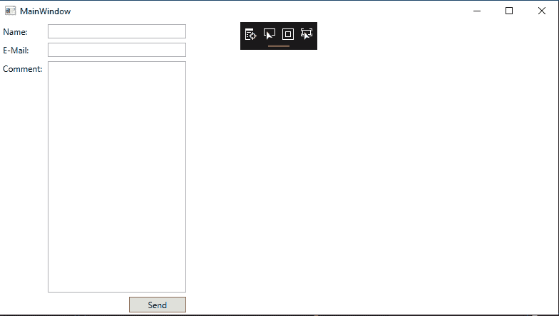

### 3.停靠面板

DockPanel 用于定义我们可以相对于彼此排列元素的区域。我们可以水平或垂直排列元素。使用 dock 面板，我们可以使用 dock Property 轻松地将子元素停靠在顶部、底部、右侧、左侧和中央。元素的停靠点由附加属性定义，即**停靠面板。停靠**。LastChildFill 属性必须设置为 true。

使用 **LastChildFill** 属性，这将填充最后一个子元素的剩余空间。分层停靠面板类如下所示:

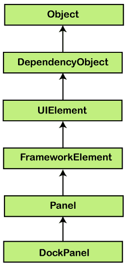

为了在每一侧设置 dock 元素，我们将为此编写以下代码:

```

<Window x:Class="Grid_WPF.MainWindow"

        xmlns:x="http://schemas.microsoft.com/winfx/2006/xaml"
        xmlns:d="http://schemas.microsoft.com/expression/blend/2008"
        xmlns:mc="http://schemas.openxmlformats.org/markup-compatibility/2006"
        xmlns:local="clr-namespace:Grid_WPF"
        mc:Ignorable="d"
        Title="MainWindow" Height="450" Width="800">
    <Grid>
        <DockPanel LastChildFill="True">
            <Button Content="Dock=Top" DockPanel.Dock="Top"/>
            <Button Content="Dock=Bottom" DockPanel.Dock="Bottom"/>
            <Button Content="Dock=Left"/>
            <Button Content="Dock=Right" DockPanel.Dock="Right"/>
            <Button Content="LastChildFill=True"/>
        </DockPanel>
    </Grid>
</Window>

```

**输出**

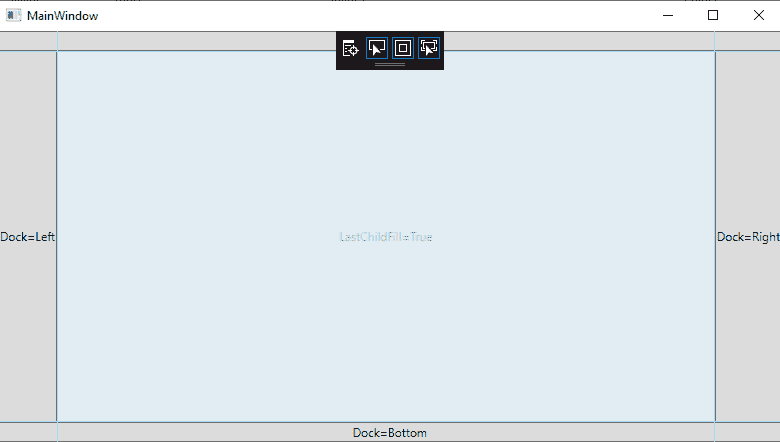

### DockPanel 的属性

这里我们有最常用的码头物业。以下是 DockPanel 属性的列表:

| 不，先生。 | 财产 | 描述 |
| 1. | 背景 | 背景属性用于获取或设置画笔，画笔将填充面板的内容区域。此属性继承自面板。 |
| 2. | 孩子们 | 子元素的属性用于获取此面板的子元素的 UIElement 集合。儿童也是从该小组继承的。 |
| 3. | 码头 | 借助 dock 属性，我们可以获取或设置值，该值显示子元素在父 dock 面板中的位置。 |
| 4. | 高度 | 利用这个属性，我们可以获取或设置元素的高度。高度属性继承自框架元素。 |
| 5. | 项目宽度 | 通过使用这个属性，我们获取或设置一个值，通过这个值我们可以指定包含在包装面板中的所有项目的宽度。 |
| 6. | lastdchildfill | 通过使用这个属性，我们获取或设置一个值，该值显示 DockPanel 中的最后一个子元素拉伸自身以填充剩余的可用空间。 |
| 7. | 逻辑儿童 | 通过这个属性，我们得到一个枚举器，它可以迭代这个面板的逻辑子元素。该属性继承自面板。 |
| 8. | 逻辑定位 | 在面板仅支持一维布局的情况下，此属性有助于面板的方向。逻辑面板属性继承自面板。 |
| 9. | 边缘 | 边距属性将获取或设置元素的外部边距。 |
| 10. | 名字 | 名称属性获取或设置标识元素的名称。该名称在代码隐藏中为我们提供了一个引用，例如事件处理程序代码。在 XAML 处理器的处理过程中，我们可以在标记元素构造之后引用它。name 属性是从 FrameworkElement 继承的。 |
| 11. | 方向 | 使用这个属性，我们获取或设置一个值，用于指定子元素内容排列的维度。 |
| 12. | 父母 | 父属性将获取元素的逻辑父元素。父元素继承自 FrameworkElement。 |
| 13. | 资源 | 此属性获取或设置本地定义的元素。资源属性继承自 FrameworkElement。 |
| 14. | 风格 | 样式属性获取或设置呈现元素时元素的样式。样式属性是从 FrameworkElement 继承的。 |

### 坞站面板最常用的方法

下面是 DockPanel 最常用的方法:

| -你好。不，不。 | 方法 | 描述 |
| **1。** | get lock | **GetDock** 方法**获取**特定 UI 元素的 Dock 附着属性的值。 |
| **2。** | **SetDock** | **设置 Dock** 方法**将 Dock 的附加属性的值设置为特定的元素。** |

### 这里我们将举一个例子来展示如何将子元素添加到 DockPanel 中。

### 为此，我们将以 XAML 为例，在面板内创建一个按钮。

### 示例:

### MainWindow(主窗口)。洗发精

```

<Window x:Class="WPF_App6.MainWindow"

        xmlns:x="http://schemas.microsoft.com/winfx/2006/xaml"
        xmlns:d="http://schemas.microsoft.com/expression/blend/2008"
        xmlns:mc="http://schemas.openxmlformats.org/markup-compatibility/2006"
        xmlns:local="clr-namespace:WPF_App6"
        mc:Ignorable="d"
        Title="MainWindow" Height="450" Width="800">
    <Grid>
        <DockPanel LastChildFill = "True">
            <Button Content = "Top" DockPanel.Dock = "Top" Click="Button_Click"/>
            <Button Content = "Bottom" DockPanel.Dock = "Bottom" Click="Button_Click" />
            <Button Content = "Left" Click="Button_Click"/>
            <Button Content = "Right" DockPanel.Dock = "Right" Click="Button_Click" />
            <Button Content = "Center" Click="Button_Click"/>
        </DockPanel>

    </Grid>
</Window>

```

XAML 代码在 C# 中的实现如下:

```

using System;
using System.Collections.Generic;
using System.Linq;
using System.Text;
using System.Threading.Tasks;
using System.Windows;
using System.Windows.Controls;
using System.Windows.Data;
using System.Windows.Documents;
using System.Windows.Input;
using System.Windows.Media;
using System.Windows.Media.Imaging;
using System.Windows.Navigation;
using System.Windows.Shapes;

namespace WPF_App6
{
    /// <summary>
    /// Interaction logic for MainWindow.xaml
    /// </summary>
    public partial class MainWindow : Window
    {
        public MainWindow()
        {
            InitializeComponent();
        }

        private void Button_Click(object sender, RoutedEventArgs e)
        {
            Button btn = sender as Button;
            string str = btn.Content.ToString() + " button clicked";
            MessageBox.Show(str);

        }
    }
}

```

点击任何按钮后，这将显示消息。这里我们将举一个例子，当我们点击任何按钮时，我们点击中心按钮，然后它显示如下所示的消息:

**输出**

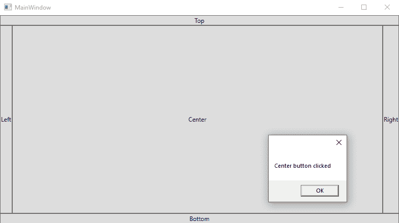

### 3.画布面板

画布是 WPF 最基本的布局面板。画布布局允许我们通过使用坐标来排列子元素，这与 Windows 窗体应用程序非常相似。借助画布，我们可以指定与任何角落相关的坐标。我们可以使用附加属性(顶部、底部、左侧和右侧)来调整画布内子元素的位置。

Canvas 是一个轻量级容器。当我们在运行时调整窗口大小时，我们不能调整画布的子元素的大小，这使得它在创建表单时不太有用。当我们需要处理图形时，画布在那些场景中是有帮助的。

面板用于对 2D 图形(如椭圆、矩形)元素进行分组。它不用于布局用户界面元素。

画布面板的层次继承如下所示:

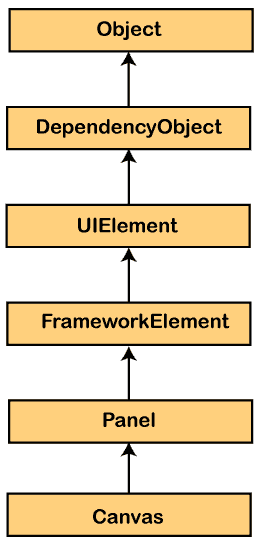

### 画布类最常用的属性如下所示:

| 不，先生。 | 财产 | 描述 |
| 1. | 背景 | 我们将使用 BackGround 属性获取或设置画笔，并可以填充面板的内容区域。背景是从面板继承的。 |
| 2. | ZIndexProperty | 该属性用于识别**画布。津德克斯** XAML 附属物业。 |
| 3. | 资源 | 要获取或设置本地资源，我们使用 resources 属性。资源属性继承自 **FrameworkElement** 。 |
| 4. | 父母 | 父属性用于获取逻辑父元素。从 **FrameworkElement** 继承的父属性。 |

## 画布法

画布的常用方法如下所示:

| -你好。不，不。 | 方法 | 描述 |
| 1. | 捷运 | 方法用于获取画布的值。留下了 XAML 的财产。 |
| 2. | 获取顶部 | GetTop 方法用于获取 Canvas 的值。XAML 的附属财产。此方法用于目标元素。 |
| 3. | GetZIndex | GetZIndex 方法用于获取 Canvas.ZIndex 的值。该方法是 XAML 的附加属性，用于目标元素。 |
| 4. | SetLeft | 方法用于设置画布的值。向左。对于目标元素，我们使用了 XAML 属性。 |
| 5. | 赛普 | 用于设置和获取画布的值。使用 Top SetTop 方法。我们使用 XAML 附加属性作为目标元素。 |
| 6. | 竖板索引 | 用于设置和获取画布的值。ZIndex，我们使用 SetZindex 方法。XAML 附加属性用于目标元素。 |

### 示例:这里有一个示例，展示了如何在画布中添加子元素。在这里，我们将编写一个代码，在画布内创建一个具有不同偏移量的椭圆:

### MainWindow(主窗口)。洗发精

```

<Window x:Class="WpfApp7.MainWindow"

        xmlns:x="http://schemas.microsoft.com/winfx/2006/xaml"
        xmlns:d="http://schemas.microsoft.com/expression/blend/2008"
        xmlns:mc="http://schemas.openxmlformats.org/markup-compatibility/2006"
        xmlns:local="clr-namespace:WpfApp7"
        mc:Ignorable="d"
        Title="MainWindow" Height="450" Width="800">
    <Grid>
        <Canvas Width = "580" Height = "360" >
            <Ellipse Canvas.Left = "30" Canvas.Top = "30"  
            Fill = "Gray" Width = "200" Height = "120" />
            <Ellipse Canvas.Right = "30" Canvas.Top = "30"  
            Fill = "Aqua" Width = "200" Height = "120" />
            <Ellipse Canvas.Left = "30" Canvas.Bottom = "30"  
            Fill = "Gainsboro" Width = "200" Height = "120" />
            <Ellipse Canvas.Right = "30" Canvas.Bottom = "30"  
            Fill = "LightCyan" Width = "200" Height = "120" />
        </Canvas>
    </Grid>

```

**输出**

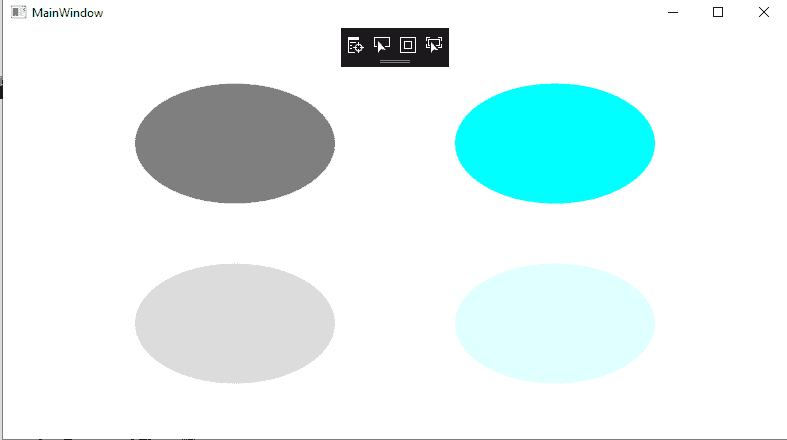

### 用于定位的画布属性

*   **Top:** 此属性用于获取或设置值，该值表示元素顶部与其父画布顶部之间的距离。
*   **Left:** 此属性用于获取或设置值，该值表示左侧元素与其父画布左侧之间的距离。
*   **Right:** 此属性用于获取或设置值，该值显示画布右侧与其父画布右侧之间的距离。
*   **底部:**此属性用于获取或设置值，该值显示元素顶部与其父画布顶部之间的距离。

### 画布布局示例

画布布局用于元素的正确位置，元素的对齐。如果我们不使用 canvas 属性，那么元素将与它们重叠。

**这里我们举一个没有使用 canvas 属性的例子。**

```

<Window x:Class="WpfApp7.MainWindow"

        xmlns:x="http://schemas.microsoft.com/winfx/2006/xaml"
        xmlns:d="http://schemas.microsoft.com/expression/blend/2008"
        xmlns:mc="http://schemas.openxmlformats.org/markup-compatibility/2006"
        xmlns:local="clr-namespace:WpfApp7"
        mc:Ignorable="d"
        Title="MainWindow" Height="450" Width="800">
    <Grid>
        <Canvas>
            <Label Content="Canvas Layout Demo" 
        FontSize="15" FontWeight="Bold"
        Foreground="Blue"/>

            <Label Content="Label1" FontSize="15" FontWeight="Bold" />
            <Label Content="Label2" FontSize="15" FontWeight="Bold" />
            <Label Content="Label3" FontSize="15" FontWeight="Bold" />
        </Canvas>
    </Grid>

```

现在输出如下所示:

**输出**

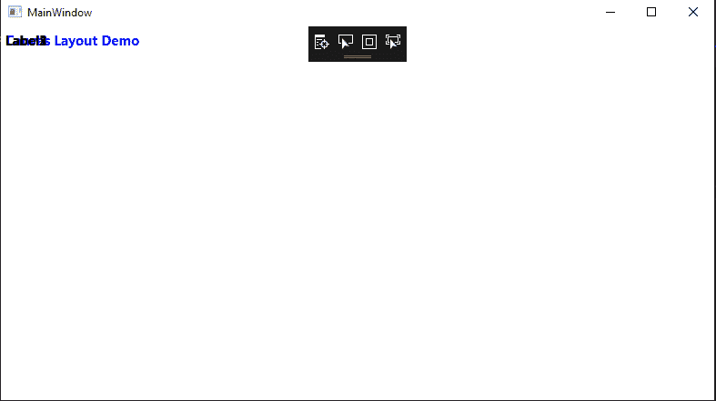

### 当我们分配画布属性时

对于绝对位置，大部分时候我们使用**画布这样的画布属性。顶部**和**画布。左**属性。

### MainWindow(主窗口)。洗发精

```

<Window x:Class="WpfApp7.MainWindow"

        xmlns:x="http://schemas.microsoft.com/winfx/2006/xaml"
        xmlns:d="http://schemas.microsoft.com/expression/blend/2008"
        xmlns:mc="http://schemas.openxmlformats.org/markup-compatibility/2006"
        xmlns:local="clr-namespace:WpfApp7"
        mc:Ignorable="d"
        Title="MainWindow" Height="450" Width="800">
    <Grid>
        <Canvas>
            <Label Content="Canvas Layout Demo" 
        FontSize="15" FontWeight="Bold"
        Foreground="Blue"
        Canvas.Top="10" Canvas.Left="25"/>

            <Label Content="Label1" FontSize="15" FontWeight="Bold" 
           Canvas.Top="40" Canvas.Left="25"/>

            <Label Content="Label2" FontSize="15" FontWeight="Bold" 
           Canvas.Top="70" Canvas.Left="75"/>

            <Label Content="Label3" FontSize="15" FontWeight="Bold" 
           Canvas.Top="100" Canvas.Left="125"/>
        </Canvas>
    </Grid>
</Window>

```

**输出**

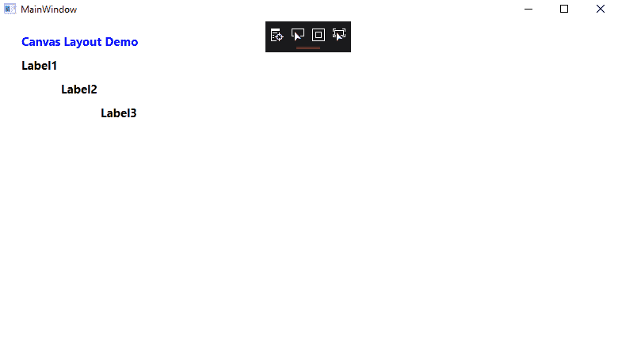

### 5.WPF 包装面板

WPF 环绕面板控件是一个面板，默认情况下，它从左到右依次定位子元素。如果堆叠的子元素不适合当前所在的行或列，那么剩余的元素将以相同的顺序包装剩余的空间。

这里我们将举一个两个包装面板的例子，其中一个是水平的，另一个是垂直的。

XAML 的包装面板元素显示了 WPF 控件的包装面板。

这里我们有一个代码片段，它在 XAML 声明了 **WrapPanel** ，设置了高度、宽度和背景属性。

下面是包装面板的代码，如下所示:

```

<Window x:Class="WpfApp7.MainWindow"

        xmlns:x="http://schemas.microsoft.com/winfx/2006/xaml"
        xmlns:d="http://schemas.microsoft.com/expression/blend/2008"
        xmlns:mc="http://schemas.openxmlformats.org/markup-compatibility/2006"
        xmlns:local="clr-namespace:WpfApp7"
        mc:Ignorable="d"
        Title="MainWindow" Height="450" Width="800">
    <Grid>
        <Ellipse Width="100" Height="100" Fill="Red" />
        <Ellipse Width="90" Height="90" Fill="Orange" />
        <Ellipse Width="80" Height="80" Fill="Yellow" />
        <Ellipse Width="70" Height="70" Fill="LightGreen" />
        <Ellipse Width="60" Height="60" Fill="Green" />
        <Ellipse Width="50" Height="50" Fill="LightBlue" />
        <Ellipse Width="40" Height="40" Fill="Blue" />
        <Ellipse Width="30" Height="30" Fill="Black" />
    </Grid>

</Window>

```

**输出**

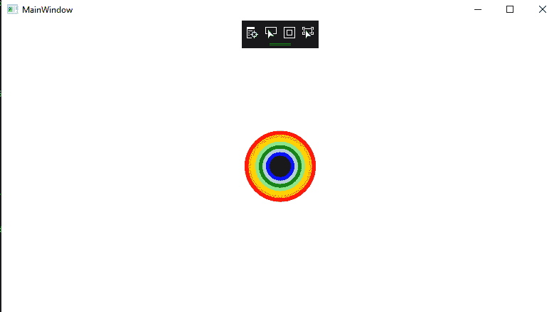

### 6.WPF 的取景框

在 WPF，ViewBox 是一个有益的控件。ViewBox 将自身调整到可用的大小。它不调整内容的大小，而是自己转换。视图框是 WPF 控件的另一个标准。ViewBox 只包含一个子控件。如果我们想向视图框中添加多个子控件，这将会给我们一个错误。

视图框元素显示了 XAML 的 WPF 视图框控件，如下所示:

```

<Viewbox />

```

ViewBox 有一个 Stretch 属性，显示内容如何适合空间，我们可以填充它的值。

这里我们要举一个例子。现在我们将创建一个名为 ViewBoxDemo 的新 WPF 应用程序。

```

<Window x:Class="WpfApp7.MainWindow"

        xmlns:x="http://schemas.microsoft.com/winfx/2006/xaml"
        xmlns:d="http://schemas.microsoft.com/expression/blend/2008"
        xmlns:mc="http://schemas.openxmlformats.org/markup-compatibility/2006"
        xmlns:local="clr-namespace:WpfApp7"
        mc:Ignorable="d"
        Title="MainWindow" Height="450" Width="800">
    <Grid>
        <DockPanel Width="250" Height="200">
            <StackPanel Orientation="Horizontal" DockPanel.Dock="Top" Background="LightBlue">
                <Button Content="01" Margin="1"/>
                <Button Content="02" Margin="1"/>
                <Button Content="03" Margin="1 1 10 1"/>
                <Button Content="04" Margin="1"/>
                <Button Content="05" Margin="1"/>
                <Button Content="06" Margin="1"/>
            </StackPanel>

            <StackPanel Orientation="Horizontal"
                    DockPanel.Dock="Bottom"
                    Background="Lightblue"
                    Height="25">
                <TextBlock VerticalAlignment="Center">Processing</TextBlock>
                <ProgressBar Value="75" Width="100" Margin="4"/>
            </StackPanel>

            <Grid>
                <TextBlock>Content area</TextBlock>
            </Grid>
        </DockPanel>
        <DockPanel Width="250" Height="200">
            <StackPanel Orientation="Horizontal" DockPanel.Dock="Top" Background="LightBlue">
                <Button Content="01" Margin="1"/>
                <Button Content="02" Margin="1"/>
                <Button Content="03" Margin="1 1 10 1"/>
                <Button Content="04" Margin="1"/>
                <Button Content="05" Margin="1"/>
                <Button Content="06" Margin="1"/>
            </StackPanel>

            <StackPanel Orientation="Horizontal"
                    DockPanel.Dock="Bottom"
                    Background="Lightblue"
                    Height="25">
                <TextBlock VerticalAlignment="Center">Processing</TextBlock>
                <ProgressBar Value="75" Width="100" Margin="4"/>
            </StackPanel>

            <Grid>
                <TextBlock>Content area</TextBlock>
            </Grid>
        </DockPanel>
        <DockPanel Width="250" Height="200">
            <StackPanel Orientation="Horizontal" DockPanel.Dock="Top" Background="LightBlue">
                <Button Content="01" Margin="1"/>
                <Button Content="02" Margin="1"/>
                <Button Content="03" Margin="1 1 10 1"/>
                <Button Content="04" Margin="1"/>
                <Button Content="05" Margin="1"/>
                <Button Content="06" Margin="1"/>
            </StackPanel>

            <StackPanel Orientation="Horizontal"
                    DockPanel.Dock="Bottom"
                    Background="Lightblue"
                    Height="25">
                <TextBlock VerticalAlignment="Center">Processing</TextBlock>
                <ProgressBar Value="75" Width="100" Margin="4"/>
            </StackPanel>

            <Grid>
                <TextBlock>Content area</TextBlock>
            </Grid>
        </DockPanel>
    </Grid>

</Window>

```

**输出**

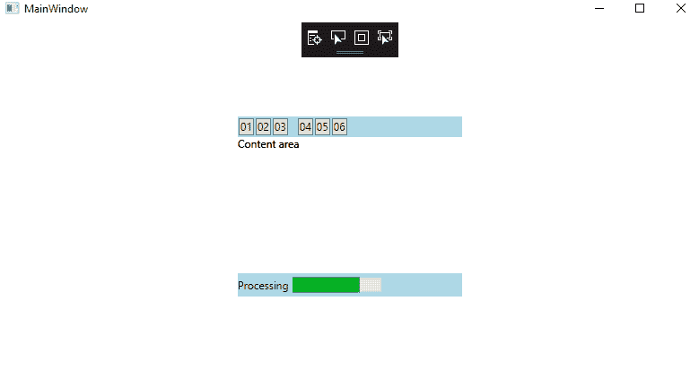

### WPF 的数据绑定

数据绑定为我们提供了一种简单而强大的方法来自动更新业务模型和用户界面之间的数据。我们称这种机制为数据绑定。当我们更改业务模型的数据时，这将自动反映对用户界面的更改，反之亦然。为了将数据带到用户界面，我们使用这个方法。

数据绑定可以是单向的，可以是从**源到目标，也可以是从目标到源**或双向的，即**源到目标或目标到源**。

为了数据绑定的正常工作，我们必须在两侧提供更改通知，这向我们显示了何时必须更新**数据绑定中的目标值。**

在.NET 属性，我们通过引发 **INotifyPropertyChanged** 接口的事件 **PropertyChanged** 来进行数据绑定。通常，我们在 XAML 通过使用标记扩展来进行数据绑定。

数据绑定为我们提供了一种机制，为 Windows Runtime 应用程序显示数据交互提供了一种简单易行的方法。

通过数据绑定，我们可以在用户界面上完成 UI 元素和数据对象之间的数据流。当绑定完成后，数据或我们的业务模型发生变化，这将自动反映在用户界面元素上的变化，反之亦然。

数据绑定有两种类型:

1.  单向数据绑定
2.  双向数据绑定

### 单向数据绑定

在单向绑定中，我们可以将数据从源(源是保存数据的对象)绑定到目标(目标被称为我们可以通过它看到数据的对象)。

为了理解单向绑定，我们将采用以下示例:

为了理解单向绑定，我们将创建名为 WPFData 的 WPF 项目。

为此，我们将编写 XAML 代码，其中我们将创建两个标签，两个文本框，一个按钮，并用一些属性初始化它们。

### MainWindow(主窗口)。洗发精

```

<Window x:Class="WpfApp7.MainWindow"

        xmlns:x="http://schemas.microsoft.com/winfx/2006/xaml"
        xmlns:d="http://schemas.microsoft.com/expression/blend/2008"
        xmlns:mc="http://schemas.openxmlformats.org/markup-compatibility/2006"
        xmlns:local="clr-namespace:WpfApp7"
        mc:Ignorable="d"
        Title="MainWindow" Height="450" Width="800">
    <Grid>
        <Grid.RowDefinitions>
            <RowDefinition Height = "Auto" />
            <RowDefinition Height = "Auto" />
            <RowDefinition Height = "*" />
        </Grid.RowDefinitions>

        <Grid.ColumnDefinitions>
            <ColumnDefinition Width = "Auto" />
            <ColumnDefinition Width = "200" />
        </Grid.ColumnDefinitions>

        <Label Name = "nameLabel" Margin = "2">_Name:</Label>

        <TextBox Name = "nameText" Grid.Column = "1" Margin = "2" 
         Text = "{Binding Name, Mode = OneWay}"/>

        <Label Name = "ageLabel" Margin = "2" Grid.Row = "1">_Age:</Label>

        <TextBox Name = "ageText" Grid.Column = "1" Grid.Row = "1" Margin = "2" 
         Text = "{Binding Age, Mode = OneWay}"/>

        <StackPanel Grid.Row = "2" Grid.ColumnSpan = "2">
            <Button Content = "_Show..." Click="Button_Click" />
        </StackPanel>

    </Grid>

</Window>

```

### MainWindow(主窗口)。萨摩足球俱乐部

```

using System;
using System.Collections.Generic;
using System.Linq;
using System.Text;
using System.Threading.Tasks;
using System.Windows;
using System.Windows.Controls;
using System.Windows.Data;
using System.Windows.Documents;
using System.Windows.Input;
using System.Windows.Media;
using System.Windows.Media.Imaging;
using System.Windows.Navigation;
using System.Windows.Shapes;

namespace WpfApp7
{
    /// <summary>
    /// Interaction logic for MainWindow.xaml
    /// </summary>
    public partial class MainWindow : Window
    {
        Person person = new Person { Name = "Steve", Age = 26 };

        public MainWindow()
        {
            InitializeComponent();
            this.DataContext = person;
        }

        private void Button_Click(object sender, RoutedEventArgs e)
        {
            string message = person.Name + " is " + person.Age;
            MessageBox.Show(message);
        }
    }

    public class Person
    {

        private string nameValue;

        public string Name
        {
            get { return nameValue; }
            set { nameValue = value; }
        }

        private double ageValue;

        public double Age
        {
            get { return ageValue; }

            set
            {
                if (value != ageValue)
                {
                    ageValue = value;
                }
            }
        }

    }
}

```

我们可以很容易地运行这个应用程序，然后我们会看到主窗口的输出。我们可以很容易地确定这个人的姓名和年龄。

**输出**

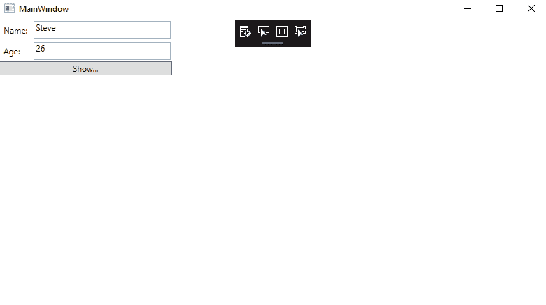

点击“显示”按钮后，会在消息框上显示姓名和年龄。

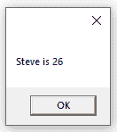

在对话框中，我们可以修改该人的姓名和年龄。

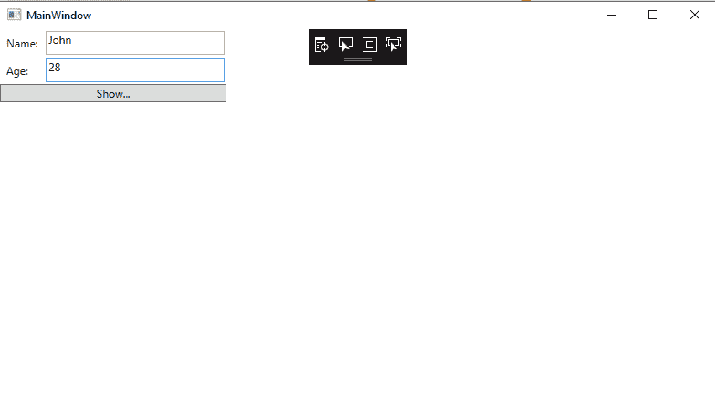

但是在更新值之后，我们将再次看到相同的消息。

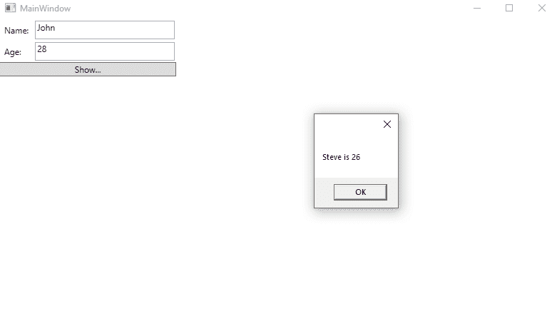

这是因为我们在 XAML 将数据绑定模式设置为单向。如果我们想显示更新的数据，我们需要了解双向数据绑定。

### 双向数据绑定

在双向数据绑定中，我们可以通过图形用户界面更新数据，并可以在源中获取更新的数据。如果我们在查看时更改了源，并且希望更新该视图。

这里我们将举一个例子，通过 XAML 代码将绑定模式从单向绑定更改为双向绑定:

### MainWindow(主窗口)。洗发精

```

<Window x:Class="WpfApp7.MainWindow"

        xmlns:x="http://schemas.microsoft.com/winfx/2006/xaml"
        xmlns:d="http://schemas.microsoft.com/expression/blend/2008"
        xmlns:mc="http://schemas.openxmlformats.org/markup-compatibility/2006"
        xmlns:local="clr-namespace:WpfApp7"
        mc:Ignorable="d"
        Title="MainWindow" Height="450" Width="800">
    <Grid>
        <Grid.RowDefinitions>
            <RowDefinition Height = "Auto" />
            <RowDefinition Height = "Auto" />
            <RowDefinition Height = "*" />
        </Grid.RowDefinitions>

        <Grid.ColumnDefinitions>
            <ColumnDefinition Width = "Auto" />
            <ColumnDefinition Width = "200" />
        </Grid.ColumnDefinitions>

        <Label Name = "nameLabel" Margin = "2">_Name:</Label>
        <TextBox Name = "nameText" Grid.Column = "1" Margin = "2" 
         Text = "{Binding Name, Mode = TwoWay}"/>
        <Label Name = "ageLabel" Margin = "2" Grid.Row = "1">_Age:</Label>
        <TextBox Name = "ageText" Grid.Column = "1" Grid.Row = "1" Margin = "2" 
         Text = "{Binding Age, Mode = TwoWay}"/>

        <StackPanel Grid.Row = "2" Grid.ColumnSpan = "2">
            <Button Content = "_Show..." Click = "Button_Click" />
        </StackPanel>

    </Grid>

</Window>

```

### MainWindow(主窗口)。萨摩足球俱乐部

```

using System;
using System.Collections.Generic;
using System.Linq;
using System.Text;
using System.Threading.Tasks;
using System.Windows;
using System.Windows.Controls;
using System.Windows.Data;
using System.Windows.Documents;
using System.Windows.Input;
using System.Windows.Media;
using System.Windows.Media.Imaging;
using System.Windows.Navigation;
using System.Windows.Shapes;

namespace WpfApp7
{
    /// <summary>
    /// Interaction logic for MainWindow.xaml
    /// </summary>
    public partial class MainWindow : Window
    {
        Person person = new Person { Name = "Steve", Age = 26 };

        public MainWindow()
        {
            InitializeComponent();
            this.DataContext = person;
        }

        private void Button_Click(object sender, RoutedEventArgs e)
        {
            string message = person.Name + " is " + person.Age;
            MessageBox.Show(message);
        }
    }

    public class Person
    {

        private string nameValue;

        public string Name
        {
            get { return nameValue; }
            set { nameValue = value; }
        }

        private double ageValue;

        public double Age
        {
            get { return ageValue; }

            set
            {
                if (value != ageValue)
                {
                    ageValue = value;
                }
            }
        }

    }
}

```

当我们运行这个应用程序时，将显示如下所示的输出:

**输出**

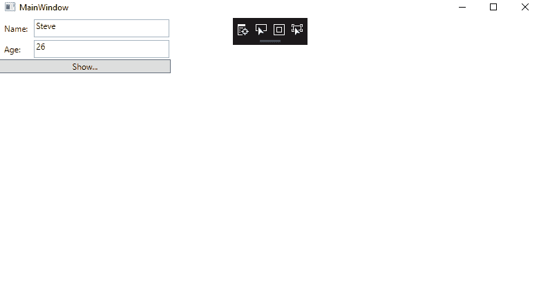

点击显示按钮后，将在对话框中向我们显示消息。

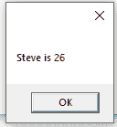

现在，我们想通过用户界面更改姓名和年龄的值:

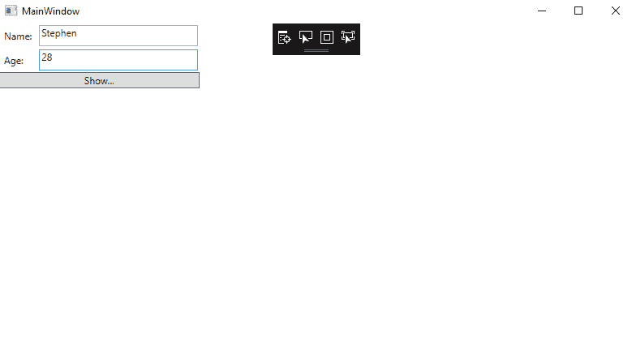

这将在对话框中显示更新后的值:

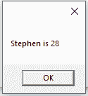

**在上面的章节中，我们已经描述了关于 WPF 的所有基本概念。**

* * *