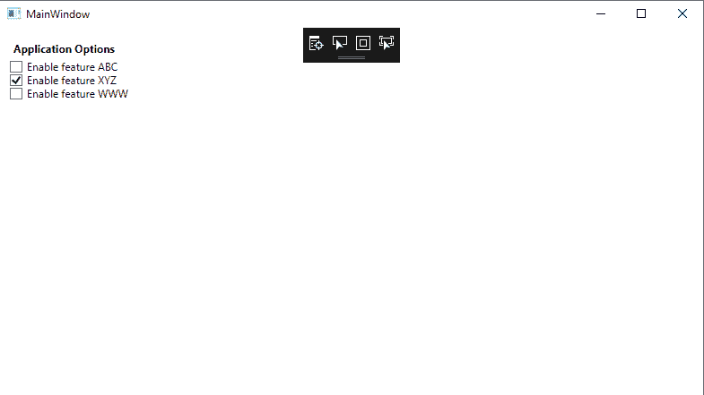
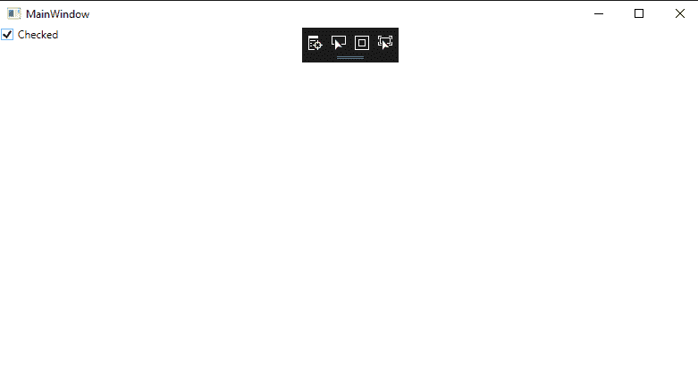
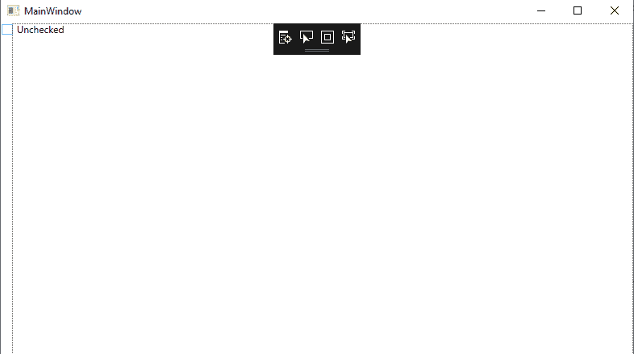

# WPF 复选框控制

> 原文:[https://www.javatpoint.com/wpf-checkbox-cntrol](https://www.javatpoint.com/wpf-checkbox-cntrol)

从复选框控件中，我们可以选择或取消选择项目。CheckBox 提供了一个列表，用户可以从中选择(检查)项目。我们将在大多数应用程序中使用这个列表。CheckBox 控件允许用户打开或关闭选项。CheckBox 以布尔值的形式向我们显示该值。

### 复选框中使用的属性

下面是 CheckBox 中使用的属性列表。

从复选框控件中，我们可以选择或取消选择项目。CheckBox 提供了一个列表，用户可以从中选择(检查)项目。我们将在大多数应用程序中使用这个列表。CheckBox 控件允许用户打开或关闭选项。CheckBox 以布尔值的形式向我们显示该值。

### 复选框中使用的属性

下面是 CheckBox 中使用的属性列表。

| -你好。不，不。 | 财产 | 描述 |
| 1. | 背景 | 背景属性用于获取或设置画笔，这将为我们提供背景控制。 |
| 2. | 边框色 | BorderBrush 属性用于获取或设置画笔，我们使用它来填充控件的边框。 |
| 3. | 内容 | content 属性用于获取或设置控件的内容。 |
| 4. | 点击模式 | ClickMode 属性用于根据设备的行为获取或设置我们点击事件时的值。 |

### CheckBox 中使用的方法

下面是 CheckBox 中使用的方法列表。

| -你好。不，不。 | 财产 | 描述 |
| 1. | **清除值** | ClearValue 方法用于清除依赖属性的局部值。 |
| 2. | t0±find name±t1±t | 在 FindName 方法的帮助下，我们将检索该对象。该对象包含唯一的名称。 |
| 3. | 不满地改变 | **OnContentChanged** 方法用于调用内容属性的值。 |
| 4. | **反应物** | **OnDragEnter** 方法用于在 DragEvent 发生时调用。 |
| 5. | **设置绑定** | **SetBinding** 方法是通过使用绑定对象将绑定与 FrameworkElement 绑定在一起。 |
| 6. | **开启切换** | **当切换按钮接收到切换的调用指令时，使用**方法。 |

### CheckBox 中使用的事件

CheckBox 中使用的事件如下:

| -你好。不，不。 | 事件 | 描述 |
| 1. | 检查 | 我们将在选中切换按钮时触发选中事件。选中的事件从 ToggleButton 继承。 |
| 2. | 点击 | 点击事件将在我们点击按钮时发生。点击事件继承自按钮库。 |
| 3. | 数据上下文已更改 | 当 **FrameworkElement 的值。数据上下文**属性更改。 |
| 4. | 龙怪 | 当输入系统报告拖动事件时，将发生拖动输入事件。拖动事件将以元素为目标发生。 |
| 5. | DragLeave | 当输入系统用原点形式的元素报告拖动事件时，将发生 DragLeave 事件。 |
| 6. | 德拉戈夫 | 当输入系统在目标的潜在下降中报告事件时，将发生 DragOver 事件。 |
| 7. | 拖动开始 | 拖动开始事件将在拖动操作初始化时发生。 |
| 8. | 获得焦点 | 当用户界面元素接收到焦点时，将发生 GotFocus 事件。 |
| 9. | IsEnabledChange | 当 IsEnable 属性更改时，将发生 IsEnabledChange 事件。 |
| 10. | 大小已更改 | 当 FrameworkElement 上的实际高度和实际宽度的值发生变化时，将发生 SizeChanges 事件。 |
| 11. | 未加抑制的 | 当我们取消选中切换按钮时，将会发生未选中的事件。 |

这里我们将解释如何在 XAML 和 T2 的帮助下在 [WPF](https://www.javatpoint.com/wpf) 中创建和使用复选框控件。

### 创建 CheckBox

在 XAML，checkbox 元素由 WPF CheckBox 控件显示。

这里我们将解释不同属性的特征。

*   内容属性将显示复选框的文本。
*   名称控件显示名称属性；该名称被称为控件的唯一标识符。
*   字体系列、字体样式、字体大小、字体拉伸所有这些属性都与字体有关。

我们将编写 XAML 代码，通过它我们将创建 checkbox 控件，并设置 CheckBox 控件的名称、内容、前景和字体相关属性。这里我们还将展示 **IsChecked** 属性的功能。

**主窗口。xaml〔t1〕**

```

<Window x:Class="WPFEvent.MainWindow"

        xmlns:x="http://schemas.microsoft.com/winfx/2006/xaml"
        xmlns:d="http://schemas.microsoft.com/expression/blend/2008"
        xmlns:mc="http://schemas.openxmlformats.org/markup-compatibility/2006"
        xmlns:local="clr-namespace:WPFEvent"
        mc:Ignorable="d"
        Title="MainWindow" Height="450" Width="800">
    <StackPanel Margin="10">
        <Label FontWeight="Bold">Application Options</Label>
        <CheckBox>Enable feature ABC</CheckBox>
        <CheckBox IsChecked="True">Enable feature XYZ</CheckBox>
        <CheckBox>Enable feature WWW</CheckBox>
    </StackPanel>

</Window>

```

上述代码的输出如下所示:



在上面的代码中，我们定义了复选框控件中 **IsChecked** 属性的状态。

### 在 CheckBox 中添加事件处理程序。

checkbox 元素的选中和未选中属性将添加选中和未选中的事件处理程序。当 CheckBox 的状态改变时，我们将触发这些事件。

事件处理程序的代码如下所示:

**主窗口。xaml〔t1〕**

```

<Window x:Class="WPFEvent.MainWindow"

        xmlns:x="http://schemas.microsoft.com/winfx/2006/xaml"
        xmlns:d="http://schemas.microsoft.com/expression/blend/2008"
        xmlns:mc="http://schemas.openxmlformats.org/markup-compatibility/2006"
        xmlns:local="clr-namespace:WPFEvent"
        mc:Ignorable="d"
        Title="MainWindow" Height="450" Width="800">
    <CheckBox Name="McCheckBox"  
   Canvas.Left="10" Canvas.Top="10"  
   Content="Check Me"  
   IsChecked="True" IsThreeState="True"  
   Checked="McCheckBox_Checked"
              Unchecked="McCheckBox_Unchecked">
    </CheckBox>

</Window>

```

**输出**



当我们点击复选框时，复选框的状态会发生变化，如下图所示:



### 包裹

在上面，我们已经描述了在设计时使用 WPF 创建复选框控件。

* * *