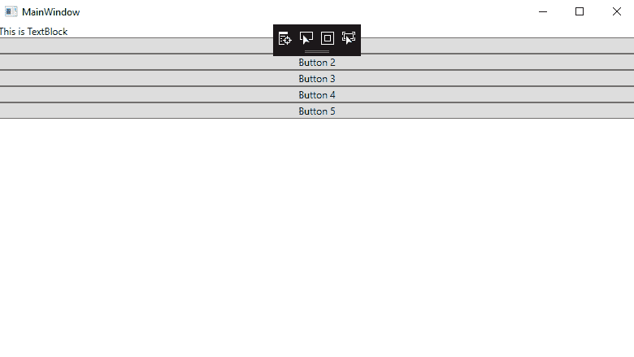
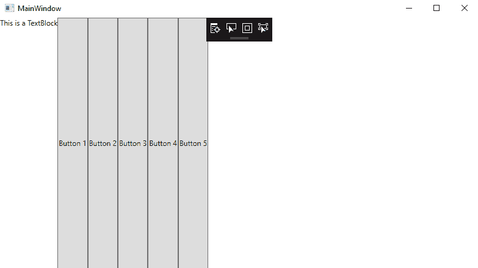
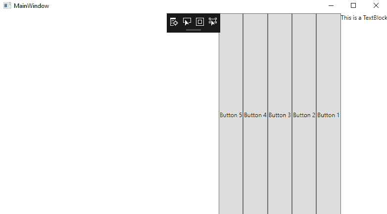
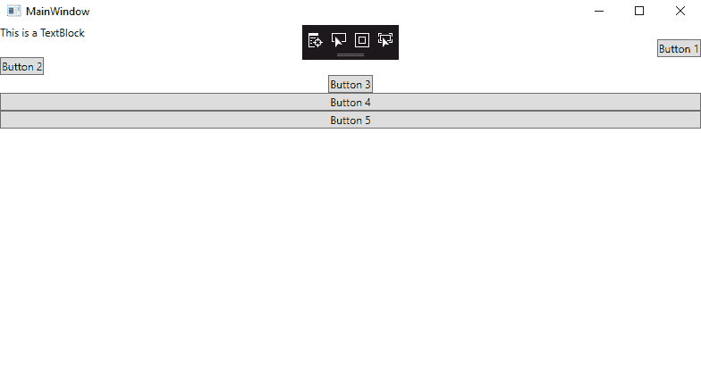
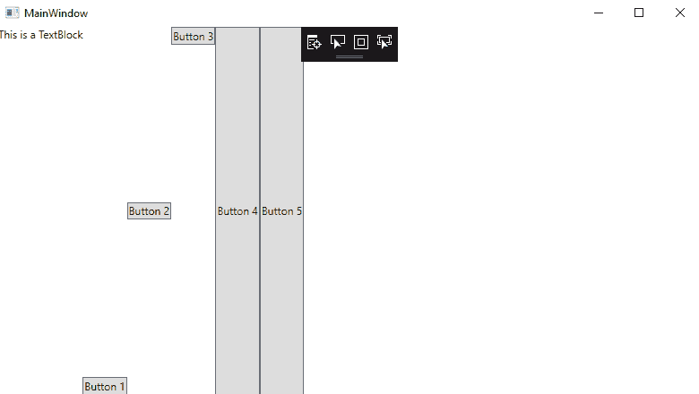
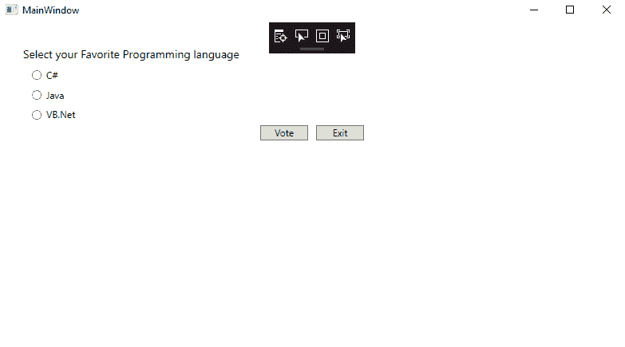

# 堆栈面板控制

> 原文：<https://www.javatpoint.com/wpf-stackpanel-control>

StackPanel 将子元素放在垂直和水平堆栈中。StackPanel 是最受欢迎的面板。StackPanel 也称为简单面板。StackPanel 的子元素在垂直方向上从上到下增长。

我们将使用水平对齐或垂直对齐来放置子元素，并使用边距和填充属性来设置间距。

现在我们将使用堆栈面板创建布局。

现在我们将编写一个代码，通过它我们将向堆栈面板添加一个文本框和 5 个按钮。默认情况下，StackPanel 将从上到下排列元素。

堆栈面板中包含的所有元素都将伸展到堆栈面板的整个宽度。

### MainWindow(主窗口)。洗发精

```cs

<Window x:Class="WPFEvent.MainWindow"

        xmlns:x="http://schemas.microsoft.com/winfx/2006/xaml"
        xmlns:d="http://schemas.microsoft.com/expression/blend/2008"
        xmlns:mc="http://schemas.openxmlformats.org/markup-compatibility/2006"
        xmlns:local="clr-namespace:WPFEvent"
        mc:Ignorable="d"
        Title="MainWindow" Height="450" Width="800">
    <StackPanel>
        <TextBlock Text="This is TextBlock"></TextBlock>
        <Button Content="Button 1"></Button>
        <Button Content="Button 2"></Button>
        <Button Content="Button 3"></Button>
        <Button Content="Button 4"></Button>
        <Button Content="Button 5"></Button>
    </StackPanel>

</Window>

```

堆栈面板的输出如下图所示:

**输出**



**示例 2:** 这里我们将举另一个 StackPanel 的例子，我们将元素水平放置在 StackPanel 中。

在这里，我们将把方向属性设置为水平后，水平排列 StackPanel 的子元素。这一次，子元素将自己伸展到堆栈面板的高度。

为此，我们将编写以下代码:

### MainWindow(主窗口)。洗发精

```cs

<Window x:Class="WPFEvent.MainWindow"

        xmlns:x="http://schemas.microsoft.com/winfx/2006/xaml"
        xmlns:d="http://schemas.microsoft.com/expression/blend/2008"
        xmlns:mc="http://schemas.openxmlformats.org/markup-compatibility/2006"
        xmlns:local="clr-namespace:WPFEvent"
        mc:Ignorable="d"
        Title="MainWindow" Height="450" Width="800">
    <StackPanel Orientation="Horizontal">
        <TextBlock Text="This is a TextBlock"></TextBlock>
        <Button Content="Button 1"></Button>
        <Button Content="Button 2"></Button>
        <Button Content="Button 3"></Button>
        <Button Content="Button 4"></Button>
        <Button Content="Button 5"></Button>
    </StackPanel>

```

下面是上面代码的输出:

**输出**



**示例 3:** 现在我们将更改 StackPanel 的 FlowDirection 属性。

现在，我们将从堆栈面板的右侧到左侧设置流向属性以及水平方向。现在从 RightToLeft 中堆叠子元素。

为此，我们将编写下面的代码来设置从右到左水平方向的子元素。

### MainWindow(主窗口)。洗发精

```cs

<Window x:Class="WPFEvent.MainWindow"

        xmlns:x="http://schemas.microsoft.com/winfx/2006/xaml"
        xmlns:d="http://schemas.microsoft.com/expression/blend/2008"
        xmlns:mc="http://schemas.openxmlformats.org/markup-compatibility/2006"
        xmlns:local="clr-namespace:WPFEvent"
        mc:Ignorable="d"
        Title="MainWindow" Height="450" Width="800">
    <StackPanel Orientation="Horizontal" FlowDirection="RightToLeft">
        <TextBlock Text="This is a TextBlock"></TextBlock>
        <Button Content="Button 1"></Button>
        <Button Content="Button 2"></Button>
        <Button Content="Button 3"></Button>
        <Button Content="Button 4"></Button>
        <Button Content="Button 5"></Button>
    </StackPanel>

</Window>

```

上述代码的输出如下图所示:

**输出**



**示例 4:** 现在，我们将更改 StackPanel 中子元素的 HorizontalAlignment 属性。

默认情况下，水平对齐属性将元素拉伸到堆栈面板的宽度。正因为如此，子元素将自己伸展到堆栈面板的整个宽度。我们可以将水平对齐方式更改为向右、向左、居中或拉伸。

**为此，我们将编写以下代码:**

**主窗口。xaml〔t1〕**

```cs

<Window x:Class="WPFEvent.MainWindow"

        xmlns:x="http://schemas.microsoft.com/winfx/2006/xaml"
        xmlns:d="http://schemas.microsoft.com/expression/blend/2008"
        xmlns:mc="http://schemas.openxmlformats.org/markup-compatibility/2006"
        xmlns:local="clr-namespace:WPFEvent"
        mc:Ignorable="d"
        Title="MainWindow" Height="450" Width="800">
    <StackPanel>
        <TextBlock Text="This is a TextBlock"></TextBlock>
        <Button Content="Button 1" HorizontalAlignment="Right"></Button>
        <Button Content="Button 2" HorizontalAlignment="Left"></Button>
        <Button Content="Button 3" HorizontalAlignment="Center"></Button>
        <Button Content="Button 4" HorizontalAlignment="Stretch"></Button>
        <Button Content="Button 5"></Button>
    </StackPanel>

</Window>

```

上面代码的输出如下截图所示:

**输出**



**示例 5:** 现在我们将更改堆栈面板中子元素的垂直对齐属性以及水平方向。

为了在垂直对齐中排列元素，我们将编写以下代码:

### MainWindow(主窗口)。洗发精

```cs

<Window x:Class="WPFEvent.MainWindow"

        xmlns:x="http://schemas.microsoft.com/winfx/2006/xaml"
        xmlns:d="http://schemas.microsoft.com/expression/blend/2008"
        xmlns:mc="http://schemas.openxmlformats.org/markup-compatibility/2006"
        xmlns:local="clr-namespace:WPFEvent"
        mc:Ignorable="d"
        Title="MainWindow" Height="450" Width="800">
    <StackPanel Orientation="Horizontal">
        <TextBlock Text="This is a TextBlock"></TextBlock>
        <Button Content="Button 1" VerticalAlignment="Bottom"></Button>
        <Button Content="Button 2" VerticalAlignment="Center"></Button>
        <Button Content="Button 3" VerticalAlignment="Top"></Button>
        <Button Content="Button 4" VerticalAlignment="Stretch"></Button>
        <Button Content="Button 5"></Button>
    </StackPanel>

</Window>

```

**输出**



### 示例 6:这里我们将举另一个堆栈面板的例子，它是嵌套的堆栈面板。

当我们在堆栈面板中使用堆栈面板时，我们将堆栈面板称为**嵌套堆栈面板**。

在这里，我们将以嵌套面板为例，我们将在垂直方向上调整外堆栈面板的方向(这是默认方向)，在水平方向上调整内堆栈面板的方向，水平对齐位于中心。

这里我们将为 **NestedStackPanel 写下下面的代码:**

### MainWindow(主窗口)。洗发精

```cs

<Window x:Class="WPFEvent.MainWindow"

        xmlns:x="http://schemas.microsoft.com/winfx/2006/xaml"
        xmlns:d="http://schemas.microsoft.com/expression/blend/2008"
        xmlns:mc="http://schemas.openxmlformats.org/markup-compatibility/2006"
        xmlns:local="clr-namespace:WPFEvent"
        mc:Ignorable="d"
        Title="MainWindow" Height="450" Width="800">
    <StackPanel Margin="30">
        <TextBlock Text="Select your Favorite Programming language" FontSize="14"></TextBlock>
        <RadioButton Margin="10,10,0,0">C#</RadioButton>
        <RadioButton Margin="10,10,0,0">Java</RadioButton>
        <RadioButton Margin="10,10,0,0">VB.Net</RadioButton>
        <StackPanel Orientation="Horizontal" HorizontalAlignment="Center">
            <Button Content="Vote" Margin="5" MinWidth="60"></Button>
            <Button Content="Exit" Margin="5" MinWidth="60"></Button>
        </StackPanel>
    </StackPanel>

</Window>

```

NestedStackPanel 的输出如下图所示:

**输出**



### 包裹

如上所述，我们已经指定了 StackPanel 的所有功能。元素的对齐通过使用 StackPanel 在右、左、上、下使用 Alignment 属性来完成。

* * *