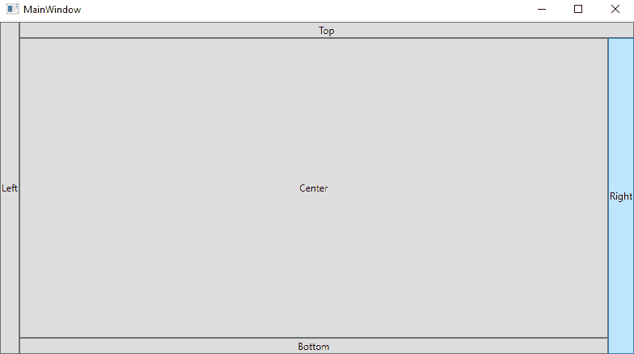
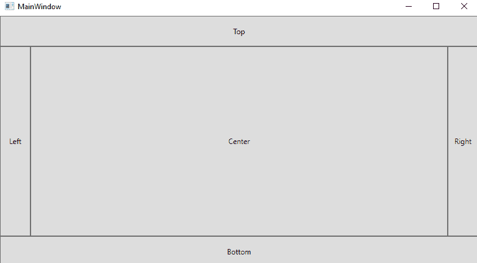
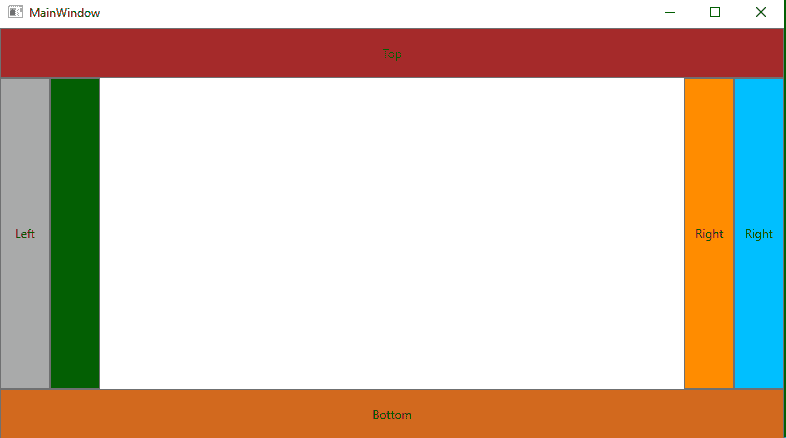
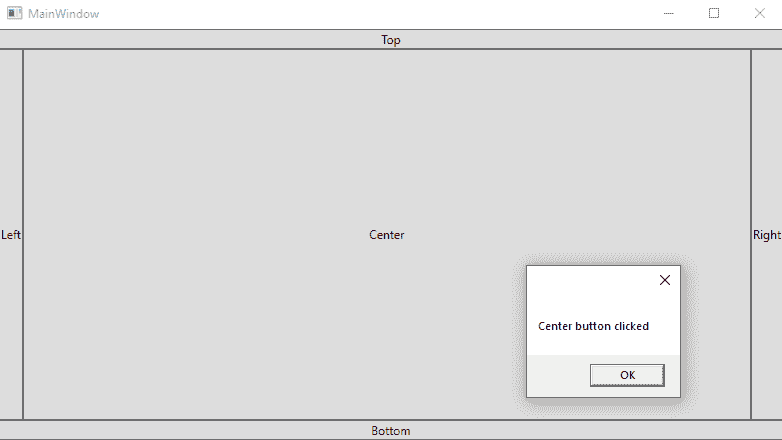

# WPF 坞站面板布局

> 原文：<https://www.javatpoint.com/wpf-dockpanel-layout>

DockPanel 为我们提供了一个相互排列元素的区域。我们可以水平或垂直放置子元素。

在 DockPanel 的帮助下，我们可以使用 Dock 属性轻松地将子元素排列在顶部、底部、右侧、左侧和中央。

DockPanel 用于向各个方向放置内容。我们可以将[窗口](https://www.javatpoint.com/windows)划分为特定区域。我们将使用停靠面板。Dock 属性来决定我们要使用哪个方向来放置子控件。如果我们没有使用这个，那么第一个控件将被放在左边。最后一个将覆盖所有的空间。

这里我们将举一个例子，根据如下所示的停靠面板布局在屏幕中放置元素:

### MainWindow(主窗口)。洗发精

```cs

<Window x:Class="DockPanelLayout.MainWindow"

        xmlns:x="http://schemas.microsoft.com/winfx/2006/xaml"
        xmlns:d="http://schemas.microsoft.com/expression/blend/2008"
        xmlns:mc="http://schemas.openxmlformats.org/markup-compatibility/2006"
        xmlns:local="clr-namespace:DockPanelLayout"
        mc:Ignorable="d"
        Title="MainWindow" Height="450" Width="800">
    <DockPanel>
        <Button DockPanel.Dock="Left">Left</Button>
        <Button DockPanel.Dock="Top">Top</Button>
        <Button DockPanel.Dock="Right">Right</Button>
        <Button DockPanel.Dock="Bottom">Bottom</Button>
        <Button>Center</Button>
    </DockPanel>

</Window>

```

上面代码的输出如下图所示:

**输出**



在上面的例子中，如果我们注意到我们为子元素分配了停靠位置。最后一个子元素自动获取整个剩余空间。中心周围的控件将根据需要占据空间，剩余的空间留给最后一个子元素。右子元素获得的空间比左子控件多。这只是因为在右边的子元素中添加了额外的字符，而额外的字符将需要额外的空间。

现在我们来谈谈屏幕的空间是如何划分的。如果我们注意到顶部元素没有获得所有的顶部空间。那只是因为左按钮覆盖了顶部按钮的一部分。在这种情况下，DockPanel 将通过查看控件的标记来决定控件的空间。

在这种情况下，左按钮在前面，因为该按钮位于标记中的第一个位置。我们可以通过给子控件分配高度和宽度来轻松更改控件的空间。

**这里我们将看到另一个例子，我们将设置控件的高度和宽度。为此，我们将编写以下代码:**

**主窗口。xaml〔t1〕**

```cs

<Window x:Class="DockPanelLayout.MainWindow"

        xmlns:x="http://schemas.microsoft.com/winfx/2006/xaml"
        xmlns:d="http://schemas.microsoft.com/expression/blend/2008"
        xmlns:mc="http://schemas.openxmlformats.org/markup-compatibility/2006"
        xmlns:local="clr-namespace:DockPanelLayout"
        mc:Ignorable="d"
        Title="MainWindow" Height="450" Width="800">
    <DockPanel>
        <Button DockPanel.Dock="Top" Height="50">Top</Button>
        <Button DockPanel.Dock="Bottom" Height="50">Bottom</Button>
        <Button DockPanel.Dock="Left" Width="50">Left</Button>
        <Button DockPanel.Dock="Right" Width="50">Right</Button>
        <Button>Center</Button>
    </DockPanel>
</Window>

```

代码的输出如下图所示:

**输出**



在上面的截图中，我们可以看到像顶部和底部这样的控件位于左右控件的前面。当我们调整窗口的大小时，在这种情况下，我们会看到静态宽度和高度保持不变。

当我们调整窗口的屏幕大小时，只有中心区域会增加或减少。

### lastdchildfill

正如我们所知，默认情况下，DockPanel 的最后一个子级获取剩余的空间。但是我们可以通过使用**lastdchildfill**来禁用这种行为。

这里我们将举一个例子，我们将编写一个代码来禁用 dock 的最后一个子元素，还将显示 dock 在同一侧有多个控件的行为。

为此，我们将编写以下 XAML 代码:

### MainWindow(主窗口)。洗发精

```cs

<Window x:Class="DockPanelLayout.MainWindow"

        xmlns:x="http://schemas.microsoft.com/winfx/2006/xaml"
        xmlns:d="http://schemas.microsoft.com/expression/blend/2008"
        xmlns:mc="http://schemas.openxmlformats.org/markup-compatibility/2006"
        xmlns:local="clr-namespace:DockPanelLayout"
        mc:Ignorable="d"
        Title="MainWindow" Height="450" Width="800">
    <DockPanel LastChildFill="False">
        <Button DockPanel.Dock="Top" Height="50" Background="Brown">Top</Button>
        <Button DockPanel.Dock="Bottom" Height="50" Background="Chocolate">Bottom</Button>
        <Button DockPanel.Dock="Left" Width="50" Background="DarkGray">Left</Button>
        <Button DockPanel.Dock="Left" Width="50" Background="DarkGreen">Left</Button>
        <Button DockPanel.Dock="Right" Width="50" Background="DeepSkyBlue">Right</Button>
        <Button DockPanel.Dock="Right" Width="50" Background="DarkOrange">Right</Button>
    </DockPanel>

</Window>

```

上述代码的输出如下图所示:

**输出**



在上面的例子中，我们将两个控件放在左边，将两个控件放在右边，并禁用 LastChildFill 属性。然后，通过这一点，我们得到了中心的空白空间，这在大多数情况下是需要的。

这里我们将举另一个 DockPanel 的例子。在这里，我们将在 XAML 代码的帮助下在 DockPanel 中添加按钮:

### MainWindow(主窗口)。洗发精

```cs

<Window x:Class="DockPanelLayout.MainWindow"

        xmlns:x="http://schemas.microsoft.com/winfx/2006/xaml"
        xmlns:d="http://schemas.microsoft.com/expression/blend/2008"
        xmlns:mc="http://schemas.openxmlformats.org/markup-compatibility/2006"
        xmlns:local="clr-namespace:DockPanelLayout"
        mc:Ignorable="d"
        Title="MainWindow" Height="450" Width="800">
    <Grid>
        <DockPanel LastChildFill = "True">
            <Button Content = "Top" DockPanel.Dock = "Top" Click="Button_Click"/>
            <Button Content = "Bottom" DockPanel.Dock = "Bottom" Click ="Button_Click" />
            <Button Content = "Left" Click ="Button_Click" />
            <Button Content = "Right" DockPanel.Dock = "Right" Click = "Button_Click" />
            <Button Content = "Center" Click ="Button_Click" />
        </DockPanel>
    </Grid>

</Window>

```

现在我们将对按钮点击事件进行 [C#](https://www.javatpoint.com/c-sharp-tutorial) 编码。

**MainWindow.cs**

```cs

using System;
using System.Collections.Generic;
using System.Linq;
using System.Text;
using System.Threading.Tasks;
using System.Windows;
using System.Windows.Controls;
using System.Windows.Data;
using System.Windows.Documents;
using System.Windows.Input;
using System.Windows.Media;
using System.Windows.Media.Imaging;
using System.Windows.Navigation;
using System.Windows.Shapes;

namespace DockPanelLayout
{
    /// <summary>
    /// Interaction logic for MainWindow.xaml
    /// </summary>
    public partial class MainWindow : Window
    {
        public MainWindow()
        {
            InitializeComponent();
        }

        private void Button_Click(object sender, RoutedEventArgs e)
        {
            Button btn = sender as Button;
            string str = btn.Content.ToString() + " button clicked";
            MessageBox.Show(str);

        }
    }
}

```

**上述代码的输出将如下截图所示:**

**输出**



* * *