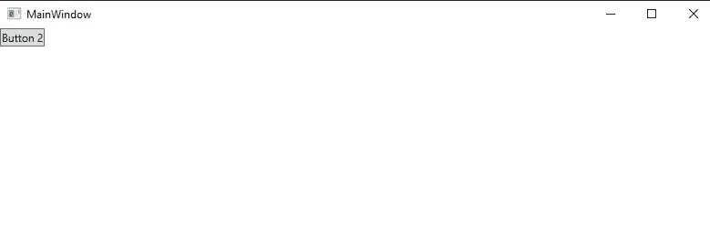
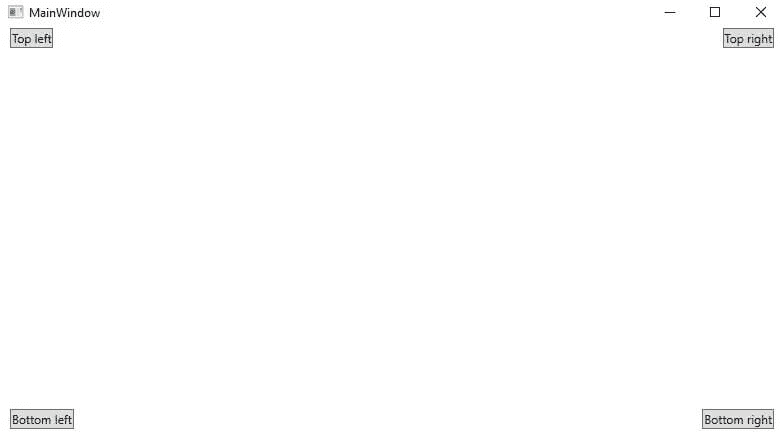
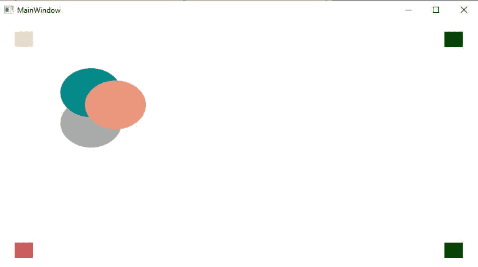

# WPF 帆布面板

> 原文：<https://www.javatpoint.com/wpf-canvas-panel>

画布面板用于通过使用坐标来放置子元素。所有这些元素都与画布区域相关。画布面板被认为是最直接的面板。画布面板本身不会做任何事情。我们唯一能做的就是把控制装置放进去。

现在我们将编写下面的 XAML 代码来创建画布面板。

### MainWindow(主窗口)。洗发精

```

<Window x:Class="ToggleButtonControl.MainWindow"

        xmlns:x="http://schemas.microsoft.com/winfx/2006/xaml"
        xmlns:d="http://schemas.microsoft.com/expression/blend/2008"
        xmlns:mc="http://schemas.openxmlformats.org/markup-compatibility/2006"
        xmlns:local="clr-namespace:ToggleButtonControl"
        mc:Ignorable="d"
        Title="MainWindow" Height="450" Width="800">
    <Canvas>
        <Button>Button 1</Button>
        <Button>Button 2</Button>
    </Canvas>

</Window>

```

上面代码的输出如下图所示:

**输出**



我们可以看到，我们创建了双按钮，并将两个按钮都放在同一个位置，但是在输出中，我们只能看到一个按钮。

画布控件本身不会做任何事情，要调整控件我们必须使用坐标。为了放置控件，我们将应用左、右、底和上坐标。

为了指定控件的位置，我们将编写以下代码:

### MainWindow(主窗口)。洗发精

```

<Window x:Class="ToggleButtonControl.MainWindow"

        xmlns:x="http://schemas.microsoft.com/winfx/2006/xaml"
        xmlns:d="http://schemas.microsoft.com/expression/blend/2008"
        xmlns:mc="http://schemas.openxmlformats.org/markup-compatibility/2006"
        xmlns:local="clr-namespace:ToggleButtonControl"
        mc:Ignorable="d"
        Title="MainWindow" Height="450" Width="800">
    <Canvas>
        <Button Canvas.Left="10">Top left</Button>
        <Button Canvas.Right="10">Top right</Button>
        <Button Canvas.Left="10" Canvas.Bottom="10">Bottom left</Button>
        <Button Canvas.Right="10" Canvas.Bottom="10">Bottom right</Button>
    </Canvas>

</Window>

```

上面代码的输出如下图所示:

**输出**



画布被称为特殊的布局面板。该面板根据 x 和 y 坐标等位置放置子元素。我们可以把元素放在画布的任何地方。当元素的位置相互交叉时，元素可以重叠。元素可以放在序列中。

在画布上放置元素没有任何限制。定义元素的高度和宽度是非常必要的。我们也可以使用 Canvas。左，画布。顶部，帆布。对，画布。底部定义画布中的坐标。

现在我们再举一个画布的例子。

### MainWindow(主窗口)。洗发精

```

<Window x:Class="ToggleButtonControl.MainWindow"

        xmlns:x="http://schemas.microsoft.com/winfx/2006/xaml"
        xmlns:d="http://schemas.microsoft.com/expression/blend/2008"
        xmlns:mc="http://schemas.openxmlformats.org/markup-compatibility/2006"
        xmlns:local="clr-namespace:ToggleButtonControl"
        mc:Ignorable="d"
        Title="MainWindow" Height="450" Width="800">
    <Canvas>
        <Border Canvas.Top="20" Canvas.Left="25" Background="Bisque" Width="30" 

          Height="25" />
        <Border Canvas.Top="20" Canvas.Right="25" Background="Green" Width="30" 

        Height="25" />
        <Border Canvas.Bottom="20" Canvas.Right="25" 

            Background="Black" Width="30" Height="25" />
        <Border Canvas.Bottom="20" Canvas.Left="25" Background="IndianRed" 

            Width="30" Height="25" />
        <Ellipse Fill="DarkGray" Canvas.Left="100" Canvas.Top="130" Width="100" 

          Height="80"></Ellipse>
        <Ellipse Fill="DarkCyan" Canvas.Left="100" Canvas.Top="80" Width="100"

           Height="80"></Ellipse>
        <Ellipse Fill="DarkSalmon" Canvas.Left="140" Canvas.Top="100" Width="100" 

         Height="80" />
    </Canvas>

</Window>

```

上面代码的输出如下图所示:

**输出**



在上面的代码中，我们可以看到我们将 Border 元素放在了同一个区域，但是 canvas 属性改变了坐标系统，将元素放在了窗口的四边。

正如我们在上面的截图中看到的那样，椭圆相互重叠，这只是因为元素被放置在相同的序列上。

* * *