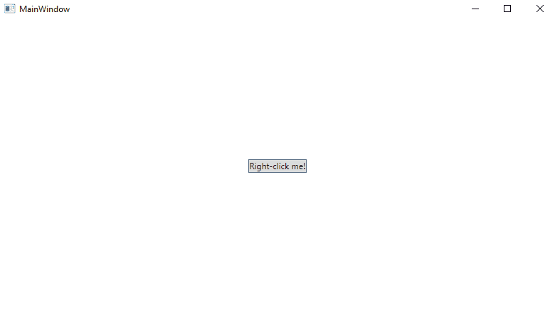
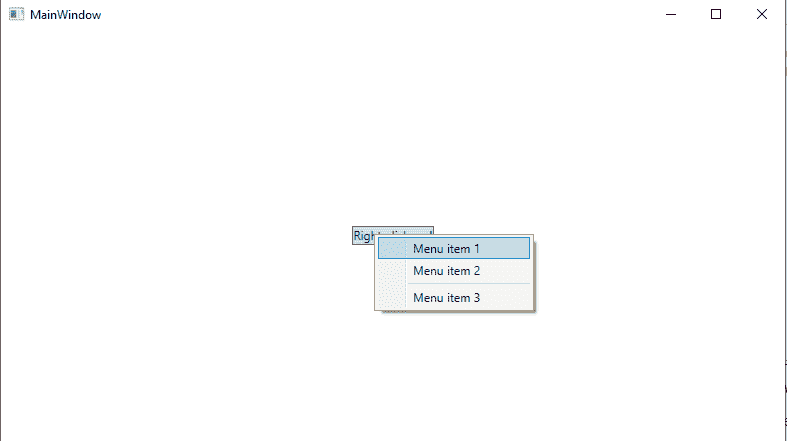
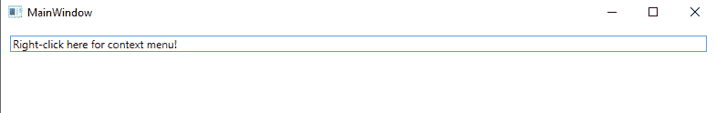
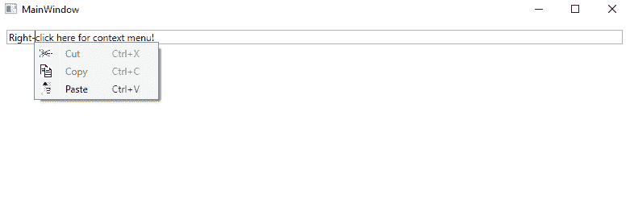

# wpf 上下文菜单

> 原文：<https://www.javatpoint.com/wpf-context-menu>

上下文菜单，通常称为弹出菜单或弹出菜单，将在用户执行特定操作时显示。通常，当我们用鼠标右键单击特定的控件或窗口时，上下文菜单就会出现。

WPF 包含上下文菜单控件，因为上下文菜单总是绑定到特定控件。这向我们展示了如何将上下文菜单添加到界面中。

上下文菜单继承了菜单栏类。

现在我们将编写 XAML 代码，在 [WPF](https://www.javatpoint.com/wpf) 中添加上下文菜单。

### MainWindow(主窗口)。洗发精

```

<Window x:Class="WPFGridControl.MainWindow"

        xmlns:x="http://schemas.microsoft.com/winfx/2006/xaml"
        xmlns:d="http://schemas.microsoft.com/expression/blend/2008"
        xmlns:mc="http://schemas.openxmlformats.org/markup-compatibility/2006"
        xmlns:local="clr-namespace:WPFGridControl"
        mc:Ignorable="d"
        Title="MainWindow" Height="450" Width="800">
    <Button Content="Right-click me!" VerticalAlignment="Center" HorizontalAlignment="Center">
        <Button.ContextMenu>
            <ContextMenu>
                <MenuItem Header="Menu item 1" />
                <MenuItem Header="Menu item 2" />
                <Separator />
                <MenuItem Header="Menu item 3" />
            </ContextMenu>
        </Button.ContextMenu>
    </Button>

</Window>

```

上述代码的输出如下所示:

**输出**



### 现在，我们将在单击窗口上下文菜单后右键单击按钮:



当我们现在使用上下文菜单时，我们将使用两个键的概念。

WPF 命令为我们提供了不同的功能，包括点击、文本和快捷文本的事件处理。分配命令属性后，我们将编写事件处理的 XAML 代码。

**主窗口。xaml〔t1〕**

```

<Window x:Class="WPFGridControl.MainWindow"

        xmlns:x="http://schemas.microsoft.com/winfx/2006/xaml"
        xmlns:d="http://schemas.microsoft.com/expression/blend/2008"
        xmlns:mc="http://schemas.openxmlformats.org/markup-compatibility/2006"
        xmlns:local="clr-namespace:WPFGridControl"
        mc:Ignorable="d"
        Title="MainWindow" Height="450" Width="800">
    <StackPanel Margin="10">
        <TextBox Text="Right-click here for context menu!">
            <TextBox.ContextMenu>
                <ContextMenu>
                    <MenuItem Command="Cut">
                        <MenuItem.Icon>
                            <Image Source="C:\Users\HP\source\repos\WPFGridControl\WPFGridControl\image\cut.jpg" />
                        </MenuItem.Icon>
                    </MenuItem>
                    <MenuItem Command="Copy">
                        <MenuItem.Icon>
                            <Image Source="C:\Users\HP\source\repos\WPFGridControl\WPFGridControl\image\copy.jpg" />
                        </MenuItem.Icon>
                    </MenuItem>
                    <MenuItem Command="Paste">
                        <MenuItem.Icon>
                            <Image Source="C:\Users\HP\source\repos\WPFGridControl\WPFGridControl\image\computer-icons-clipboard-cut-copy-and-paste-symbol.jpg" />
                        </MenuItem.Icon>
                    </MenuItem>
                </ContextMenu>
            </TextBox.ContextMenu>
        </TextBox>
    </StackPanel>
</Window>

```

**在初始状态下，上面代码的输出会给我们展示如下截图所示:**

**输出**



**右键点击文本后，上面代码的输出如下截图所示:**



右键单击文本后，会显示一个包含剪切、复制和粘贴命令功能的弹出窗口。

从上面的截图中，我们可以看到在上下文菜单的菜单项上使用图标是多么简单。

### 在代码的帮助下调用上下文菜单

在此之前，我们已经看到在右键单击控件后调用了上下文菜单。在 [WPF](https://www.javatpoint.com/wpf-interview-questions) 的帮助下，当我们将其分配给上下文菜单属性时，我们自动调用了上下文菜单。但是当我们想要在代码的帮助下手动调用上下文菜单时，就会出现这种情况。

为此，我们将编写以下代码:

**主窗口。xaml〔t1〕**

```

<Window x:Class="WPFGridControl.MainWindow"

        xmlns:x="http://schemas.microsoft.com/winfx/2006/xaml"
        xmlns:d="http://schemas.microsoft.com/expression/blend/2008"
        xmlns:mc="http://schemas.openxmlformats.org/markup-compatibility/2006"
        xmlns:local="clr-namespace:WPFGridControl"
        mc:Ignorable="d"
        Title="MainWindow" Height="450" Width="800">
    <Window.Resources>
        <ContextMenu x:Key="cmButton">
            <MenuItem Header="Menu item 1" />
            <MenuItem Header="Menu item 2" />
            <Separator />
            <MenuItem Header="Menu item 3" />
        </ContextMenu>
    </Window.Resources>
    <Grid>
        <Button Content="Click me!" VerticalAlignment="Center" HorizontalAlignment="Center" Click="Button_Click"
                />
    </Grid>

</Window>

```

事件按钮点击已经发生。在主窗口上。XAML.cs，我们将在 [C#](https://www.javatpoint.com/c-sharp-tutorial) 中进行编码。

**主窗口。xaml . cs〔t1〕**

```

using System;
using System.Collections.Generic;
using System.Linq;
using System.Text;
using System.Threading.Tasks;
using System.Windows;
using System.Windows.Controls;
using System.Windows.Data;
using System.Windows.Documents;
using System.Windows.Input;
using System.Windows.Media;
using System.Windows.Media.Imaging;
using System.Windows.Navigation;
using System.Windows.Shapes;

namespace WPFGridControl
{
    /// <summary>
    /// Interaction logic for MainWindow.xaml
    /// </summary>
    public partial class MainWindow : Window
    {
        public MainWindow()
        {
            InitializeComponent();
        }

        private void Button_Click(object sender, RoutedEventArgs e)
        {
            ContextMenu cm = this.FindResource("cmButton") as ContextMenu;
            cm.PlacementTarget = sender as Button;
            cm.IsOpen = true;

        }
    }
}

```

**输出**


**按钮有 click 事件处理程序，在源代码中处理。窗口资源包含位于[窗口](https://www.javatpoint.com/windows)资源中的上下文对象。**

* * *