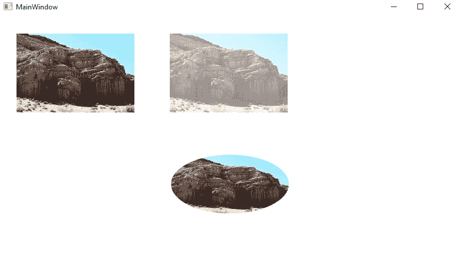
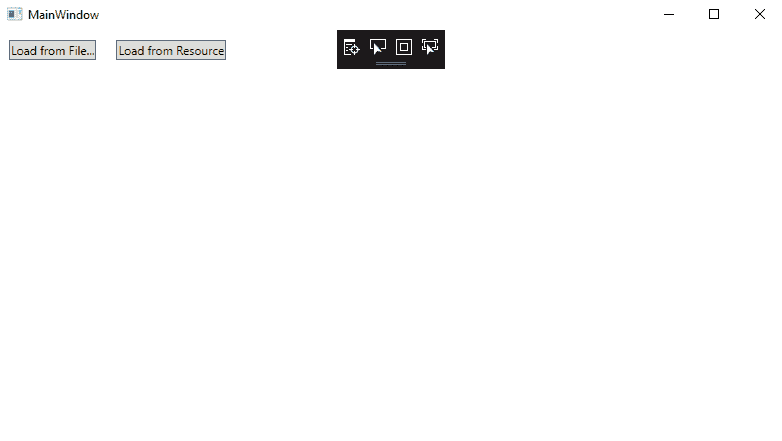
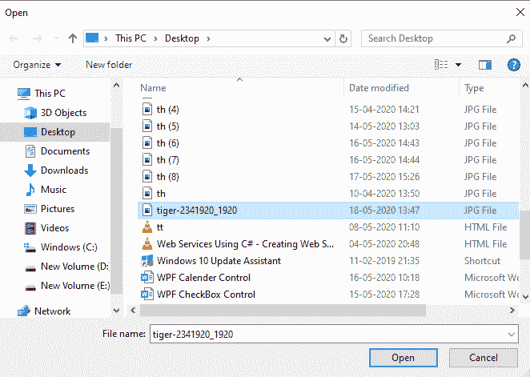
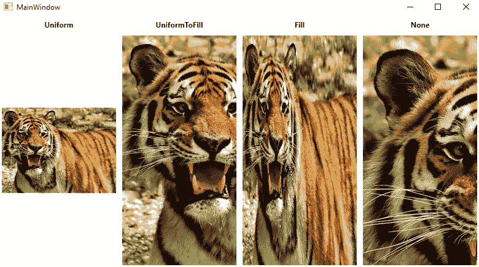

# WPF 图像控制

> 原文：<https://www.javatpoint.com/wpf-image-control>

借助 WPF 图像控件，我们可以在应用程序中显示图像。WPF 图像控制是一种多功能控制。WPF 图像控制显示图像。为此，我们可以使用 ImageObject 或 ImageBrush 对象。ImageObject 将显示图像，而 ImageBrushObject 将使用图像绘制另一个对象。图像的来源是通过引用支持不同格式的图像文件来指定的。

图像控件支持的格式如下:

1.  位图(BMP)。
2.  标记图像文件格式。
3.  图标(ICO)。
4.  联合摄影专家组(JPEG)。
5.  图形交换格式。
6.  便携式网络图形。
7.  JPEG XR。

### 图像控制中使用的属性

| -你好。不，不。 | 性能 | 描述 |
| **1。** | 可以拉 | CanDrag 属性用于获取或设置值。该值用于指示我们是否可以使用拖放操作来拖动元素。CanDrag 属性继承自用户界面元素。 |
| **2。** | 高度 | **Height** 属性用于获取或设置值。该值设置 FrameworkElement 的高度。 |
| **3。** | 播放源 | 当我们将图像用于播放源场景时，播放源属性用于获取传输的信息。 |
| **4。** | SourceProperty | 源属性用于标识源依赖属性。 |
| **5。** | 伸展 | 拉伸属性用于获取或设置值，该值显示我们如何拉伸图像以填充目标。 |
| **6。** | 拉伸属性 | 拉伸属性用于标识搜索依赖属性。 |
| **7。** | 来源 | source 属性用于获取或设置图像的源。 |

### 图像类中使用的事件

我们在图像类中使用的事件如下:

| -你好。不，不。 | 性能 | 描述 |
| 1. | 数据上下文已更改 | 当 FrameworkElement 属性的值。数据上下文已更改。 |
| 2. | 龙怪 | 当输入系统报告以元素为目标的拖动事件时，将发生拖动输入事件。 |
| 3. | DragLeave | 当输入系统用像原点这样的元素报告拖动事件时，将发生 DragLeave 事件。 |
| 4. | 拖动开始 | DragStarting 事件将在我们初始化拖动操作时发生。 |
| 5. | 图像已打开 | 当我们下载图像的来源并对其进行解码而没有失败时，就会发生 ImageOpened 事件。我们可以使用此事件来确定图像源的大小。 |
| 6. | 图像失败 | 当我们检索图像的格式时，会发生 ImageFailed 事件，然后会发生错误。 |
| 7. | 大小已更改 | 当实际高度和实际宽度的属性更改 FrameworkElement 上的值时，将发生大小更改事件。 |

[WPF](https://www.javatpoint.com/wpf) 图像控制是一个多功能控制。

我们将使用语法:**图像源属性来添加图像。**

**源属性:**我们使用源属性来定义我们想要显示的图像。我们在图像控件中使用 source 属性来标识我们想要显示的图像。借助 Source 属性，我们可以轻松定义要在图像控件中显示的图像。

### 现在我们以 WPF 图像控制为例。

现在让我们创建一个新的 [WPF](https://www.javatpoint.com/wpf-interview-questions) 项目，该项目的名称为 WPFImageControl。这里，我们将使用网格行定义将屏幕分成两行。很快，我们将拖动三个图像控件。在下面的例子中，我们将展示这三个图像。首先，我们要展示一个简单的图像。在第二张图片中，我们将设置不透明度属性。在第三个图像中，我们将在 eclipse 中设置图像，并用 ImageBrush 绘制它。

现在我们将编写代码来添加图像。

### MainWindow(主窗口)。洗发精

```cs

<Window x:Class="WPFImageControl.MainWindow"

        xmlns:x="http://schemas.microsoft.com/winfx/2006/xaml"
        xmlns:d="http://schemas.microsoft.com/expression/blend/2008"
        xmlns:mc="http://schemas.openxmlformats.org/markup-compatibility/2006"
        xmlns:local="clr-namespace:WPFImageControl"
        mc:Ignorable="d"
        Title="MainWindow" Height="450" Width="800">
    <Grid>
        <Grid.RowDefinitions>
            <RowDefinition Height = "1*"/>
            <RowDefinition Height = "1*"/>
        </Grid.RowDefinitions>

        <StackPanel Orientation = "Horizontal">
            <Image Width = "200" Source ="C:\Users\HP\source\repos\WPFImageControl\WPFImageControl\Image\RockImage.jpg"  
            VerticalAlignment = "Top" Margin = "30"/>
            <Image Width = "200" Source="C:\Users\HP\source\repos\WPFImageControl\WPFImageControl\Image\RockImage.jpg"  VerticalAlignment = "Top"
            Margin = "30" Opacity = "0.5"/>
        </StackPanel>

        <StackPanel Grid.Row = "1">
            <Ellipse Height = "100" Width = "200" HorizontalAlignment = "Center" Margin = "30">
                <Ellipse.Fill>
                    <ImageBrush ImageSource="C:\Users\HP\source\repos\WPFImageControl\WPFImageControl\Image\RockImage.jpg" />
                </Ellipse.Fill>
            </Ellipse>
        </StackPanel>

    </Grid>
</Window>

```

编译上述代码后，我们将获得以下输出:

**输出**



WPF 图像控制是一种多功能控制。

我们将使用语法:**图像源属性来添加图像。**

**Source Property:** 从上面的例子中，我们看到 Source Property 用于定义我们想要显示的图像。我们在图像控件中使用 source 属性来标识我们想要显示的图像。借助 Source 属性，我们可以轻松定义要在图像控件中显示的图像。在上面的例子中，我们使用了远程图像，图像将从远程图像中自动获取并尽快显示图像。这个特性显示了图像控件的多功能性，但是在大多数情况下，我们希望在应用程序中捆绑图像，而不是从远程源加载图像。

我们可以向项目中添加资源文件。资源文件可以在当前的 visual studio 中看到，也可以在解决方案资源管理器中看到图像的文件夹。

之后，我们将编译我们的应用程序。我们可以通过使用资源的网址格式来访问文件，所以如果我们在“图像”文件夹中有一个像“google.png”这样的图像。现在语法如下所示:

语法:< Image Source = " WpfTutorialSamples；img/Google . png”；

我们将这些 URI 称为 URI 的“T1”。

**URI:** URI 包含两部分。第一部分包括程序集名称，它是我们与组件结合的应用程序的“WPFTutorialSample”名称。第二部分包括资源的路径。

通过使用这种语法，我们可以很容易地引用应用程序中的资源。我们可以在我们的应用程序中使用简单的 url 添加资源，如:。

### 图像的动态加载

当需要动态加载图像时，就会出现这种情况。例如，根据我们的选择，我们希望将图像加载到应用程序中。我们可以通过代码来实现。

为此，我们将编写一个代码来从我们的计算机中加载图像，该代码基于我们从 OpenFileDialog 中的选择:

为了通过文件显示数据，我们将编写以下代码:

```cs

private void BtnLoadFromFile_Click(object sender, RoutedEventArgs e)
        {
            OpenFileDialog openFileDialog = new OpenFileDialog();
            if (openFileDialog.ShowDialog() == true)
            {
                Uri fileUri = new Uri(openFileDialog.FileName);
                imgDynamic.Source = new BitmapImage(fileUri);
            }

        }

```

这里，如果我们注意到我们创建了我经过 URI 的**位图图像**的实例。我们将从我们选择的路径中选择它。我们还将使用相同的技术来加载图像，其中包括作为资源的应用程序。

```cs

private void BtnLoadFromResource_Click(object sender, RoutedEventArgs e)
        {
            Uri resourceUri = new Uriimg/tiger.jpg", UriKind.Relative);
            imgDynamic.Source = new BitmapImage(resourceUri);

        }

```

为此，我们将使用与上面相同的相对路径。

为了从我们应用程序中的不同资源加载图像，我们将编写以下代码:

### MainWindow(主窗口)。洗发精

```cs

<Window x:Class="WPFImage.MainWindow"

        xmlns:x="http://schemas.microsoft.com/winfx/2006/xaml"
        xmlns:d="http://schemas.microsoft.com/expression/blend/2008"
        xmlns:mc="http://schemas.openxmlformats.org/markup-compatibility/2006"
        xmlns:local="clr-namespace:WPFImage"
        mc:Ignorable="d"
        Title="MainWindow" Height="450" Width="800">
    <Grid>
        <StackPanel>
            <WrapPanel Margin="10" HorizontalAlignment="Left">
                <Button Name="btnLoadFromFile" Margin="0,0,20,0" HorizontalAlignment="Left" Click="BtnLoadFromFile_Click">Load from File...</Button>
                <Button Name="btnLoadFromResource" HorizontalAlignment="Left" Click="BtnLoadFromResource_Click">Load from Resource</Button>
            </WrapPanel>
            <Image Name="imgDynamic" Margin="10"  />
        </StackPanel>

    </Grid>
</Window>

```

现在我们将编写代码，通过点击按钮添加来自不同资源的图像。

### MainWindow(主窗口)。萨摩足球俱乐部

```cs

using Microsoft.Win32;
using System;
using System.Collections.Generic;
using System.Linq;
using System.Text;
using System.Threading.Tasks;
using System.Windows;
using System.Windows.Controls;
using System.Windows.Data;
using System.Windows.Documents;
using System.Windows.Input;
using System.Windows.Media;
using System.Windows.Media.Imaging;
using System.Windows.Navigation;
using System.Windows.Shapes;

namespace WPFImage
{
    /// <summary>
    /// Interaction logic for MainWindow.xaml
    /// </summary>
    public partial class MainWindow : Window
    {
        public MainWindow()
        {
            InitializeComponent();
        }

        private void BtnLoadFromFile_Click(object sender, RoutedEventArgs e)
        {
            OpenFileDialog openFileDialog = new OpenFileDialog();
            if (openFileDialog.ShowDialog() == true)
            {
                Uri fileUri = new Uri(openFileDialog.FileName);
                imgDynamic.Source = new BitmapImage(fileUri);
            }

        }

        private void BtnLoadFromResource_Click(object sender, RoutedEventArgs e)
        {
            Uri resourceUri = new Uriimg/tiger.jpg", UriKind.Relative);
            imgDynamic.Source = new BitmapImage(resourceUri);

        }
    }
}

```

从资源加载之前，上述代码的输出如下所示:

**输出**



如果我们点击从文件加载，这将打开一个新窗口，我们将选择“图像”，我们想在我们的应用程序中显示。单击从文件加载后，会打开一个新窗口，我们在其中选择文件，如下图所示:



点击“确定”后，图像将如下图所示:


现在，我们希望通过资源文件显示图像，如下图所示:


### 拉伸特性

众所周知，源属性很重要，其次是拉伸属性。当加载的图像与图像控件的尺寸不匹配时，我们将应用拉伸属性。大小不合适的问题总是会发生，因为窗口的大小是由别人控制的，图像控件的大小也会发生变化。

借助“拉伸”属性，我们可以控制图像的大小以及它们的外观。

我们将编写一个 XAML 代码，通过使用拉伸属性来定义图像的视图。

**MainWindow.xaml**

```cs

<Window x:Class="WPFImage.MainWindow"

        xmlns:x="http://schemas.microsoft.com/winfx/2006/xaml"
        xmlns:d="http://schemas.microsoft.com/expression/blend/2008"
        xmlns:mc="http://schemas.openxmlformats.org/markup-compatibility/2006"
        xmlns:local="clr-namespace:WPFImage"
        mc:Ignorable="d"
        Title="MainWindow" Height="450" Width="800">
    <Grid>
        <Grid.ColumnDefinitions>
            <ColumnDefinition Width="*" />
            <ColumnDefinition Width="*" />
            <ColumnDefinition Width="*" />
            <ColumnDefinition Width="*" />
        </Grid.ColumnDefinitions>
        <Grid.RowDefinitions>
            <RowDefinition Height="Auto" />
            <RowDefinition Height="*" />
        </Grid.RowDefinitions>
        <Label Grid.Column="0" HorizontalAlignment="Center" FontWeight="Bold">Uniform</Label>
        <Label Grid.Column="1" HorizontalAlignment="Center" FontWeight="Bold">UniformToFill</Label>
        <Label Grid.Column="2" HorizontalAlignment="Center" FontWeight="Bold">Fill</Label>
        <Label Grid.Column="3" HorizontalAlignment="Center" FontWeight="Bold">None</Label>
        <Image Sourceimg/tiger.jpg" Stretch="Uniform" Grid.Column="0" Grid.Row="1" Margin="5" />
        <Image Sourceimg/tiger.jpg" Stretch="UniformToFill" Grid.Column="1" Grid.Row="1" Margin="5" />
        <Image Sourceimg/tiger.jpg" Stretch="Fill" Grid.Column="2" Grid.Row="1" Margin="5" />
        <Image Sourceimg/tiger.jpg" Stretch="None" Grid.Column="3" Grid.Row="1" Margin="5" />
    </Grid>

</Window>

```

**以上代码的输出如下截图所示:**



现在我们将解释拉伸的特性:

这里我们已经看到，所有四个图像将显示相同的图像，但是包含不同的拉伸属性值。

现在我们将解释各种模式的工作原理。

*   **制服:**制服是默认代码。在统一模式下，图像会根据图像区域进行自我调整。使用统一模式时，图像将在图像区域内自行设置。
*   **UniformToFill:** 在 UniformToFill 模式下，图像会自动缩放，以便图像可以获取图像的所有区域。
*   **填充:填充**模式用于根据图像控件的区域进行自适应。我们不能保留纵横比，因为我们可以独立缩放图像的高度和宽度。
*   **无:无**模式用于图像尺寸较小的场景。如果图像的大小小于图像控件，那么就没有必要做任何事情。如果图像的大小现在比图像控件大，图像本身将被裁剪以适合图像控件，这意味着图像的一部分将被显示。

**总结**

**借助 WPF 图像控件，我们可以在应用程序中轻松显示图像。图像资源可以是远程、嵌入式或本地计算机。**

* * *