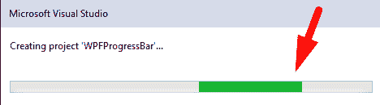
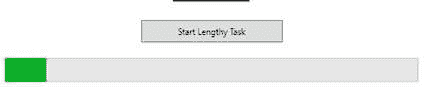
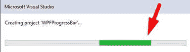
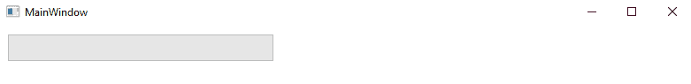
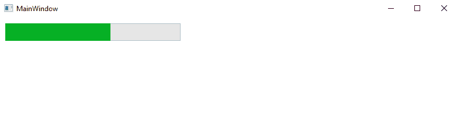
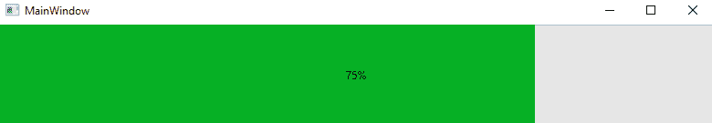
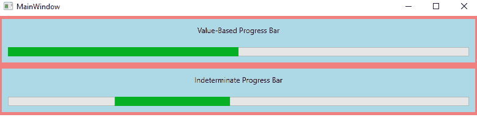

# wpf progressbar

> 原文:[https://www.javatpoint.com/wpf-progress-bar](https://www.javatpoint.com/wpf-progress-bar)

当我们运行任何应用程序时，长时间运行的任务会使应用程序或软件无响应。在这里，如果我们想向用户更新长时间运行的任务的状态，并让应用程序在长时间运行任务时保持响应，我们可以使用不同类型的加载栏，如下所示:

1.  **进度条**
2.  **环杆**

现在我们将讨论进度条。

**简介**

进度条给我们控制，显示操作处于运行位置。在运行位置时，进度条将如下截图所示:



进度条的**状态**

1.  **确定**
2.  **不确定**

**1。确定状态**

在确定状态下，我们将知道操作完成了多少。

进度条的确定状态如下图所示:



**2。不确定状态**

当我们不确定冗长任务的执行时间时，就会出现不确定状态。进度条的不确定状态如下图所示:



现在我们将编写一个代码来展示进度条控件的使用。进度条标签显示 [WPF](https://www.javatpoint.com/wpf) 中进度条的控件。

进度条语法如下所示:

**<progress bar></progress bar>**

进度条的宽度和高度属性向我们显示了进度条的宽度和高度。为了显示控件的名称，我们将使用 name 属性。名称被称为唯一标识符控件。为了显示 ProgressBar 控件在父控件中的位置，使用了 margin 属性。为了设置水平和垂直对齐，我们将使用水平对齐属性和垂直对齐属性。

现在我们将编写代码来设置进度条的名称、高度和宽度，如下所示:

### MainWindow(主窗口)。洗发精

```

<Window x:Class="WPFProgressBarControl.MainWindow"

        xmlns:x="http://schemas.microsoft.com/winfx/2006/xaml"
        xmlns:d="http://schemas.microsoft.com/expression/blend/2008"
        xmlns:mc="http://schemas.openxmlformats.org/markup-compatibility/2006"
        xmlns:local="clr-namespace:WPFProgressBarControl"
        mc:Ignorable="d"
        Title="MainWindow" Height="450" Width="800">
    <Grid>
        <ProgressBar Margin="10,10,0,13" Name="ListView1" HorizontalAlignment="Left" VerticalAlignment="Top" Width="300" Height="30" />

    </Grid>
</Window>

```

上述代码的输出如下所示:

**输出**



### 进度条的设置值

ProgressBar 的 value 属性将设置 ProgressBar 控件的当前值。在下面的代码中，我们将 Value 属性设置为 60。

### MainWindow(主窗口)。洗发精

```

<Window x:Class="WPFProgressBarControl.MainWindow"

        xmlns:x="http://schemas.microsoft.com/winfx/2006/xaml"
        xmlns:d="http://schemas.microsoft.com/expression/blend/2008"
        xmlns:mc="http://schemas.openxmlformats.org/markup-compatibility/2006"
        xmlns:local="clr-namespace:WPFProgressBarControl"
        mc:Ignorable="d"
        Title="MainWindow" Height="450" Width="800">
    <Grid>
        <ProgressBar Margin="10,10,0,13" Name="ListView1" HorizontalAlignment="Left" VerticalAlignment="Top" Width="300" Height="30" Value="60" />

    </Grid>
</Window>

```

之后，进度条将如下图所示:

**OutPut**



### 带文本的进度条

[WPF](https://www.javatpoint.com/wpf-interview-questions) 进度条可以用进度条显示进度的文本表示。在 WPF 的帮助下，我们可以很容易地完成这项任务。

为了在进度条中显示流程的进度状态，我们将编写以下代码:

**主窗口。xaml〔t1〕**

```

<Window x:Class="WPFProgressBarControl.MainWindow"

        xmlns:x="http://schemas.microsoft.com/winfx/2006/xaml"
        xmlns:d="http://schemas.microsoft.com/expression/blend/2008"
        xmlns:mc="http://schemas.openxmlformats.org/markup-compatibility/2006"
        xmlns:local="clr-namespace:WPFProgressBarControl"
        mc:Ignorable="d"
        Title="MainWindow" Height="150" Width="800">
    <Grid>
        <ProgressBar Minimum="0" Maximum="100" Value="75" Name="pbStatus" />
        <TextBlock Text="{Binding ElementName=pbStatus, Path=Value, StringFormat={}{0:0}%}" HorizontalAlignment="Center" VerticalAlignment="Center" />

    </Grid>
</Window>

```

**以上代码的输出如下截图所示:**

**输出**



在上面的代码中，我们将进度条和文本块放在同一个网格中。这里我们把文本块放在进度条的顶部。这也是我们想要的。这里，默认情况下，文本块具有透明背景。

这里我们使用绑定来显示文本块包含与进度条相同的值。

我们使用了字符串“StringFormat”的特殊语法，在它的帮助下，我们将显示值以及后缀符号百分比。

现在我们将举另一个使用 ProgressBar 的例子。现在，我们将编写 XAML 代码来创建和初始化两个带有 isindex 属性的 ProgressBar 控件。

### MainWindow(主窗口)。洗发精

```

<Window x:Class="WPFProgressBarControl.MainWindow"

        xmlns:x="http://schemas.microsoft.com/winfx/2006/xaml"
        xmlns:d="http://schemas.microsoft.com/expression/blend/2008"
        xmlns:mc="http://schemas.openxmlformats.org/markup-compatibility/2006"
        xmlns:local="clr-namespace:WPFProgressBarControl"
        mc:Ignorable="d"
        Title="MainWindow" Height="250" Width="800">
    <Grid>
        <StackPanel x:Name = "LayoutRoot" >
            <Border BorderThickness = "5" BorderBrush = "LightCoral">
                <StackPanel Background = "LightBlue">
                    <TextBlock HorizontalAlignment = "Center" Margin = "10"
                  Text = "Value-Based Progress Bar" />
                    <ProgressBar x:Name = "pg1" Value = "100" Margin = "10" Maximum = "200"
                  Height = "15" IsIndeterminate = "False" />
                </StackPanel>
            </Border>

            <Border BorderThickness = "5" BorderBrush = "LightCoral">
                <StackPanel Background = "LightBlue">
                    <TextBlock HorizontalAlignment = "Center" Margin = "10" Text = "Indeterminate Progress Bar" />
                    <ProgressBar x:Name = "pg2" Margin = "10" Height = "15" IsIndeterminate = "True" />
                </StackPanel>
            </Border>
        </StackPanel>
    </Grid>

</Window>

```

现在，上面代码的输出如下图所示:

**输出**



* * *