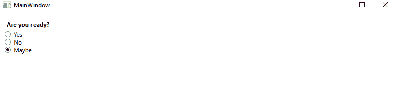
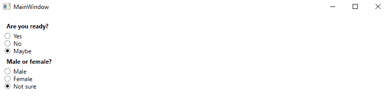
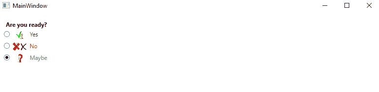

# WPF 无线电按钮控制

> 原文：<https://www.javatpoint.com/wpf-radiobutton-control>

在单选按钮控件的帮助下，我们可以获得可能的不同选项的列表，其中我们一次只选择一个选项。我们可以在组合框控件的帮助下获得同样的功能。ComboBox 控件占用的空间更少，但是 RadioButton 的使用给了我们更好的体验。

现在我们将编写一个 XAML 代码，其中包含带有问号的标签和三个单选按钮以及可能的答案。在单选按钮中，我们将通过使用最后一个单选按钮上的 IsChecked 属性来设置默认选项。我们可以通过点击其他按钮来更改默认选项。

### MainWindow(主窗口)。洗发精

```

<Window x:Class="WPFProgressBarControl.MainWindow"

        xmlns:x="http://schemas.microsoft.com/winfx/2006/xaml"
        xmlns:d="http://schemas.microsoft.com/expression/blend/2008"
        xmlns:mc="http://schemas.openxmlformats.org/markup-compatibility/2006"
        xmlns:local="clr-namespace:WPFProgressBarControl"
        mc:Ignorable="d"
        Title="MainWindow" Height="250" Width="800">

        <StackPanel Margin="10">
            <Label FontWeight="Bold">Are you ready?</Label>
            <RadioButton>Yes</RadioButton>
            <RadioButton>No</RadioButton>
            <RadioButton IsChecked="True">Maybe</RadioButton>
            </StackPanel>

</Window>

```

上面代码的输出如下图所示:

**输出**



### 单选按钮组

正如我们上面看到的，在 RadioButton 的帮助下，我们只能选中一个按钮，但是当我们需要同时选择不同的选项时，可能会出现这种情况。然后，在这种情况下，我们需要添加单选按钮组。单选按钮的组具有单独的选择标识。

### MainWindow(主窗口)。洗发精

```

<Window x:Class="WPFProgressBarControl.MainWindow"

        xmlns:x="http://schemas.microsoft.com/winfx/2006/xaml"
        xmlns:d="http://schemas.microsoft.com/expression/blend/2008"
        xmlns:mc="http://schemas.openxmlformats.org/markup-compatibility/2006"
        xmlns:local="clr-namespace:WPFProgressBarControl"
        mc:Ignorable="d"
        Title="MainWindow" Height="250" Width="800">

    <StackPanel Margin="10">
        <Label FontWeight="Bold">Are you ready?</Label>
        <RadioButton GroupName="ready">Yes</RadioButton>
        <RadioButton GroupName="ready">No</RadioButton>
        <RadioButton GroupName="ready" IsChecked="True">Maybe</RadioButton>

        <Label FontWeight="Bold">Male or female?</Label>
        <RadioButton GroupName="sex">Male</RadioButton>
        <RadioButton GroupName="sex">Female</RadioButton>
        <RadioButton GroupName="sex" IsChecked="True">Not sure</RadioButton>
    </StackPanel>

</Window>

```

**输出**



在单选按钮的帮助下，我们可以从该组的两个选项中进行多重选择。不使用单选按钮，我们只能从所有六个项目中选择一个项目。

### 自定义内容

我们可以从 ContentControl 类继承 RadioButton 控件，这意味着我们可以显示自定义内容。 [WPF](https://www.javatpoint.com/wpf) 将把文本放入文本块控件并显示出来。

为此，我们将编写以下 XAML 代码:

### MainWindow(主窗口)。洗发精

```

<Window x:Class="WPFProgressBarControl.MainWindow"

        xmlns:x="http://schemas.microsoft.com/winfx/2006/xaml"
        xmlns:d="http://schemas.microsoft.com/expression/blend/2008"
        xmlns:mc="http://schemas.openxmlformats.org/markup-compatibility/2006"
        xmlns:local="clr-namespace:WPFProgressBarControl"
        mc:Ignorable="d"
        Title="MainWindow" Height="250" Width="800">

    <StackPanel Margin="10">
        <Label FontWeight="Bold">Are you ready?</Label>
        <RadioButton>
            <WrapPanel>
                <Image Source="C:\Users\HP\source\repos\WPFProgressBarControl\WPFProgressBarControl\images\Correct.jpg" Width="30" Height="20" Margin="0,0,5,0" />
                <TextBlock Text="Yes" Foreground="Green" />
            </WrapPanel>
        </RadioButton>
        <RadioButton Margin="0,5">
            <WrapPanel>
                <Image Source="C:\Users\HP\source\repos\WPFProgressBarControl\WPFProgressBarControl\images\Wrong.jpg"  Width="30" Height="20" Margin="0,0,5,0" />
                <TextBlock Text="No" Foreground="Red" />
            </WrapPanel>
        </RadioButton>
        <RadioButton IsChecked="True">
            <WrapPanel>
                <Image Source="C:\Users\HP\source\repos\WPFProgressBarControl\WPFProgressBarControl\images\QuestionMark.jpg"  Width="30" Height="20" Margin="0,0,5,0" />
                <TextBlock Text="Maybe" Foreground="Gray" />
            </WrapPanel>
        </RadioButton>
    </StackPanel>

</Window>

```

上面代码的输出如下图所示:

**输出**



RadioButton 的概念很简单。所有的单选按钮都包含带有图像和文本的包装面板。在这里，我们将使用图像控件来显示我们选择的图像。

* * *