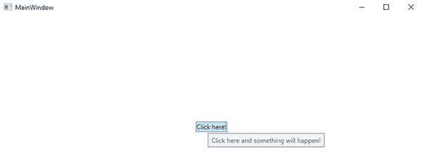
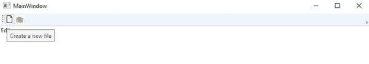
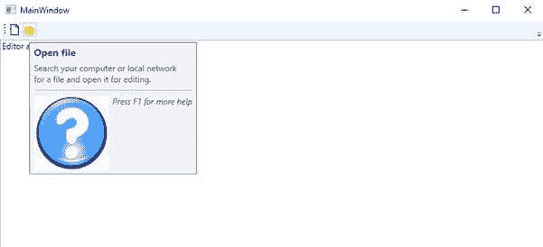

# WPF 工具提示控件

> 原文：<https://www.javatpoint.com/wpf-tooltip-control>

工具提示是一个小的弹出窗口。当鼠标停留在元素上时，我们会看到这个窗口。就像鼠标放在按钮上一样。

现在我们将讨论工具提示。什么是工具提示？

### 什么是工具提示？

当我们将鼠标指针移动到有工具提示的元素和包含工具提示内容的[窗口](https://www.javatpoint.com/windows)上时，它会出现一段时间。如果我们把指针从控件上移开，那么窗口就会消失。这是因为工具提示的内容没有获得焦点。

工具提示的内容可以包含一行或多行文本、图像、形状或其他视觉内容。

我们可以通过将下面的属性设置为工具提示的内容来定义控件的工具提示。

*   工具提示
*   工具提示

### 工具提示的创建

在这里，我们将通过将按钮控件的工具提示属性设置为文本字符串来演示工具提示的创建。

### MainWindow(主窗口)。洗发精

```

<Window x:Class="TooltipControl.MainWindow"

        xmlns:x="http://schemas.microsoft.com/winfx/2006/xaml"
        xmlns:d="http://schemas.microsoft.com/expression/blend/2008"
        xmlns:mc="http://schemas.openxmlformats.org/markup-compatibility/2006"
        xmlns:local="clr-namespace:TooltipControl"
        mc:Ignorable="d"
        Title="MainWindow" Height="450" Width="800">
    <Grid VerticalAlignment="Center" HorizontalAlignment="Center">

        <Button ToolTip=" Click here, and something will happen!">Click here!</Button>

    </Grid>

</Window>

```

上面代码的输出如下图所示:



在上面的屏幕中，我们可以看到当我们将鼠标移动到按钮上时，会显示一串文本。

在 [WPF](https://www.javatpoint.com/wpf) 中，工具提示不是字符串的类型。它是对象的类型，这意味着我们可以在工具提示中放入任何我们想要的东西。

这里我们将再举一个例子，并与上面的例子进行比较。

### MainWindow(主窗口)。洗发精

```

<Window x:Class="TooltipControl.MainWindow"

        xmlns:x="http://schemas.microsoft.com/winfx/2006/xaml"
        xmlns:d="http://schemas.microsoft.com/expression/blend/2008"
        xmlns:mc="http://schemas.openxmlformats.org/markup-compatibility/2006"
        xmlns:local="clr-namespace:TooltipControl"
        mc:Ignorable="d"
        Title="MainWindow" Height="450" Width="800">
    <DockPanel>
        <ToolBar DockPanel.Dock="Top">
            <Button ToolTip="Create a new file">
                <Button.Content>
                    <Image Source="C:\Users\HP\source\repos\TooltipControl\TooltipControl\Images\New.jpg" Width="16" Height="16" />
                </Button.Content>
            </Button>
            <Button>
                <Button.Content>
                    <Image Source="C:\Users\HP\source\repos\TooltipControl\TooltipControl\Images\open.jpg" Width="16" Height="16" />
                </Button.Content>
                <Button.ToolTip>
                    <StackPanel>
                        <TextBlock FontWeight="Bold" FontSize="14" Margin="0,0,0,5">Open file</TextBlock>
                        <TextBlock>
                        Search your computer or local network
                        <LineBreak />
                        for a file and open it for editing.
                        </TextBlock>
                        <Border BorderBrush="Silver" BorderThickness="0,1,0,0" Margin="0,8" />
                        <WrapPanel>
                            <Image Source="" Margin="0,0,5,0" />
                            <TextBlock FontStyle="Italic">Press F1 for more help</TextBlock>
                        </WrapPanel>
                    </StackPanel>
                </Button.ToolTip>
            </Button>
        </ToolBar>

        <TextBox>
            Editor area...
        </TextBox>
    </DockPanel>

</Window>

```

上面代码的输出如下图所示:

**输出**



这里当我们观察上面的截图时，我们会看到这里我们在第一个按钮中使用了简单的字符串工具提示。在第二个按钮上，我们使用了高级字符串工具提示，如下图所示:



### 高级选项

工具提示服务的属性将影响我们工具提示的行为。我们可以直接在包含工具提示的控件上设置这些属性。例如，我们可以通过使用 ShowDuration 属性来延长工具提示的时间。为此，我们将编写以下代码:

```

            <Button ToolTip="Create a new file" ToolTipService.ShowDuration="5000" Content="Open" />

```

我们还可以通过使用 HasDropShadow 属性来控制内容的阴影。

### 包裹

工具提示的使用对用户有很大的帮助。WPF 给了我们可以轻松使用的控件，并为我们提供了使用工具提示内容的灵活性。通过使用 tooltipservice 类的工具提示属性，我们可以快速创建用户友好的应用程序。

* * *