# ASP.NET 网络应用编程接口教程

> 原文：<https://www.javatpoint.com/web-api>

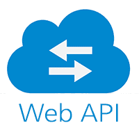

在本教程中，我们将讨论以下主题:

*   [什么是 Web API？](#What)
*   [谁用 API？](#Who)
*   [ASP.NET 网页 API](#WebApi)
*   [ASP.NET 网络应用编程接口功能](#features)
*   [RESTful 服务](#RESTful)
*   [REST API 的原理](#Principles)
*   [REST 原料药的方法](#Methods)
*   [实现 REST API 简单应用](#Implementing)
*   [对网络应用编程接口的需求](#Need)
*   [MVC 对 Web API](#MVC)
*   [网络应用编程接口对 WCF](#WCF)
*   [网络应用编程接口与网络服务](#Services)
*   [网络应用编程接口安全](#Security)

ASP.NET 网络应用编程接口教程提供了 ASP.NET 的基本和高级概念。我们的 ASP.NET 教程是为初学者和专业人士设计的。

## 什么是 Web API？

*   网络应用编程接口是网络应用程序的增强形式，用于在不同的设备上提供服务，如笔记本电脑、手机等。
*   今天，各种各样的企业都把互联网作为在国际市场上拓展业务的一种具有成本效益的方式。
*   **网络应用**有助于在互联网上交换信息，也有助于在网站上进行安全交易。
*   网络应用很受欢迎，因为网络浏览器在**默认**中可用，我们不需要在有操作系统的计算机上安装任何软件。
*   例如，脸书(一个社交网络应用程序)、Flickr(一个照片共享网络应用程序)和维基百科是网络应用程序的主要例子。
*   从技术上讲，web 应用程序由两种类型的脚本组成:

1) **客户端脚本:**使用 JavaScript、HTML 等客户端脚本语言设计 web 表单，向用户呈现信息。

2) **服务器端脚本:** ASP 等服务器端脚本语言用于执行存储和检索信息等业务逻辑和数据库相关操作。

*   一个网络应用是**人机交互**。
*   它可以是仅仅为某些业务提供信息的单页应用程序，也可以是用于从用户那里获取一些信息并向用户提供服务的网页集合。

* * *

## 谁用 API？

不同类型的用户可以访问这些服务，例如:

*   网络浏览器
*   移动应用
*   桌面应用程序
*   物联网

* * *

## ASP.NET 网络应用编程接口

API 代表 ***应用编程接口*** 。

> *“ASP。NET Web API 是一个可扩展的框架，用于构建可从任何客户端(如浏览器和移动设备)访问的 HTTP(超文本传输协议)服务。”*

**例如**，我们从不同的 web 应用程序(如 MakeMyTrip、Ixigo 或 Paytm 以及所有其他预订 web 应用程序)进行预订，但所有应用程序仅使用 IRCTC 网站的凭据进行预订，即执行预订的用户必须具有 IRCTC 网站的登录凭据。

不同类型的用户可以访问这些服务，例如:

*   网络浏览器
*   移动应用
*   桌面应用程序
*   物联网

当应用程序要在分布式系统上使用时，使用网络应用编程接口服务。

Web API 从不同类型的客户端设备(如移动设备、笔记本电脑等)接收请求。并将它们发送到 web 服务器进行处理，并将所需的数据返回给客户端。

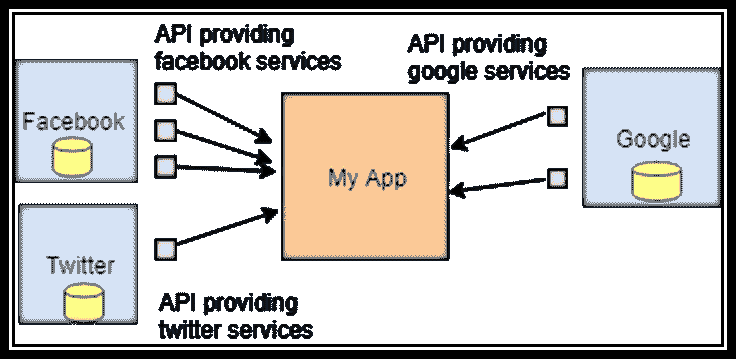

**使用不同种类的应用编程接口的定制网络应用程序**

网络应用编程接口是**系统-系统交互**，来自一个系统的信息由另一个系统处理，结果数据显示给查看者。

让我们从 Web API 示例中再举一个例子，我们想要麦当劳汉堡。

让我们假设麦当劳只允许外卖给厨师，不允许给其他人。在这里，麦当劳外卖(厨师)就像一个应用编程接口，允许其他系统(厨师)访问服务并提供所需的数据。

* * *

## ASP.NET 网络应用编程接口特性

1)ASP.NET Web API 和 ASP.NET MVC 很像。

2)它包含与 ASP.NET MVC 相似的特性，比如:

*   选择途径
*   控制器
*   行动结果
*   过滤器
*   模型等。

3)有一种误解，认为 ASP.NET Web API 是 ASP.NET MVC 框架的一部分，而它可以用于任何其他类型的 Web 应用程序。

4)可以使用 Web API 开发独立的服务。

5)广泛使用 ASP.NET Web API 框架开发 **RESTful** 服务。

* * *

## RESTful 服务

*   网络应用编程接口是网络应用程序的增强形式。
*   **SOAP(简单对象访问协议)**是一种基于 XML 的协议，用于开发连接的网络应用程序。
*   SOAP 的问题在于，对于每个请求，**元数据**都附有要传输的数据。
*   此元数据将服务器上的小数据转换为大数据。
*   **Web API** 可能是 **RESTful** 服务，也可能不是，但它们始终是基于 **HTTP 的**服务。
*   REST 代表**代表状态转移**。
*   在 REST API 中，只有对象的**状态被发送到服务器，才能找到想要的结果。**
*   **REST** 是一个**架构模式**，用于开发一个使用 HTTP 作为底层通信方法的 API。

当我们使用基于 HTTP 的服务时，例如 BookMyShow 应用程序，我们需要像 JSON 格式、XML 格式这样的托管形式的数据。

客户端通过使用 **API 方法**发送参数来请求信息。

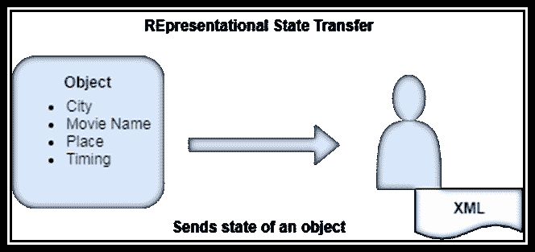

例如，如果我们想预订一个节目，我们想知道诸如城市、电影名称、地点、时间等细节。我们将对象的状态发送到网络服务器，API 将检查数据是否可用。

如果数据可用(该实例的电影可用)，那么它会将响应与对象一起发送回客户端。

对象的值被发送到客户端，也就是说，基本上对象的状态被发送到客户端，所以每次都不必创建对象。

> *“REST API 是一种架构风格，也是一种用于通信目的的方法，经常在各种网络开发中使用。”*

它是一个**无状态**，客户端-服务器模型。

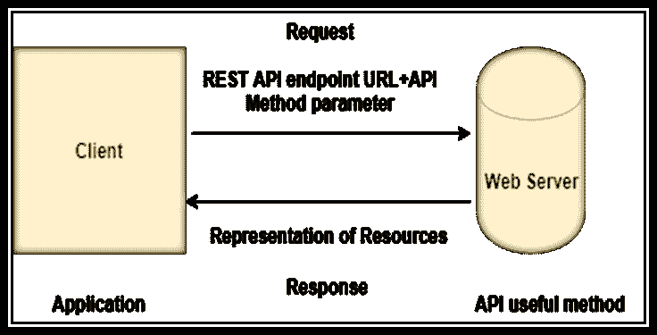

* * *

## 休息应用编程接口的原理

REST API 的六个原则是:

1.  无国籍的
2.  客户端-服务器
3.  统一界面
4.  可缓冲的
5.  分层系统
6.  按需编码

**1)无状态:**当来自客户端的请求被发送到服务器时，它包含了使服务器处理它所需的所有信息。请求可能是查询字符串或网址的一部分。

例如，让我们假设资源是从 URL(统一资源定位符)请求的。

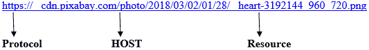

**2)客户端-服务器:**分离功能有助于提高跨多个平台的用户界面可移植性，并扩展服务器组件的可扩展性。

**3)统一接口:**为了在整个应用中获得统一性，REST 定义了四个接口约束，它们是:

*   资源标识
*   使用表示的资源操作
*   自我描述按摩
*   和超媒体作为网络应用的引擎

**4)可缓存:**为了提供更好的性能，应用程序被设为可缓存。这是通过隐式或显式地将响应标记为可缓存或不可缓存来实现的。如果资源被定义为可缓存的，那么客户端缓存可以为等价请求重用响应数据。

**5)分层系统:**分层系统通过限制组件行为，使应用程序最稳定。分层架构也有助于增强安全性，因为每一层的组件不能在它们所在的每一层之外进行交互。

**6)按需编码:**可选且最少使用的约束。通过创建一个不依赖于自身代码结构的智能应用程序来分析和简化客户端。

* * *

## 休息的方法

*   研究网络技术，我们研究 CRUD 应用程序。
*   在这些应用程序中，CRUD 是创建、读取、更新和删除资源。
*   这里，资源被定义为期望的结果。例如:[https://in.bookmyshow.com/noida/movies](https://in.bookmyshow.com/noida/movies)
*   在上面的例子中，用户在 bookmyshow 应用程序上寻找 city Noida 的电影，所以资源就是数据，客户端在寻找。
*   要执行这些操作，比如创建资源、读取资源、更新资源或删除资源，我们可以使用 HTTP 方法，也称为 REST 方法。

现在，基本的 CRUD 操作以下列方式映射到 HTTP 协议:

| CRUD 方法 | 休息应用编程接口方法 | 描述 |
| 创造 | 邮政 | 方法指的是 CRUD 的 C(创建)部分。
用于创建资源。 |
| 阅读 | 得到 | 方法引用了 CRUD 的检索部分。
用于读取资源。 |
| 更新 | 放 | 方法引用 CRUD 的 U(更新)部分。
用于更新资源。 |
| 删除 | 删除 | 方法指的是 CRUD 的 D(删除)部分。
用于删除资源。 |

*   REST API 最适合用于分布式系统。
*   分布式数据库无处不在，数据库存储数据，在其上执行 CRUD(创建、检索、更新和删除)操作。

让我们举一个从资源中获取一些菜肴的例子:

**[www.testwebsite.com/dishes](www.testwebsite.com/dishes)T3】**

现在让我们假设我们想从资源中获得一些特定的菜:

**[www.testwebsite.com/dishes/2](www.testwebsite.com/dishes/2)T3】**

* * *

## 实现简单的应用程序

让我们为学生创建一个 REST API 服务。

*   首先打开 Visual Studio(这里有 Visual Studio 2019)。
*   现在选择**创建新项目:**

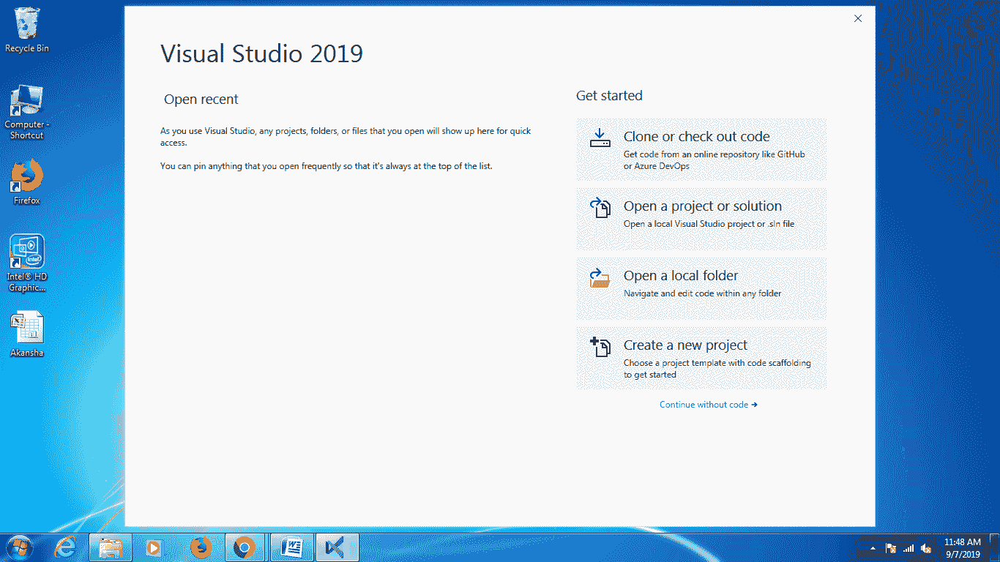

*   现在选择模板 ASP.NET 网络应用程序()。NET Framework)，并将该项目命名为“**webapischestsample**”。

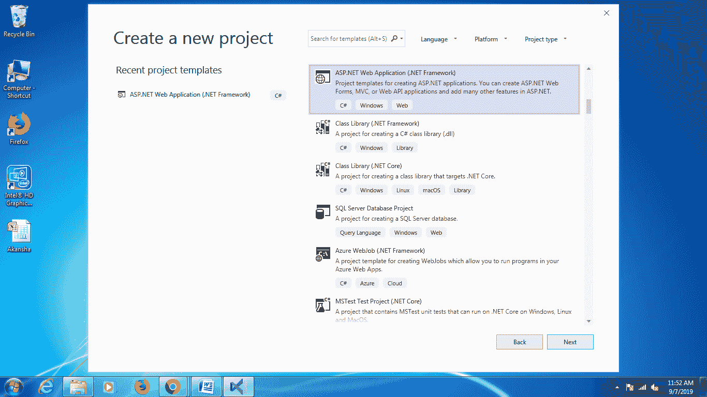

*   在 ASP.NET 项目对话框中，选择**空模板**，同时选中**网络应用编程接口**选项。点击**确定**。

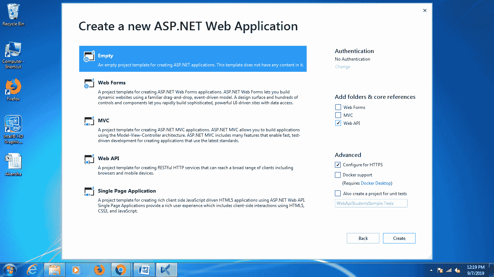

*   生成的默认结构如下:

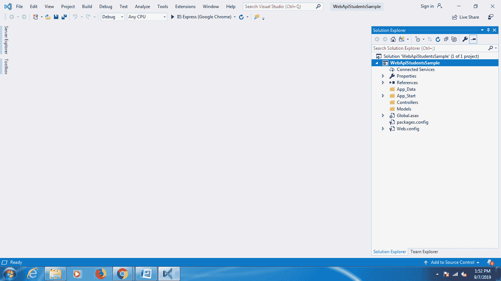

**将学生课程添加到模型文件夹**

*   添加一个名为**学生**的类来定义属性和其他业务逻辑。我们还可以将其他逻辑定义为验证、数据访问等。
*   右键单击模型，选择添加选项，然后选择类，给类命名为“ **Student.cs**

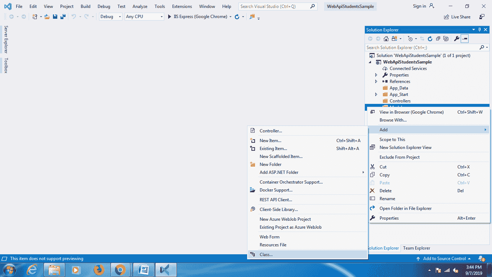

添加以下代码来定义学生类的属性:

```

namespace WebApiStudentsSample.Models
{
    public class Students
    {
        public int StudentId
        {
            get;
            set;
        }
        public string StudentName
        {
            get;
            set;
        }
        public string Address
        {
            get;
            set;
        }
        public string Course
        {
            get;
            set;
        }

    }
}

```

**将 StudentControllers.cs 类添加到控制器文件夹**

*   控制器类处理来自客户端的 HTTP 请求，客户端可以是桌面应用程序、移动设备和浏览器。
*   右键单击**控制器**，选择添加选项，然后选择“**控制器”..**。

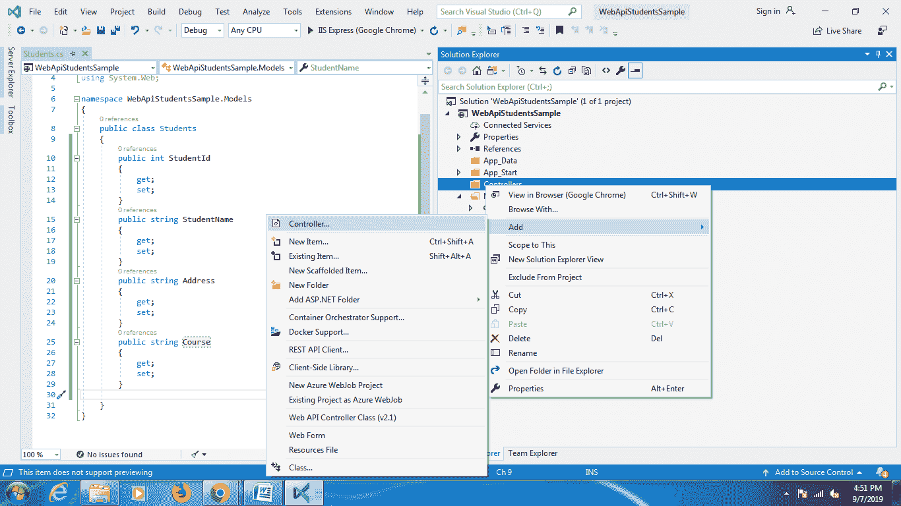

**添加脚手架**窗口将打开，然后选择**网络 API2 控制器？清空**模板。

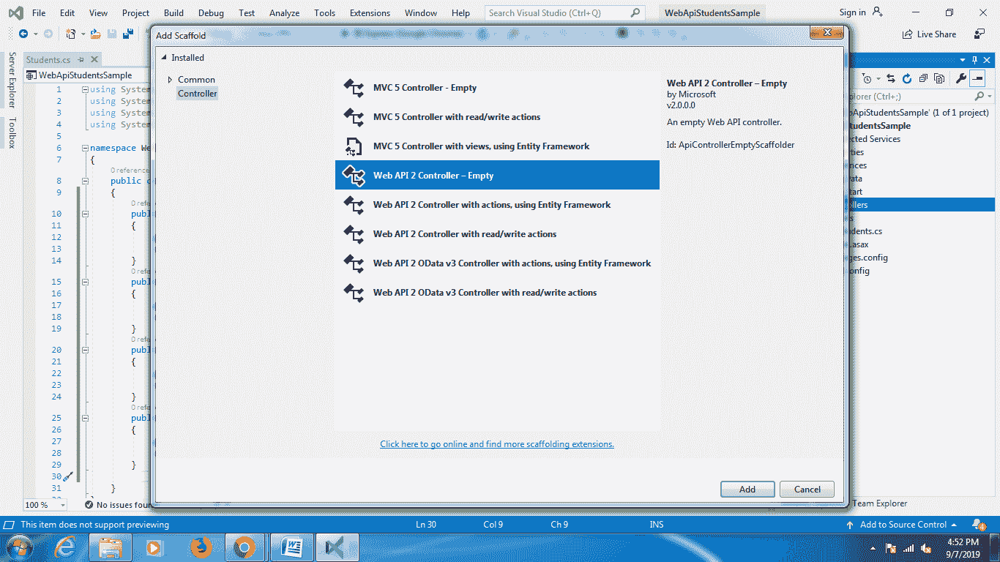

*   选择脚手架模板后，添加控制器窗口将打开，并给类命名为“ **StudentController** ”。

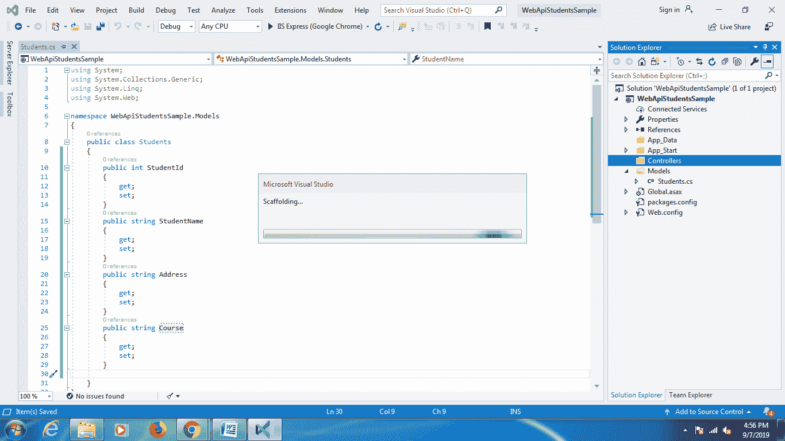

#### 注意:我们可以看到控制器类继承了系统。而不是控制器类。

*   **脚手架**在**控制器**文件夹内创建一个“ **StudentController.cs** 类。

现在实现执行 CRUD 操作的方法。让我们假设我们想要所有学生的详细信息，也想要一些特定学生的详细信息。

现在添加以下代码:

```

using System;
using System.Collections.Generic;
using System.Linq;
using System.Net;
using System.Net.Http;
using System.Web.Http;
using WebApiStudentsSample.Models;

namespace WebApiStudentsSample.Controllers
{
    public class StudentController : ApiController
    {
        IList<Students> Students = new List<Students>()
        {
            new Students()
                {
                    StudentId = 1, StudentName = "Mukesh Kumar", Address = "New Delhi", Course = "IT"
                },
                new Students()
                {
                    StudentId = 2, StudentName = "Banky Chamber", Address = "London", Course = "HR"
                },
                new Students()
                {
                    StudentId = 3, StudentName = "Rahul Rathor", Address = "Laxmi Nagar", Course = "IT"
                },
                new Students()
                {
                    StudentId = 4, StudentName = "YaduVeer Singh", Address = "Goa", Course = "Sales"
                },
                new Students()
                {
                    StudentId = 5, StudentName = "Manish Sharma", Address = "New Delhi", Course = "HR"
                },
        };
        public IList<Students> GetAllStudents()
        {
            //Return list of all employees  
            return Students;
        }
        public Students GetStudentDetails(int id)
        {
            //Return a single employee detail  
            var Student = Students.FirstOrDefault(e => e.StudentId == id);
            if (Student == null)
            {
                throw new HttpResponseException(Request.CreateResponse(HttpStatusCode.NotFound));
            }
            return Student;
        }
    }
}

```

在 **StudentController** 类控制器中，可以看到方法“ **GetAllStudents** ”返回所有学生的列表，方法“ **GetStudentDetails** ”返回单个**学生的详细信息**。

在下表中，您可以了解控制器如何使用路由 URL 来执行 CRUD 操作。

| 控制器方法 | URI 路由(统一资源标识符) |
| **获取所有学生** | /api/ **学生** |
| **get students 详细信息** | /api/ **学生** /id |

**运行网络应用编程接口**

要运行网络应用编程接口，首先按 F5 或 Ctrl+F5 或单击 IIS 快速运行图标，浏览器将打开，网址如 **https://localhost:44329/**

现在要找到所有学生的列表，请将网址编辑为**https://localhost:44329/API/student**

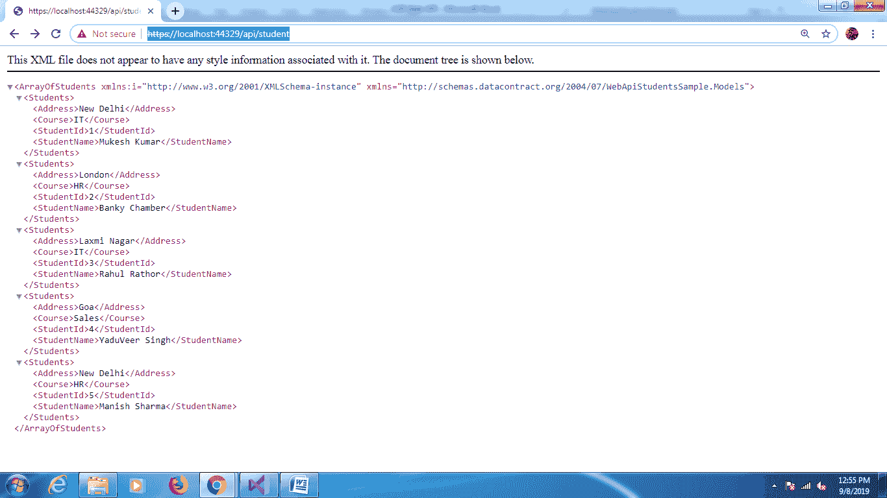

要获取单个学生的详细信息，请将网址编辑为:

**https://localhost:44329/API/student/2**

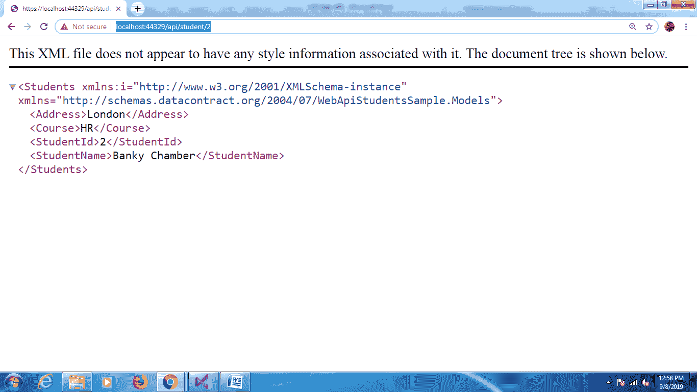

* * *

## 对网络应用编程接口的需求

*   网络应用编程接口有助于从不同的互联网设备(如浏览器、移动应用和其他设备)访问服务数据。
*   帮助处理 RESTful 网络服务。
*   有助于开发轻量级和可维护的网络服务。
*   用于创建 RESTful 服务和非 RESTful 服务。
*   还支持 JSON、XML 和其他数据格式。
*   帮助开发支持 HTTP 服务所有特性的服务，如**缓存、请求/响应头、版本控制**等。

* * *

## MVC 与网络应用编程接口

ASP.NET API 和 ASP.NET MVC 的区别如下:

| 手动音量调节 | Web API |
| 帮助开发处理请求并发送视图和数据的 web 应用程序。 | 帮助开发 HTTP 服务(RESTful 和非 RESTful 服务)，这些服务只处理请求并返回数据，而不是视图。 |
| 使用 JsonResult 以 JSON 格式表示结果数据。 | 以特定格式返回数据，如 JSON、XML 或任何其他格式 |
| 请求被映射到操作名称。 | 在网络应用编程接口中，请求被映射到 HTTP 动词 |
| 模型绑定、路由和其他特性在 System.Web.Mvc 中定义 | 相同的功能在网络应用编程接口中可用，这些功能在系统中定义。Web.Http 程序集。 |
| MVC 通常与视图交互以提供最终输出 | 支持内容协商功能，即决定与客户端机器兼容的响应数据的最佳格式。 |

* * *

## 网络应用编程接口与 WCF

ASP.NET WCF 和 ASP.NET 网络应用编程接口之间的区别如下:

| 特征 | Web API | 世界商会联合会 |
| 内容格式 | 网络应用编程接口支持任何媒体格式，如 XML、JSON 等。 | WCF 支持基于 SOAP 的服务和 XML 格式。 |
| 作战 | 网络应用编程接口支持 IIS 托管，自托管 | WCF 支持作品激活服务和 IIS 托管，自我托管。 |
| MVC 特性 | ASP.NET 网络应用编程接口支持控制器、路由、动作等功能。与 MVC 相同。 | 像 MVC 一样，WCF 没有提供任何像控制器、路由、过滤器、拍卖结果等功能。 |
| 草案 | Web API 支持 HTTP 协议。 | 支持 UDP、HTTP 和自定义传输协议。 |
| 模型的使用 | 将 HTTP 动词用作称为 CRUD 操作的方法 | **服务合同**属性定义了包含操作的服务合同。
**操作合同**属性定义将要使用的操作。
**DataContract** 属性定义了将在双方之间转移的属性或类型。 |

* * *

## 网络应用编程接口与网络服务

网络应用编程接口和网络服务之间的区别如下:

| 特征 | Web API | Web 服务 |
| 作战 | 宿主在应用程序或 IIS 中完成。 | 托管在 IIS 上完成。 |
| 开放源码 | 网络应用编程接口是开源的，它可以被任何支持 JSON 或 XML 的客户端使用。 | Web 服务不是开源的，但是可以被任何支持 XML 的客户端使用。 |
| 体系结构 | 网络应用编程接口是一种轻量级架构，适用于带宽有限的设备，如移动设备。 | 它需要 SOAP 协议来通过网络接收和发送数据，因此它不是轻量级架构。 |
| 草案 | 它支持 HTTP 协议:URL、请求/响应头、版本控制、缓存、内容格式。 | 它只支持 HTTP 协议。 |

* * *

## 网络应用编程接口安全性

ASP.NET 网络应用编程接口认证和授权是网络应用编程接口安全的重要概念。

假设创建了一个网络应用编程接口，对该接口的访问是针对某些特定用户的，并且不同的用户可以进行不同的操作。

*   **认证**是为用户验证凭证并进行识别。
    例如，用户使用用户名和密码登录，服务器通过密码验证用户。
*   **授权**是定义每个用户执行不同操作的访问级别。
    例如，一个人可以创建资源，但不能删除记录。

如果一个请求需要在 web API 中进行认证，但是客户端没有提供请求头中的凭证，那么服务器将返回 **401(未授权的**)。

* * *

## 先决条件

在学习网络应用编程接口之前，用户必须对 Http 方法、C# 属性有基本的了解，对 MVC 的了解也会加分。

## 观众

本教程供初学者和专业人士学习网络应用编程接口和 RESTful 服务。

## 问题

本教程仍然以简单易懂的语言提供，如果有任何疑问，请在联系表格中发布。

* * *