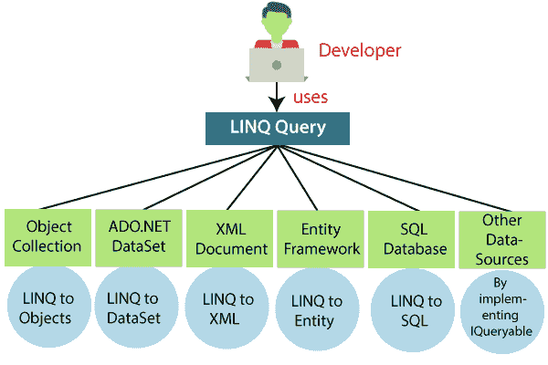

# LINQ 教程

> 原文：<https://www.javatpoint.com/linq>

LINQ 教程提供了 LINQ 的基本和高级概念。我们的 LINQ 教程是为初学者和专业人士设计的。

我们的 LINQ 教程包括 LINQ 的所有主题，如介绍，语法，最小函数，最大函数，求和函数，计数函数，排序运算符等。

## 什么是 Linq

LinQ 是一个“**语言集成查询**”LINQ 提供了处理数据的新方法，无论是从数据库还是向数据库，或者是用一个 XML 文件，或者是用一个简单的动态数据列表。LINQ 是一个统一的 C# 查询系统，用于从不同的数据源和格式中检索数据。它与 C# 集成，消除了编程语言与数据库的不匹配。它为不同的数据源提供了单一的查询接口。

**例如，** SQL 是一种结构化查询语言，用于保存和检索数据库中的数据。同样地， **LINQ** 是结构化查询语法。LINQ 是用 C# 建造的。它用于从不同类型的来源中检索数据，如 XML、文档、集合、ADO.Net 数据集、网络服务、微软 SQL Server 和其他数据库服务器。

## 为什么要用 LINQ

语言集成查询(LINQ)是在 C# 3.0 &中引入的.NET 框架 3.5。这里我们正在创建一个场景，假设有一天我们正在处理 SQL Server 数据库。因此，为此，需要学习 SQL Server 语法、与 SQL 相关的 ADO.NET 对象。现在过了一段时间，我们想切换到 Oracle 数据库，所以我们再次需要抓取 Oracle 相关语法和 Oracle 相关 ADO.NET 对象上的命令来使用 C#。这个问题随着我们适应的技术的数量而出现。在这个场景中，我们需要学习所有的语言。所以基本上，为了避免这种情况，微软引入了 LINQ。在 LINQ，我们不仅可以使用数据库中填充的集合，还可以使用各种其他数据源，如内存数据表中的 XML 文件等。我们可以使用 LINQ，即使我们正在与反射工作。英寸 Net 任何实现 **IEnumerable** 接口的数据源都可以用来查询、过滤、分组、排序、&投影数据。

**我们可以通过两种方式使用 LINQ 查询:**

1.  查询语法
2.  方法语法

很多时候我们两者并用。现在，随着**实体框架**的演变，LINQ 的重要性与旧时代相比增长了很多。

## 先决条件

在继续学习 LINQ 教程之前，我们应该知道使用.NET 框架与 C# 或 VB.NET。LINQ 操作可以在 C# 或 VB.NET 上执行。为此，需要在我们的系统中安装 Visual Studio。

## 观众

本教程面向初学者以及了解如何使用 C# 或 VB.NET 实现应用程序的专业人士。

## 问题

我们向您保证，您不会发现 LINQ 教程有任何问题。但是如果有任何错误，请在联系表格中发布问题。

* * *