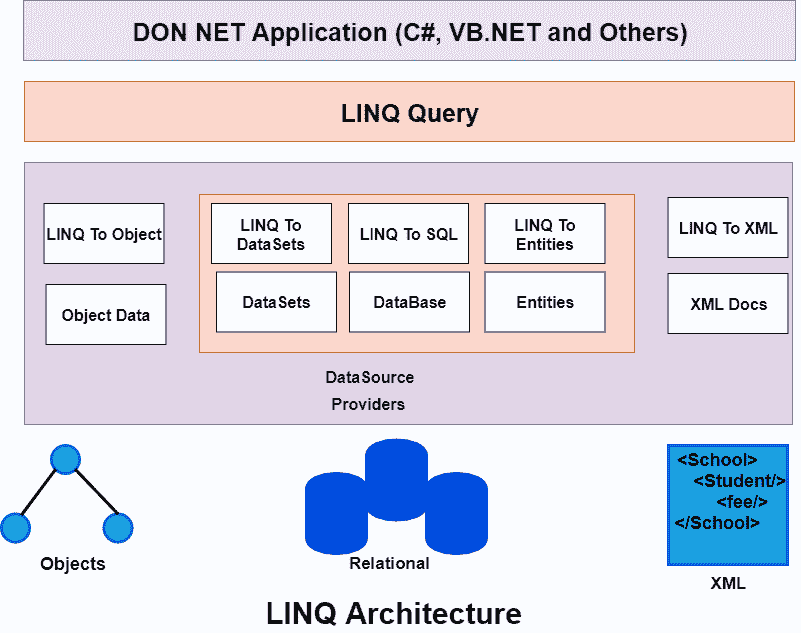
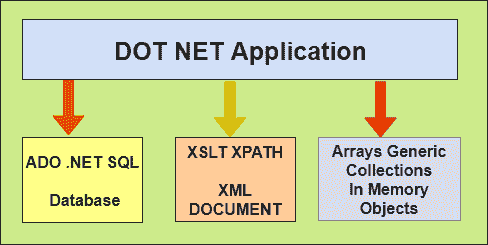

# LINQ 简介

> 原文：<https://www.javatpoint.com/what-is-linq>

在这里，我们将学习 LINQ 的介绍，什么是 C#/asp.net 中的 LINQ，我们为什么在 C#/asp.net 中使用 LINQ，LINQ 的架构，LINQ 的优势和劣势。

## LINQ 是什么

LINQ 的完整形式是“**语言综合查询**”，在**引入。NET Framework 3.5** 查询集合、泛型、XML 文档、ADO.NET 数据集、SQL、Web Services 等不同数据源的数据。在 C# 和 VB.NET。LINQ 用. NET 编程语言(如 C# 和 VB.NET)提供了丰富、标准化的查询语法，允许开发人员与任何数据源进行交互。

在 C# 或 VB.NET，LINQ 功能可以通过导入**系统来实现。Linq** 命名空间在我们的应用程序中。通常，LINQ 包含一组扩展方法，允许我们根据需求直接在代码中查询数据对象的来源。

## LINQ 建筑

这是 LINQ 的架构，因为我们知道我们可以在. NET 中开发应用程序。类似地，LINQ 编程可以返回上面提到的任何一个。NET 编程语言。在实际的 LINQ 查询和底层数据源之间，还存在另一个组件，称为 **LINQProvider** 。

**提供商**

LINQ 提供商的责任是将 **LINQ 查询**转换成一种格式，以便数据源能够理解。

**示例:**这里我们来看一个场景，假设应用程序想要从 SQL Database 中获取数据。在这种情况下，LINQ 查询将适合 **LINQ 到 SQL 提供程序**。在这种情况下，它会将 **LINQ 查询转换为 T-SQL** ，以便底层数据库可以以同样的方式理解是否需要从 **XML** 文档中获取数据。在这种情况下，我们也将使用相同的 LINQ 查询，即 LINQ 到 XML 提供程序。XML 提供者将把 **LINQ 查询转换成 XLST** ，以便**XML 数据源**能够理解。

**LINQ 物件**

正如我们在上面的图表中提到的，我们在 C# 和 above 有不同类型的 LINQ 对象。

*   LINQ 对物体
*   linq to 数据集
*   开放式并发概述
*   查询
*   LINQ 对实体

## LINQ 的需要

LINQ 比 SQL 更简单、更有序、更高级。当我们想要使用查询数据库时，在大多数情况下，LINQ 是一种比 SQL 更有效的查询语言。

此外，我们还有智能感知的好处，因为 LINQ 查询是在代码后面编写的。LINQ 在编译时有完整的类型检查，所以我们可以在编译时自己捕捉任何错误。用 C# 或者 VB.Net 写 LINQ 的查询更好玩。

这里，我们举一个开发. NET 应用程序的例子，该应用程序需要来自不同数据源的数据。

1.  假设应用程序需要来自 SQL Server 数据库的数据。因此，作为一名开发人员，要从 SQL Server 数据库中访问数据，我们需要了解 ADO.NET 和 SQL Server 特定的语法。如果数据库是 Oracle，那么就需要了解 SQL 语法，这是 Oracle 数据库特有的。
2.  应用程序还需要来自 XML 文档的数据。因此，作为一名处理 XML 文档的开发人员，我们需要理解 XSLT 和 XPath 查询。
3.  在应用中，还需要对内存中的数据(对象)进行操作，如 List <products>、List <orders>等。因此，作为开发人员，需要了解如何使用内存中的对象。</orders>T3】</products>

LINQ 提供了**统一编程模型**(即熟悉的查询语法)。它允许我们通过使用一个标准或者以一种统一的编码风格来处理不同的数据源。因此，我们不需要学习不同的语法来查询不同的数据源。

**LINQ 也有一些优势和劣势，它们是:**

## LINQ 的优势

在我们的应用中，LINQ 的优势在于:

1.  我们不需要为不同的数据源学习新的查询语言语法，因为它为各种数据源提供了标准的查询语法。
2.  在 LINQ，与传统方法相比，我们必须编写更少的代码。使用 LINQ，我们可以最大限度地减少代码。
3.  LINQ 在 Visual Studio 中提供编译时错误检查以及智能支持。这个强大的特性帮助我们避免运行时错误。
4.  LINQ 提供了许多内置的方法，我们可以用来执行不同的操作，如过滤，排序，分组等。这使得我们的工作变得容易。
5.  LINQ 的查询可以重复使用。

## LINQ 的缺点

LINQ 的缺点是:

1.  使用 LINQ，很难写出像 SQL 这样复杂的查询。
2.  它是在代码中编写的，我们不能使用缓存执行计划，这是我们在存储过程中使用的 SQL 功能。
3.  如果查询写得不正确，那么性能将会下降。
4.  如果我们对查询进行一些更改，那么我们需要重新编译应用程序，并需要将 dll 重新部署到服务器。

* * *