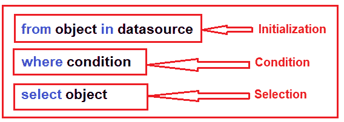
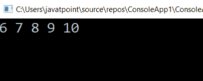
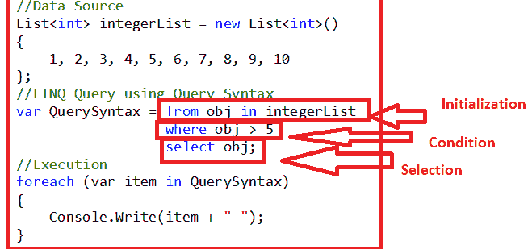
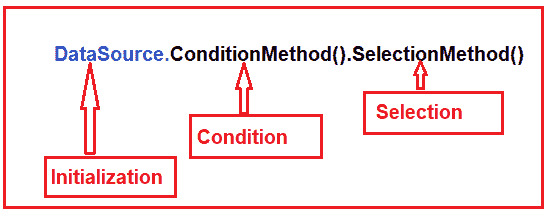
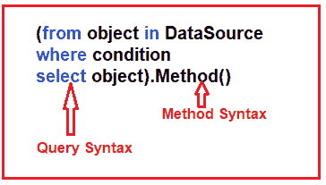
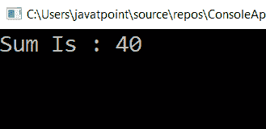

# LINQ 语法

> 原文：<https://www.javatpoint.com/linq-syntax>

在继续学习 LINQ 查询语法之前，我们将讨论一些与 LINQ 语法相关的基本术语:

## 编写 LINQ 查询的要求

要编写 LINQ 查询，我们需要以下三样东西:

1.  数据源(内存对象、SQL、XML)
2.  询问
3.  查询的执行

## 什么是查询？

查询只不过是一组指令。查询应用于数据源(即内存对象、SQL、XML 等)。)来执行操作(即 CRUD 操作)并显示该查询的输出形状。这意味着查询不负责输出内容；相反，它负责输出的形状。

***每个查询是三个东西的组合；它们是:***

1.  初始化(使用特定的数据源)
2.  条件(位置、筛选、排序条件)
3.  选择(单一选择、群组选择或加入)

LINQ 是“**语言综合查询**的首字母缩写。”主要功能是允许用户使用查询语法在代码中以 SQL 查询的样式编写查询。

那个.NET 框架在 LINQ 提供了一组内置的查询关键字，允许用户编写 SQL 风格的查询。

**LINQ 有三种方式编写查询:**

*   使用查询语法
*   使用方法语法
*   使用混合语法

### LINQ 查询语法

LINQ 是以可访问和可读的格式编写复杂的 LINQ 查询的最简单的方法之一。这种查询的语法与 SQL 查询非常相似。

LINQ 的语法如下:



在 LINQ，我们通过遵循某些规则来编写 LINQ 查询。语法不同于 SQL。为了在 LINQ 编写查询，需要遵循如下语法层次结构:

```

from <variable> in <collection>
< where, joining, grouping, operators, etc.> <lambda expression>
<select or groupBy operator> <format the results>

```

当我们在 LINQ 写查询时，我们将遵循这个顺序。LINQ 的起点从“**”关键字开始，后面跟一个**自定义变量**，后面跟 in，指定数据的集合或引用的来源，后面跟一个 **where** 子句。如果在选择离子之前有一个特定的查询可以用来过滤**记录**和**选择**之后是并分组到子句中。**

 ****LINQ 查询的子句顺序如下所示:**

| 条款 | 描述 |
| 从 | [标识符] |
| 在…里 | [来源集合] |
| 让 | [表情] |
| 在哪里 | [布尔表达式] |
| 以...排序 | [表情] |
| 挑选 | [表情] |
| 分组依据 | [表情] |
| 到…里面 | [表情] |

**c# 中 LINQ 查询的代码片段**

**c# 中的 LINQ 查询语法**

```

int[] Num = { 1, 2, 3, 4, 5, 6, 7, 8, 9 };
IEnumerable<int> result = from numbers in Num
                                where numbers >3
                                select numbers;

```

**现在我们将通过以下示例了解如何使用 LINQ 查询语法:**

**示例:**我们有一个整数列表，我们需要编写一个 LINQ 查询，它将返回所有大于 5 的整数。这里我们将创建一个控制台应用程序。

**使用查询语法的示例**

```

using System;
usingSystem.Collections.Generic;
usingSystem.Linq;
usingSystem.Text;
usingSystem.Threading.Tasks;

namespace ConsoleApp1
{
classProgram
    {
staticvoid Main(string[] args)
        {
//Data Source
            ListintegerList = new List<int>()
            {
                1, 2, 3, 4, 5, 6, 7, 8, 9, 10
            };
//LINQ Query using Query Syntax
varQuerySyntax = fromobjinintegerList
whereobj> 5
selectobj;
//Execution
foreach (var item inQuerySyntax)
            {
Console.Write(item + " ");
            }
Console.ReadKey();
        }
    }
}</int> 
```

现在我们将运行该应用程序，它将显示值 6、7、8、9、10，如下所示，显示在控制台窗口的输出中。

**输出**




### LINQ 方法语法

方法语法成为当今最流行的编写 LINQ 查询的方法。它使用 lambda 表达式来定义查询的条件。方法语法很容易编写简单的查询来对特定数据源执行读写操作。对于复杂的查询，与查询语法相比，方法语法有点难。

在这种方法中，LINQ 查询是通过使用多种方法并用一个点(。).

对于这种方法，语法是:



现在，我们将使用 LINQ 方法语法重写同一个示例:

```

using System;
usingSystem.Collections.Generic;
usingSystem. Linq;
usingSystem. Text;
usingSystem.Threading.Tasks;

namespace ConsoleApp1
{
classProgram
    {
staticvoid Main(string[] args)
        {
//Data Source
            ListintegerList = new List<int>()
            {
                1, 2, 3, 4, 5, 6, 7, 8, 9, 10
            };
//LINQ Query using Method Syntax
varMethodSyntax = integerList.Where(obj =>obj> 5).ToList();
//Execution
foreach (var item inMethodSyntax)
            {
Console.Write(item + " ");
            }

Console.ReadKey();
        }
    }
}</int> 
```

**输出**


### LINQ 混合语法

LINQ 混合语法是**查询**和**方法语法**的组合。



**示例:**现在，我们正在更改需求。首先，我们需要过滤值高于 5 的列表，然后我们需要计算总和。

```

using System;
usingSystem.Collections.Generic;
usingSystem. Linq;
usingSystem. Text;
usingSystem.Threading.Tasks;

namespace ConsoleApp1
{
classProgram
    {
staticvoid Main(string[] args)
        {
//Data Source
            ListintegerList = new List<int>()
            {
                1, 2, 3, 4, 5, 6, 7, 8, 9, 10
            };
//LINQ Query using Mixed Syntax
varMethodSyntax = (fromobjinintegerList
whereobj> 5
selectobj).Sum();
//Execution
Console.Write("Sum Is : " + MethodSyntax);

Console.ReadKey();
        }
    }
}</int> 
```

现在我们运行应用程序，它将显示总和为 40，如下所示，在控制台窗口的输出中。

**输出**



* * ***