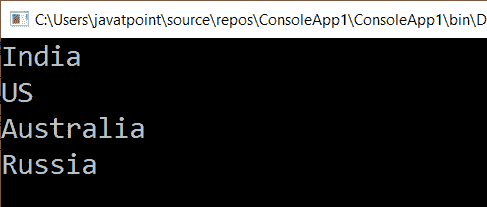

# LINQλ表达式语法

> 原文：<https://www.javatpoint.com/linq-lambda-expression-syntax>

在 LINQ，λ表达式是一个没有名字的函数。它使语法简短明了。虽然 lambda 表达式不像 LINQ 查询那样可读，但它和 LINQ 查询一样重要，它在内部转换成 lambda。当我们将 lambda 表达式用作表达式时，它的范围是有限的。之后不能使用 Lambda 表达式。

**在 LINQ 定义 lambda 表达式的语法如下:**

```cs

(Input Parameter) => Method Expression

```

Lambda 表达式是动态的，在编译时决定类型。在上面左边的 lambda 表达式中，我们有一个括号()，它包含输入参数。

参数的名称可以是任何东西，在这个参数的前面(= >)是一个**等于(=)** 后跟一个**大于(> )** 的符号，用于从左到右发送或传递参数，在右边我们使用输入参数执行操作，我们将从左边的参数传递输入参数。

整个语法形成了一个**λ表达式**。

这里，我们举一个常用表达式的例子:

**X= > x+10**

Here, x is an input parameter which is followed by => operator, and next to the operator, there is an expression that adds numeric 10 to the input variable (x). Now the output would increment the numeric 10 to x variable, which was the input parameter on the left-hand side of the Expression.

## C# 中的 LINQλ表达式示例

```cs

using System;
using System.Collections.Generic;
using System.Linq;
using System.Text;
using System.Threading.Tasks;

namespace ConsoleApp1
{
    class Program
    {
        static void Main(string[] args)
        {
//list to store the countries type of string
            List countries = new List<string>();

            countries.Add("India");

            countries.Add("US");

            countries.Add("Australia");

            countries.Add("Russia");
    //use lambda expression to show the list of the countries
            IEnumerable <string>result = countries.Select(x => x);
    //foreach loop to display the countries
            foreach (var item in the result) 

            {

                Console.WriteLine(item);

            }

            Console.ReadLine();
        }
    }
}</string></string> 
```

现在运行该应用程序，它将显示国家列表，如下所示在控制台窗口的输出。

**输出**



在上面的例子中，我们创建了一个带有国家名称的**列表**对象**(国家)**，我们使用 lambda 表达式从**列表**对象(国家)中选择国家。

这里，**选择**是我们用来从列表中选择的属性。x 是输入参数，位于表达式的左侧，后跟= >运算符。在表达式的右侧，我们有相同的输入参数 indired，我们希望在不执行任何操作的情况下显示该参数。我们没有具体说明任何条件。

* * *