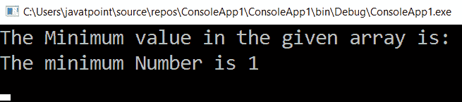

# LINQ 最小()函数

> 原文：<https://www.javatpoint.com/linq-min-function>

LINQ 的 MIN()函数对于从集合或列表中获取最小值很有用。LINQ 使得从给定的数据源中找到最小值变得非常容易。在编码中，我们必须编写一个位代码，从可用值的**列表**中获取最小值。

## C#中的 LINQ 最小()函数语法

```

int[] a = { 1, 2, 3, 4, 5, 6, 7, 8, 9 };
int minimumNum = a.Min();

```

从上面的语法中，我们使用 LINQ 最小()函数从“ **a** 列表中获得最小值。

现在，我们将看到在 C#应用程序中使用 LINQ **Min()** 函数从列表中获取最小值的完整示例。

```

using System;
using System.Collections.Generic;
using System. Linq;
using System. Text;
using System.Threading.Tasks;

namespace ConsoleApp1
{
    class Program
    {
        static void Main(string[] args)
        {
//Create an array 'a' type of int having the values 1 to 9
            int[] a = { 1, 2, 3, 4, 5, 6, 7, 8, 9 };

            Console.WriteLine("The Minimum value in the given array is:");
/*Min() function is applied on the array 'a'
 to find the minimum number from the array*/
            int minimumNum = a.Min();

            Console.WriteLine("The minimum Number is {0}", minimumNum);

            Console.ReadLine();
        }
    }
}

```

从上面的例子中，它将显示整数数组“ **a** ”，我们正在使用 **LINQ()** 函数从给定的数组中寻找最小值。

现在我们运行应用程序，它将显示列表中的最小值，如下所示，显示在控制台窗口的输出中。

**输出**



* * *