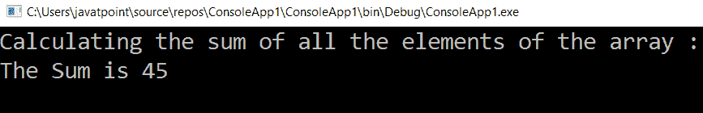

# LINQ 和()函数

> 原文：<https://www.javatpoint.com/linq-sum-function>

在 LINQ，sum()函数用于计算**集合/列表**中项目的总和。

下面是用 C# 定义 LINQ 求和函数的语法，总结一下，列表中的项目。

## C# 中 LINQ 和函数的语法

```

int[] Num = { 1, 2, 3, 4, 5, 6, 7, 8, 9 };
int Sum = Num.Sum();

```

根据上面的语法，我们使用 LINQ **求和**函数对“ **Num** 列表中的项目进行求和。

现在，我们将看到在 C# 应用程序中使用 LINQ Sum()函数来汇总来自**集合/列表**的项目的完整示例。

```

using System;
using System.Collections.Generic;
using System. Linq;
using System. Text;
using System.Threading.Tasks;

namespace ConsoleApp1
{
    class Program
    {
        static void Main(string[] args)
        {   
//create array num with the initializing value
            int[] Num = { 1, 2, 3, 4, 5, 6, 7, 8, 9 };
            Console.WriteLine("Calculating the sum of all the elements of the array :");
//Num.Sum() is used to add the value of the Num array
            int Sum = Num.Sum();
            Console.WriteLine("The Sum is {0}", Sum);
            Console.ReadLine();
        }
    }
}

```

在上面的例子中，我们使用 sum 函数来计算数组列表“Num”中元素的总和。

当我们执行上面的例子时，我们得到如下结果:



我们可以使用 LINQ 的 **sum ()** 功能来汇总集合/列表中的项目，这是基于我们的需求。

* * *