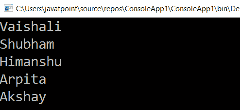

# LINQ 递减算子排序

> 原文:[https://www.javatpoint.com/linq-orderby-descending-operator](https://www.javatpoint.com/linq-orderby-descending-operator)

在 LINQ，OrderBy 降序运算符用于按降序对项目列表/集合进行排序。

## LINQ 排序递减运算符的语法

LINQ ordrbydesending 运算符的语法是，按降序对项目/集合列表进行排序:

C#代码

```

var studentname = Objstudent.OrderByDescending(x => x.Name);

```

## LINQ 排序递减运算符示例

下面是使用 LINQ order by 降序排序运算符按降序对项目/集合列表进行排序的示例:

**C#代码**

```

using System;
using System.Collections;
using System.Collections.Generic;
using System.Linq;
using System.Text;
using System.Threading.Tasks;

namespace ConsoleApp1
{
    class Program
    {
        static void Main(string[] args)
        {
//create object of Student class and create a list of the student information
            List Objstudent = new List<student>()
            {
                new Student() { Name = "Akshay", Gender = "Male", Subjects = new List <string>{ "Mathematics", "Physics" } },
                new Student() { Name = "Vaishali", Gender = "Female", Subjects = new List <string>{ "Computer", "Botany" } },
                new Student() { Name = "Arpita", Gender = "FMale", Subjects = new List <string>{ "Economics", "Operating System", "Java" } },
                new Student() { Name = "Shubham", Gender = "Male", Subjects = new List <string>{ "Account", "Social Studies", "Chemistry" } },
                new Student() { Name = "Himanshu", Gender = "Male", Subjects = new List<string>{ "English", "Charted" } }
    };
    /*OrderByDescending() operator is used to print 
    the name of the student in the descending form*/
    var studentname = Objstudent.OrderByDescending(x => x.Name);
    //foreach loop is used to print the name of the student
    foreach (var student in studentname)
    {
    Console.WriteLine(student.Name);
    }
    Console.ReadLine();
    }
    }
    //create a class student
    class Student
    {
    public string Name { get; set; }
    public string Gender { get; set; }
    public List <string>Subjects { get; set; }
        }
        }</string></string></string></string></string></string></student> 
```

下面是上面代码按降序排列的结果是:

**输出:**



* * *