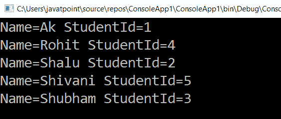

# LINQ 然后是操作员

> 原文:[https://www.javatpoint.com/linq-thenby-operator](https://www.javatpoint.com/linq-thenby-operator)

ThenBy 排序运算符用于实现对多个字段的排序，默认情况下，ThenBy 运算符将按升序对项目集合进行排序。通常，在 LINQ，ThenBy 运算符与 OrderBy 运算符一起使用，以实现列表/集合中多个字段的排序。

如果我们希望在 LINQ 排序时有多个条件，那么我们可以在 OrderBy 子句中使用 ThenBy 子句。在 LINQ，OrderBy 是主要的排序运算符，而 ThenBy 是次要运算符。

## LINQ 然后比运算符的语法

在 LINQ 使用 ThenBy 运算符对多个字段进行排序的语法是:

```

var studentname = Objstudent.OrderBy(x => x.Name).ThenBy(x => x.RoleId);

```

在上面的语法中，我们使用“**名称**对项目列表进行排序，并且我们通过使用 ThenBy 条件对项目列表进行排序来添加另一个字段“**角色 id** ”。现在，我们将借助一个示例来了解这一点。

## LINQ 接着符的例子

下面是 LINQ ThenBy 运算符的示例，该运算符根据多个字段对项目列表/集合进行排序。

**C#代码**

```

using System;
using System.Collections;
using System.Collections.Generic;
using System.Linq;
using System.Text;
using System.Threading.Tasks;

namespace ConsoleApp1
{
    class Program
    {
        static void Main(string[] args)
        {
//create an object Objstudent of the class Student, and create a list of the information of the student
            List Objstudent = new List<student>()
            {
                new Student() { RoleId=1, Name = "Ak", Gender = "Male", Subjects = new List <string>{ "Mathematics", "Physics" } },
                new Student() { RoleId=2, Name = "Shalu", Gender = "Female", Subjects = new List <string>{ "Computers", "Botany" } },
                new Student() { RoleId=3, Name = "Shubham", Gender = "Male", Subjects = new List <string>{ "Economics", "Operating System", "Java" } },
                new Student() { RoleId=4, Name = "Rohit", Gender = "Male", Subjects = new List <string>{ "Accounting", "Social Studies", "Chemistry" } },
                new Student() { RoleId=5, Name = "Shivani", Gender = "FeMale", Subjects = new List <string>{ "English", "Charterd" } }
            };
    //ThenBy() operator is used here to sort the Information of the student in ascending form on the behalf of the RollNumber
                var studentname = Objstudent.OrderBy(x => x.Name).ThenBy(x => x.RoleNumber Id);
    //foreach loop is used to print the information
                foreach (var student in studentname)
                {
                    Console.WriteLine("Name={0} studentid={1}", student.Name, student.Roleid);
                }
                    Console.ReadLine();
        }
    }
                class Student
                {
                    public int RoleNumber Id { get; set; }
                    public string Name { get; set; }
                    public string Gender { get; set; }
                    public List <string>Subjects { get; set; }
                }
}</string></string></string></string></string></string></student> 
```

在上例中，我们使用多个字段**名称、角色编号标识**对“对象学习”列表项进行排序。

**输出:**

LINQ 排序运算符根据多个字段对项目列表进行排序的结果是:



* * *