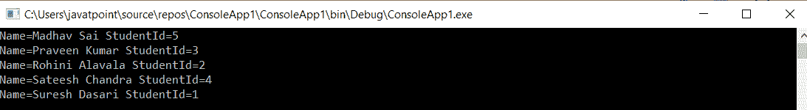

# LINQ 然后是递减运算符

> 原文：<https://www.javatpoint.com/linq-thenby-descending-operator>

在 LINQ，**然后通过**运算符对列表/集合中的多个字段进行排序，默认情况下，通过降序运算符对项目列表进行排序。在 LINQ，我们使用“然后按降序”操作符和“T2”按“T3”操作符。

在 LINQ，使用“降序”运算符将第二个排序条件指定为降序，使用“排序方式”运算符指定初级排序的条件。

## LINQ 然后递减运算符的语法

使用 LINQ **然后通过降序**运算符与 **OrderBy** 运算符一起对项目列表/集合进行排序的语法。

**C# 代码**

```cs

  var studentname = Objstudent.OrderBy(x => x.Name).ThenByDescending(x => x.RoleId);

```

从上面的例子可以看出，我们首先用 **OrderBy** 运算符定义了排序条件，然后用 ThenByDescending 运算符定义了第二个条件。我们正在使用“**名称**对项目列表进行排序，并使用“递减运算符”添加了另一个字段“**角色标识**”。

**我们将借助一个例子来看。**

## LINQ 乘递减运算符示例

下面是 LINQ 的例子，根据多个字段对项目列表/集合进行排序的降序运算符是:

```cs

using System;
using System. Collections;
using System.Collections.Generic;
using System. Linq;
using System. Text;
using System.Threading.Tasks;

namespace ConsoleApp1
{
    class Program
    {
        static void Main(string[] args)
        {
//Create object ObjStudent of the Student class having the list of the student information
            List Objstudent = new List<student>()
            {
                new Student() { RoleId=1, Name = "Suresh Dasari", Gender = "Male", Subjects = new List <string>{ "Mathematics","Physics" } },
                new Student() { RoleId=2, Name = "Rohini Alavala", Gender = "Female", Subjects = new List <string>{ "Entomology", "Botany" } },
                new Student() { RoleId=3, Name = "Praveen Kumar", Gender = "Male", Subjects = new List <string>{ "Computers","Operating System", "Java" } },
                new Student() { RoleId=4, Name = "Sateesh Chandra", Gender = "Male", Subjects = new List <string>{ "English", "Social Studies", "Chemistry" } },
                new Student() { RoleId=5, Name = "Madhav Sai", Gender = "Male", Subjects = new List <string>{ "Accounting", "Charted" } }
            };
    //ThenByDescending() operator is used to sort the information of the student in the descending form
                var studentname = Objstudent.OrderBy(x => x.Name).ThenByDescending(x => x.RoleId);
                foreach (var student in studentname)
                {
                    Console.WriteLine("Name={0} StudentId={1}", student.Name, student.RoleId);
                }
                    Console.ReadLine();
         }
     }
    //create a student class
    class Student
    {
        public int RoleId { get; set; }
        public string Name { get; set; }
        public string Gender { get; set; }
        public List <string>Subjects { get; set; }
    }
}</string></string></string></string></string></string></student> 
```

在上面的示例中，我们使用多个字段**名称、角色标识**对项目列表中的“**对象进行排序。**

**输出:**



* * *