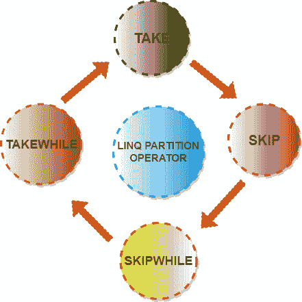

# LINQ 分区算子

> 原文：<https://www.javatpoint.com/linq-partition-operator>

在 LINQ，分区运算符用于将列表/集合项划分为两部分，并返回列表项的一部分。以下是 LINQ 提供的不同类型的分区运算符。

1.  拿
2.  TAKEWHILE
3.  跳跃
4.  SKIPWHILE

通过使用这些操作符，我们可以将项目列表/集合分成两部分，并返回列表项目的一部分。

该表显示了与 LINQ 分区运算符相关的更多详细信息。

| 操作员 | 描述 | 查询-语法 |
| 拿 | 该运算符用于返回序列中指定数量的元素。 | 拿 |
| TAKEWHILE | 该运算符用于返回序列中满足特定条件的元素。 | 花点时间 |
| 跳跃 | 该运算符用于跳过序列中指定数量的元素，并返回剩余的元素。 | 跳跃 |
| SKIPWHILE | 该运算符用于根据条件(定义为 true)跳过序列中的元素。 | Skipwhile |

* * *