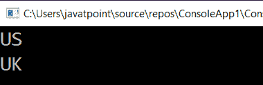

# LINQ 带 While 分区运算符

> 原文：<https://www.javatpoint.com/linq-takewhile-partition-operator>

在 LINQ，TakeWhile 运算符用于从数据源的列表/集合中获取元素，只要指定的条件包含表达式。

## LINQ 乘 While 运算符的语法

使用 LINQ TakeWhile 运算符的语法是根据指定的条件从列表中获取元素。

**C#代码**

```

IEnumerable<string> result = countries.TakeWhile(x => x.StartsWith("U"));

```

从上面的语法中，我们得到了列表中的元素，其中元素以“ **U** 开头。

## 方法语法中的 LINQ TakeWhile 示例

下面是在方法语法中使用 LINQ TakeWhile 从列表/集合中获取元素的例子。

**C#代码**

```

using System;
using System.Collections;
using System.Collections.Generic;
using System.Linq;
using System.Text;
using System.Threading.Tasks;

namespace ConsoleApp1
{
    class Program
    {
        static void Main(string[] args)
        {
//Array countries is created of string type.
            string[] countries = { "US", "UK", "Russia", "China", "Australia", "Argentina" };
/*TakeWhile operator is used which will print 
the values until the specified condition is satisfied.*/
            IEnumerable result = countries.TakeWhile(x => x.StartsWith("U"));
    //foreach loop will print the value of the result
            foreach (string s in  result) 
            {
                Console.WriteLine(s);
            }
                Console.ReadLine();
        }
    }
} 
```

在上面的例子中，我们使用了 **TakeWhile ()** 运算符和一个 lambda 表达式，其中我们指定了选择以“ **U** 开头的国家的条件所以，它只返回前两个元素。

**输出:**



## 查询语法中的 LINQ TakeWhile 示例

下面是在查询语法中使用 LINQ TakeWhile 运算符从列表中获取元素的示例。

```

using System;
using System. Collections;
using System.Collections.Generic;
using System. Linq;
using System. Text;
using System.Threading.Tasks;

namespace ConsoleApp1
{
    class Program
    {
        static void Main(string[] args)
        {
            string[] countries = { "US", "UK", "China", "Russia", "Argentina", "India" };
//apply the query syntax to print the values upto the specified condition.StartWith("U").
            IEnumerable result = (from x in countries select x).TakeWhile(x => x.StartsWith("U"));
            foreach (string s in  result) 
            {
                Console.WriteLine(s);
            }
                Console.ReadLine();
        }
    }
} 
```

**输出:**

执行上述程序后，我们得到如下所示的输出:


* * *