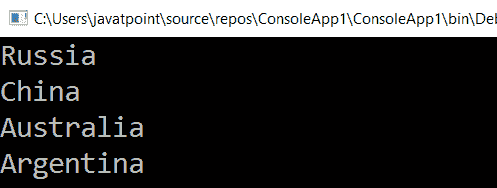

# LINQ 跳过运算符

> 原文：<https://www.javatpoint.com/linq-skip-operator>

在 LINQ，Skip 运算符用于从列表/集合中跳过指定数量的元素，并返回剩余的元素。

## LINQ 跳跃算子的语法

使用 LINQ 跳过运算符的语法用于跳过集合中指定数量的元素，并返回集合中剩余的元素。

**C# 代码**

```cs

IEnumerable<string> result = countries.Skip(3);

```

从上面的语法中，我们通过使用“Skip (3)”来跳过前三个元素，并从集合中获取剩余的元素。

## 方法语法中的 LINQ 跳过运算符示例

下面是在方法语法中使用 LINQ Skip 运算符从集合中跳过指定元素并从集合中获取剩余元素的示例。

```cs

using System;
using System. Collections;
using System.Collections.Generic;
using System. Linq;
using System. Text;
using System.Threading.Tasks;

namespace ConsoleApp1
{
    class Program
    {
        static void Main(string[] args)
        {
//create array of string type countries with the initialization
            string[] countries = { "US", "UK", "India", "Russia", "China", "Australia", "Argentina" };
/*skip method is used to with the IEnumerable to return
 the value which skip the third element of the array*/
            IEnumerable result = countries.Skip(3);
    //foreach loop is used to print the element of the array
            foreach (string s in result)
            {
                Console.WriteLine(s);
            }
                Console.ReadLine();
        }
    }
} 
```

在上面的例子中，我们试图跳过前三个国家。因此，我们在 SKIP 运算符的帮助下传递了“3”作为输入参数。它将展示这个国家的其他地方。

**输出:**

在 LINQ 使用 skip 运算符跳过列表中某些元素的结果如下所示。



## 查询语法中的 LINQ 跳过运算符示例

**C# 代码**

```cs

using System;
using System.Collections;
using System.Collections.Generic;
using System.Linq;
using System.Text;
using System.Threading.Tasks;

namespace ConsoleApp1
{
    class Program
    {
        static void Main(string[] args)
        {

            string[] countries = { "US", "UK", "India", "Russia", "China", "Australia", "Argentina" };

            IEnumerable result = (from x in countries select x).Skip(3);

            foreach (string s in result)

            {

                Console.WriteLine(s);

            }

            Console.ReadLine();

        }

    }

    } 
```

**输出:**


* * *