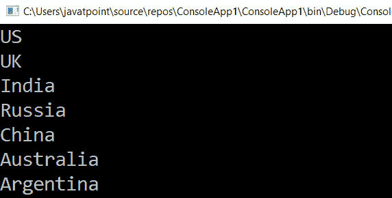

# LINQ 托列斯特()方法

> 原文:[https://www.javatpoint.com/linq-tolist-method](https://www.javatpoint.com/linq-tolist-method)

在 LINQ，ToList 操作符从给定的源中获取元素，并返回一个新的列表。因此，在这种情况下，输入将被转换为列表类型。

## LINQ ToList()运算符的语法

使用 LINQ 列表()将输入集合转换为列表的语法。

**C#代码**

```

List result = countries.ToList(); 
```

在上面的语法中，我们使用 LINQ ToList()运算符将“国家”集合转换为列表。

## 方法语法中 ToList()运算符的示例

在方法语法中使用 LINQ 列表()将输入集合转换为列表的示例。

**C#代码**

```

using System;
using System.Collections;
using System.Collections.Generic;
using System.Linq;
using System.Text;
using System.Threading.Tasks;

namespace ConsoleApp1
{
    class Program
    {
        static void Main(string[] args)
        {
//create array countries of type string containing the collection of data
            string[] countries = { "US", "UK", "India", "Russia", "China", "Australia", "Argentina" };
//countries.ToList() convert the collection of data into the list.
            List result = countries.ToList();
    //foreach loop is used to print the information of the student
            foreach (string s in result)
            {
                Console.WriteLine(s);
            }
                Console.ReadLine();
        }
    }
} 
```

**输出:**



在上例中，我们使用 LINQ **ToList()** 方法将国家集合转换为列表。

## 查询语法中 ToList()运算符的示例

在查询语法中使用 LINQ ToList()运算符的示例

```

using System;
using System.Collections;
using System.Collections.Generic;
using System.Linq;
using System.Text;
using System.Threading.Tasks;

namespace ConsoleApp1
{
    class Program
    {
        static void Main(string[] args)
        {
            string[] countries = { "US", "UK", "India", "Russia", "China", "Australia", "Argentina" };
//used query syntax to convert the collection of the data into the list
            List result = (from x in countries select x).ToList();
            foreach (string s in result)
            {
                Console.WriteLine(s);
            }
                Console.ReadLine();
        }
    }
} 
```

**输出:**


* * *