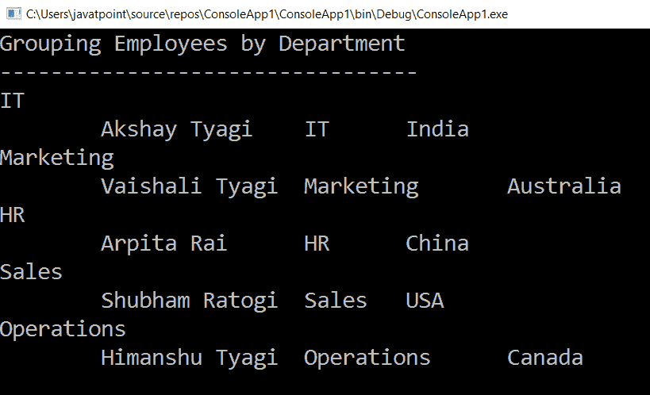
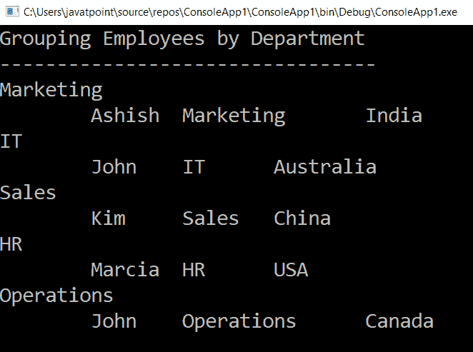

# LINQ·托鲁克普()方法

> 原文：<https://www.javatpoint.com/linq-tolookup-method>

LINQ 的 ToLookup 运算符是一种扩展方法，用于从源中提取一组键/值对。这里，结果集合中的每个元素都是一个通用的查找对象。查找对象保存关键字和与关键字匹配的子序列项。

## linq 查找运算符的语法

下面是使用 LINQ ToLookup 运算符将集合作为键/值对返回的语法。

**C# 代码**

```cs

var Emp = objEmployee.ToLookup(x => x.Department);

```

在上面的语法中，我们使用 **ToLookup** 运算符将“**对象对象**的集合转换为键/值对列表。

## 方法语法中的 LINQ ToLookup()运算符示例

下面是在方法语法中使用 LINQ ToLookup()将输入集合项转换为键/值对列表的示例。

**C# 代码**

```cs

using System;
using System.Collections;
using System.Collections.Generic;
using System.Linq;
using System.Text;
using System.Threading.Tasks;

namespace ConsoleApp1
{
    class Program
    {
        static void Main(string[] args)
        {
//create an objEmployee of the class Employee and create a list of Employee
            List objEmployee = new List<employee>()
            {
                new Employee(){ Name="Akshay Tyagi", Department="IT", Country="India"},
                new Employee(){ Name="Vaishali Tyagi", Department="Marketing", Country="Australia"},
                new Employee(){ Name="Arpita Rai", Department="HR", Country="China"},
                new Employee(){ Name="Shubham Ratogi", Department="Sales", Country="USA"},
                new Employee(){ Name="Himanshu Tyagi", Department="Operations", Country="Canada"}
            };
    //objEmployee.ToLookup() method is used to print the value of the data in the pair/collection of items.
                var Emp = objEmployee.ToLookup(x => x.Department);
                Console.WriteLine("Grouping Employees by Department");
                Console.WriteLine("---------------------------------");
                foreach (var KeyValurPair in Emp)
                {
                    Console.WriteLine(KeyValurPair.Key);
                // Lookup employees by Department
                foreach (var item in Emp[KeyValurPair.Key])
                {
                    Console.WriteLine("\t" + item.Name + "\t" + item.Department + "\t" + item.Country);
                }
          }
                Console.ReadLine();
    }
}
    class Employee
    {
        public string Name { get; set; }
        public string Department { get; set; }
        public string Country { get; set; }
    }
}</employee> 
```

在上面的例子中，我们使用**到**的方法按部门对员工进行分组。因为 ToLookup 生成了键/值对，所以我们在 **foreach** 循环中使用了它，并且内部循环基于作为输入传递的键提取值。

**输出:**



## 查询语法中的 LINQ ToLookup()示例

```cs

using System;
using System.Collections;
using System.Collections.Generic;
using System.Linq;
using System.Text;
using System.Threading.Tasks;

namespace ConsoleApp1
{
    class Program
    {
        static void Main(string[] args)
        {
            List objEmployee = new List<employee>()
            {
                new Employee(){ Name="Ashish ", Department="Marketing", Country="India"},
                new Employee(){ Name="John", Department="IT", Country="Australia"},
                new Employee(){ Name="Kim", Department="Sales", Country="China"},
                new Employee(){ Name="Marcia", Department="HR", Country="USA"},
                new Employee(){ Name="John", Department="Operations", Country="Canada"}
            };
                var emp = (from employee in objEmployee select employee).ToLookup(x => x.Department);
                 Console.WriteLine("Grouping Employees by Department");
                Console.WriteLine("---------------------------------");
                foreach (var KeyValurPair in emp)
                {
                    Console.WriteLine(KeyValurPair.Key);
                    // Lookup employees by Department
                    foreach (var item in emp[KeyValurPair.Key])
                    {
                        Console.WriteLine("\t" + item.Name + "\t" + item.Department + "\t" + item.Country);
                    }
                }
                    Console.ReadLine();
          }
    }
        class Employee
        {
            public string Name { get; set; }
            public string Department { get; set; }
            public string Country { get; set; }
         }
}</employee> 
```

**输出:**



* * *