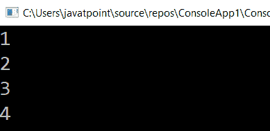

# LINQ 地震法

> 原文：<https://www.javatpoint.com/linq-asenumrable-method>

在 LINQ，AsEnumerble()方法用于将给定列表的特定类型转换为等效的 IEnumerable()类型。

## LINQ 可数()方法的语法

**C# 代码**

```cs

var result = numarray.AsEnumerable();

```

在上面的语法中，我们将“ **numarray** ”的列表转换为 IEnumerable 类型。

## LINQ 数字()方法示例

下面是使用 LINQ **可数**方法将列表转换为可数的例子。

```cs

using System;
using System. Collections;
using System.Collections.Generic;
using System. Linq;
using System. Text;
using System.Threading.Tasks;
namespace ConsoleApp1
{
    class Program1
    {
        static void Main(string[] args)
        {
//here we are creating an array NumArray type of int
            int[] NumArray = new int[] { 1, 2, 3, 4,5};
//After applying the AsEnumerable method the output will be store in variable result
            var result = NumArray.AsEnumerable();
//Now we will print the value of variable result one by one with the help of foreach loop
            foreach (var number in result)
        {
            Console.WriteLine(number);
        }
            Console.ReadLine();
        }
        }
}

```

在上面的示例中，我们使用**可数**方法将“ **NumArray** ”列表转换为**可数**类型。

**输出:**



* * *