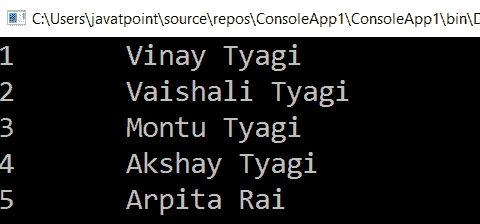

# LINQ 至爱尔兰()方法

> 原文：<https://www.javatpoint.com/linq-todictionary-method>

在 LINQ，ToDictionary()方法用于将列表/集合(IEnumerable <t>)的项目转换为新的字典对象(Dictionary <tkey>)，它将仅根据所需值优化列表/集合项目。</tkey></t>

## LINQ 的句法转换方法

下面是使用 LINQ ToDictionary()运算符的语法。

**C# 代码**

```cs

var student = objStudent.ToDictionary(x => x.Id, x => x.Name);

```

在上面的语法中，我们正在将“ **objStudent** 的集合转换为字典对象，并获得唯一需要的填充值(ID 和 Name)。

## ToDictionary 方法示例

下面是使用 LINQ ToDictionary 运算符将集合转换为新字典对象的示例。

```cs

using System;
using System. Collections;
using System.Collections.Generic;
using System. Linq;
using System. Text;
using System.Threading.Tasks;

namespace ConsoleApp1
{
    class Program
    {
        static void Main(string[] args)
        {
//Create a object objStudent of Student class and add the information of student in the List
            List objStudent = new List<student>()
            {
                new Student() { Id=1,Name = "Vinay Tyagi", Gender = "Male",Location="Chennai" },
                new Student() { Id=2,Name = "Vaishali Tyagi", Gender = "Female", Location="Chennai" },
                new Student() { Id=3,Name = "Montu Tyagi", Gender = "Male",Location="Bangalore" },
                new Student() { Id=4,Name = "Akshay Tyagi", Gender = "Male", Location ="Vizag"},
                new Student() { Id=5,Name = "Arpita Rai", Gender = "Male", Location="Nagpur"}
             };
    /*here with the help of ToDictionary() method we are converting the colection 
    of information in the form of dictionary and will fetch only the required information*/
                var student = objStudent.ToDictionary(x => x.Id, x => x.Name);
    //foreach loop is used to print the information of the student
                foreach (var stud in student)
                {
                    Console.WriteLine(stud.Key + "\t" + stud.Value);
                }
                Console.ReadLine();
    }
}
        class Student
        {
            public int Id { get; set; }
            public string Name { get; set; }
            public string Gender { get; set; }
            public string Location { get; set; }
         }
}</student> 
```

在上面的例子中，我们将“对象学习”集合转换为字典对象，并从两个值(标识和名称)中获取值。

**输出:**



* * *