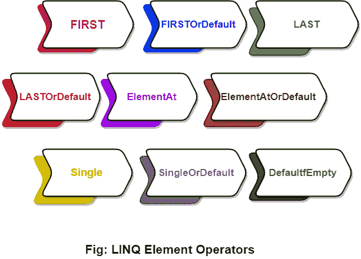

# LINQ 元素算子

> 原文：<https://www.javatpoint.com/linq-element-operators>

在 LINQ，元素运算符用于从集合中返回列表的第一个和最后一个元素或单个元素，或者基于集合中的索引值返回特定元素。

在 LINQ，我们有不同类型的元素操作符可用。这些是:

1.  第一
2.  FirstOrDefault
3.  最后的
4.  LastOrDefault
5.  项目在
6.  elemontatorrdefault
7.  单一的
8.  singleordefault
9.  defaultifempty

通过使用这些元素操作符，我们可以获得特定位置的项目列表/集合。下表显示了与元素运算符相关的更多详细信息。

| 经营者 | 描述 |
| **第一** | 它根据条件返回序列中或集合中的第一个元素。 |
| **一阶违约** | 与**先**相同，但在集合中找不到元素的情况下返回默认值。 |
| **最后** | 它根据匹配条件返回序列中的最后一个元素或最后一个元素。 |
| **元素** | 它根据特定的索引位置从列表中返回一个元素。 |
| **元素默认值** | 它与中的**元素相同，但如果集合的指定索引处没有元素，它将返回默认值。** |
| **单** | 它从集合中返回单个特定元素。 |
| **单字错误** | 与 **Single** 相同，但在集合中找不到元素的情况下返回默认值。 |
| **DefaultfEmpty** | 如果列表或集合包含空值，则返回默认值。 |

* * *