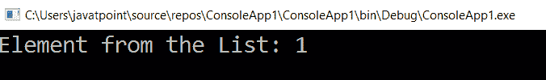

# LINQ 第一元素

> 原文:[https://www.javatpoint.com/linq-first-element](https://www.javatpoint.com/linq-first-element)

在 LINQ，First()方法/运算符用于根据指定条件返回列表或集合中项目序列的第一个元素或列表中项目序列的第一个元素。如果列表/集合中没有基于指定条件的元素，那么 LINQ FIRST()方法将抛出一个错误。

## LINQ 第一()方法的语法

从列表中获取第一个元素的第一个方法的语法是:

```

int result = objList.First();

```

从上面的语法中，我们使用 LINQ FIRST()方法从“**对象列表**”集合中获得了第一个元素。

## LINQ 第一()方法示例

下面是方法语法中的 LINQ FIRST()运算符从集合中获取第一个元素的示例。

**C#代码**

```

using System;
using System.Collections;
using System.Collections.Generic;
using System.Linq;
using System.Text;
using System.Threading.Tasks;
namespace ConsoleApp1
{
    class Program1
    {
        static void Main(string[] args)
        {
//Create an array objList of the type of int
            int[] objList = { 1, 2, 3, 4, 5 };
//First() method is used to return the first element from the array 'objList'
            int result = objList.First();
            Console.WriteLine("Element from the List: {0}", result);
            Console.ReadLine();
        }
    }
}

```

从上面的例子中，我们试图通过在方法语法中使用 LINQ FIRST()运算符从“objList”集合中获取第一个元素。

**输出:**

方法语法中的 LINQ 第一()运算符的结果如下所示:



## 查询语法中的 LINQ 第一()运算符示例

下面是方法语法中的 LINQ FIRST()运算符从集合中获取第一个元素的示例。

```

using System;
using System. Collections;
using System.Collections.Generic;
using System. Linq;
using System. Text;
using System.Threading.Tasks;

namespace ConsoleApp1
{
    class Program1
    {
        static void Main(string[] args)
        {

            int[] objList = { 1, 2, 3, 4, 5 };

            int result = (from l in objList select l).First();

            Console.WriteLine("Element from the List: {0}", result);

            Console.ReadLine();

        }

    }

    }

```

**输出:**

方法语法中的 LINQ 第一()运算符的结果如下所示:


* * *