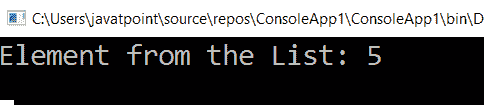

# LINQ 最后()方法

> 原文:[https://www.javatpoint.com/linq-last-method](https://www.javatpoint.com/linq-last-method)

LINQ 的 **last ()** 方法用于从列表/集合中返回最后一个元素。如果列表/集合没有返回任何元素，LINQ Last()方法将引发异常。

## LINQ 最后()方法的语法

```

int result = objList.Last();

```

从上面的语法中，我们尝试使用 LINQ Last()方法从“objList”中获取最后一个元素。

## 方法语法中的 LINQ 最后()示例

下面是方法语法中的 LINQ Last()运算符从列表中获取最后一个元素的示例。

```

using System;
using System. Collections;
using System.Collections.Generic;
using System. Linq;
using System. Text;
using System.Threading.Tasks;

namespace ConsoleApp1
{
    class Program1
    {
        static void Main(string[] args)
        {
//create an array ListObj of type int store the value 1 to 5
            int[] ListObj = { 1, 2, 3, 4, 5 };
/*apply the Last() method to fetch the last element 
of the list and store in result variable of type int*/
            int result = ListObj.Last();
//Console.Writeline() used to print the value of the Last() method
            Console.WriteLine("Element from the List: {0}", result);
            Console.ReadLine();
        }
    }
}

```

从上面的代码中，我们使用 LINQ Last()方法从“ListObj”列表中获取最后一个元素。

**输出:**



## 查询语法中的 LINQ 最后()运算符示例

```

using System;
using System.Collections;
using System.Collections.Generic;
using System.Linq;
using System.Text;
using System.Threading.Tasks;

namespace ConsoleApp1
{
    class Program1
    {
        static void Main(string[] args)
        {
//create an array ListObj of type int store the value 1 to 5
            int[] ListObj = { 1, 2, 3, 4, 5 };
//apply query syntax to fetch the last value from the list
            int result = (from l in ListObj select l).Last();
            Console.WriteLine("Element from the List: {0}", result);
            Console.ReadLine();
        }
    }
}

```

**输出:**


* * *