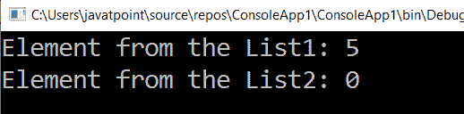

# LINQ 最后一个默认()方法

> 原文：<https://www.javatpoint.com/linq-lastordefault-method>

在 LINQ，使用**lastordefault()**方法/运算符从列表/集合中返回最后一个元素，与 LINQ Last()方法相同，唯一不同的是当列表/集合中没有元素时会返回默认值。

## LINQ 最后一个默认()方法的语法

下面是使用 LINQ **LastOrDefault()** 方法从列表或默认值中获取最后一个元素的语法。在这种情况下，if lists 使用 LINQ LastOrDefault()方法不返回任何元素。

```

int result = ListObj.LastOrDefault();

```

从上面的语法中，我们试图使用 LINQ **LastOrDefault()** 方法从“ **LastObj** 列表中获取最后一个元素。

## 方法语法中的 LINQ LastOrDefault()运算符示例

下面是在方法语法中使用 LINQ **LastOrDefault()** 运算符从列表中获取最后一个元素的例子。

```

using System;
using System. Collections;
using System.Collections.Generic;
using System. Linq;
using System. Text;
using System.Threading.Tasks;

namespace ConsoleApp1
{
    class Program1
    {
        static void Main(string[] args)
        {
//Create an array LISTOBJ having the values from 1 to 5
            int[] LISTOBJ = { 1, 2, 3, 4, 5 };
//Create another array ValObj having no values
            int[] ValObj = { };
/*LastOrDefault() method will fetch the last element 
from the LISTOBJ and store the output in the variable result*/
            int result = LISTOBJ.LastOrDefault();
/*Here LastOrDefault() method is applied on 
the ValObj array and return the result in the variable val*/
            int val = ValObj.LastOrDefault();
            Console.WriteLine("Element from the List1: {0}", result);
            Console.WriteLine("Element from the List2: {0}", val);
            Console.ReadLine();
        }
    }
}

```

从上面的代码中，我们通过使用 LINQ LastOrDefault()方法获得了“**listoobj**”和“ **ValObj** 列表中的最后一个元素。

**输出:**



## 查询语法中的 LINQ LastOrDefault()运算符示例

下面是在查询语法中使用 LINQ **LastOrDefault()** 运算符从列表中获取最后一个元素的示例。

```

using System;
using System. Collections;
using System.Collections.Generic;
using System. Linq;
using System. Text;
using System.Threading.Tasks;

namespace ConsoleApp1
{
    class Program1
    {
        static void Main(string[] args)
        {
            int[] LISTOBJ = { 1, 2, 3, 4, 5 };
            int[] ValObj = { };
            int result = (from l in LISTOBJ select l).LastOrDefault();
            int val = (from x in ValObj select x).LastOrDefault();
            Console.WriteLine("Element from the List1: {0}", result);
            Console.WriteLine("Element from the List2: {0}", val);
            Console.ReadLine();
        }
    }
}

```

**输出:**


* * *