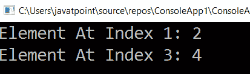

# LINQ 元素法

> 原文:[https://www.javatpoint.com/linq-elementat-method](https://www.javatpoint.com/linq-elementat-method)

在 LINQ，ElementAt()运算符用于根据指定的索引从列表/集合中返回元素。

一般在列表中，索引会从零开始，所以如果我们想得到第一个元素，那么就需要发送零(0)作为索引位置。

## LINQ 元素法的语法

```

int result = objList.ElementAt(1);

```

在上面的语法中，我们从集合中获取位于第二个索引位置的元素。

## LINQ 元素法的例子

下面是使用 LINQ **ElementAt()** 方法获取指定索引位置的元素的例子。

```

using System;
using System.Collections;
using System.Collections.Generic;
using System.Linq;
using System.Text;
using System.Threading.Tasks;
namespace ConsoleApp1
{
    class Program1
    {
        static void Main(string[] args)
        {
    //create an array named 'a' type int with assigning values
            int[] a = { 1, 2, 3, 4, 5 };
/*With the help of ElementAt() method will fetch the element from
    the specified position and store the value in 'result' and 'val' variable.*/
            int result = a.ElementAt(1);
            int val = a.ElementAt(3);
/*WriteLine function will print the value of the specified index*/
            Console.WriteLine("Element At Index 1: {0}", result);
            Console.WriteLine("Element At Index 3: {0}", val);
            Console.ReadLine();
        }

    }

    }

```

从上面的例子中，我们试图根据不同的索引位置获取集合中的不同元素。

**输出:**



* * *